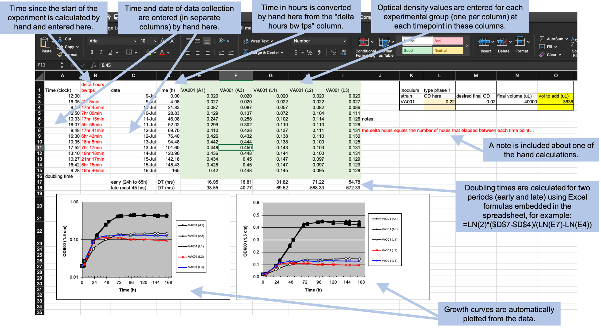
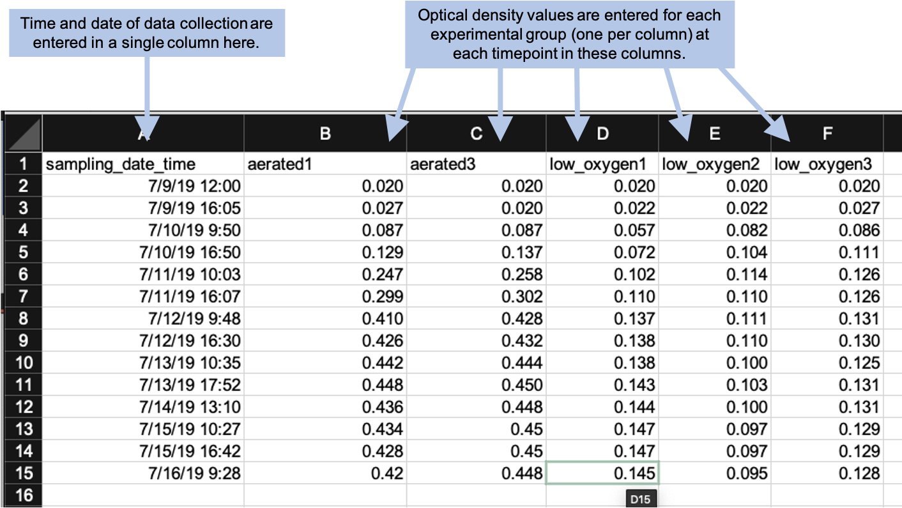

## Example: Creating a template for "tidy" data collection {#module5}

We will walk through an example of creating a template to collect data in a
"tidy" format for a laboratory-based research project, based on a research
project on drug efficacy in murine tuberculosis models. We will show the initial
"untidy" format for data recording and show how we converted it to a "tidy"
format. Finally, we will show how the data can then easily be analyzed and
visualized using reproducible tools.

**Objectives.** After this module, the trainee will be able to:

- Understand how the principles of "tidy" data can be applied for a real, complex research project;
- List advantages of the "tidy" data format for the example project 

### Example---Data on rate of bacterial growth 

The first set of data are from a study on the growth of *Mycobacterium
tuberculosis*. The goal of this study was to compare growth yield and doubling
time of *Mycobacterium tuberculosis* grown in rich medium under two assay
conditions. One set of cultures were grown in tubes with a low culture volume
relative to a large air head space to allow free oxygen exchange. A second set
of cultures were grown in tubes filled to near capacity, resulting in limited
air head space which has been shown elsewhere to limit oxygen availability over
time. The caps on both sets of cultures were sealed to restrict air exchange
during the study.

Some background information is helpful in understanding these example data,
especially if you have not conducted this type of experiment. The increase in
the cell size and cell mass during the development of an organism is termed
growth. It is the unique characteristics of all organisms. The organism must
require certain basic parameters for their energy generation and cellular
biosynthesis. The growth of the organism is affected by both physical and
nutritional factors. There are multiple methods by which growth can be measured,
but the use of closed tissue culture tubes and a spectrophotometer to track
increases in optical density (absorbance at 600 nm) over time offers several
advantages: 1) it is less subject to technical error and contamination, 2) read
out is fast and simple, 3) growth as measure by increased absorbance (turbidity)
is directly proportional to increases in cell mass. There are four distinct
phases of bacterial growth. Lag phase, log (exponential phase), stationary
phase, death phase. From these data, bacterial generation times (doubling time)
during the exponential growth phase can be calculated.

$$
\mbox{Doubling time} = \frac{log(2)(t_1 - t_2)}{log(OD_{t_1} - log(OD_{t_2}))}
$$
where $t_1$ and $t_2$ are two time points and $OD_{t_1}$ and $OD_{t_2}$ are the 
optical densities at the two time points (all $log$s are natural in this case).

An excel-based workbook (Figure \@ref(fig:growthexcel)) was created to allow the
student performing the work to (1) calculate the amount of initial inoculum
(cell culture) to add to each tube to begin the study, (2) record the raw data
absorbance measurements, (3) graph the data on both a log and linear scale, and
(4) calculate doubling time in two phases of growth using the equation listed
above. Columns were added to allow the student to track the time (column A), the
difference in time (hours) between each time point in which data were collected
(column B), the date on which data were gathered (column C), and the time in
hours for each data point from the start of the study for graphing purposes
(column D). Absorbance data for each sampling timepoint were listed in Columns
E-F (high oxygen conditions; VA001 A1, A3) or columns G-I (limited oxygen
conditions; VA001 L1, L2, L3).

```{r growthexcel, fig.fullwidth = TRUE, echo = FALSE, out.width = "\\textwidth", fig.cap = "Example of an Excel spreadsheet used to record and analyze data for a laboratory experiment. Annotations highlight where data is entered by hand, where calculations are done by hand, and where embedded Excel formulas are used. The figures are created automatically using values in a specified column."}

```

What the researchers found appealing about the format of this Excel sheet was
the ease with which the student could accomplish the study goals. They also
cited transparency of the raw data and ease with which additional sampling data
points could be added. The data being graphed in real time and the inclusion of
a simple macro to calculate doubling time, allowed the student to see tangible
differences between the two assay conditions. This was also somewhat problematic
as the equation to calculate doubling time was based on anchored time points
built into the original spreadsheet resulting in two different results that were
not properly linked to the correct data time points.

Data that are saved in a format like that shown in Figure \@ref(fig:growthexcel), 
however, are hard to read in for a statistical program like R, Perl, or Python.
In this format, the raw data (the time points each observation was collected and
the optical density for the sample at that time point) form only part of the 
spreadsheet. The spreadsheet also includes notes, automated figures, and 
cells where an embedded formula runs calculations behind the scenes.

Instead of this format, we can design a simpler format to collect the data. We'll
remove all figures and calculations, and instead save those to perform in a 
code script. Figure \@ref(fig:growthsimple) shows an example of a simpler 
format for collecting the same data. In this case, all the "extras" have been 
stripped out---this only has spaces for recording times points and the observed
optical density at those time points. In later chapters, we'll show how a code
script can be used to input these data into R and then perform calculations
and create figures. By separating out the steps of data recording from 
data analysis, you can ensure that all steps of analysis are clearly spelled 
out (and can be easily reproduced with other similar data) through a code 
script. Note that you can still collect the data in this simpler format using
a spreadsheet program, if you'd like---Figure \@ref(fig:growthsimple) shows 
the data collection set up to be recorded in a spreadsheet program, for example.
Within the spreadsheet, you can choose to save the data in a plain text format
(a csv [comma-separated value] file, for example).

```{r growthsimple, echo = FALSE, out.width = "\\textwidth", fig.cap = "Example of an simpler format that can be used to record and analyze data for the same laboratory experiment as the previous figure. Annotations highlight where data is entered by hand. No calculations are conducted or figures created---these are all done later, using a code script."}

```
In this new data collection format, the data are not completely "tidy". This is because
there is still some information included in the column names that we might want to use 
for analysis and plotting---namely, the different experimental group names (e.g., 
"aerated1", "low_oxygen1"). However, there is a balance in creating data collection 
spreadsheets. They should be in a format that is easy to read into an interactive 
programming environment like R, as well as in a format that will be easy to convert
to a truly "tidy" format once they are read in. However, it's okay to balance these
needs with aims to make the data collection spreadsheet easy for a researcher to use.

The example shown in Figure \@ref(fig:growthsimple) is designed to be easy to use 
when collecting data. All data points for a single collection time are grouped together
on a single row. When a researchers collects data for one time point, he or she can 
easy confirm visually that all the experimental groups have been measured for that 
time point. This format still makes it easy to read the data into an interactive 
programming environment, however, since they are in a clear two-dimensional format, 
with column names in the first row and values in the remaining rows. The removal of
extraneous elements---like embedded formulas, the results of hand calculations or 
automated calculations, and annotations through notes or colored highlighting---remove
barriers when reading the data into more sophisticated software. Once the data are
read into R, there can be converted into a truly tidy data format with just a few
command calls. 

The following code shows an example of how easy it is to read data into R in the simplified
format shown in Figure \@ref(fig:growthsimple). It also shows how a few lines of code
can then be used to convert the data into a truly "tidy" format, and how easily 
sophisticated plots can then be made with the data.

```{r echo = TRUE, message = FALSE, warning = FALSE}
library("tidyverse")
library("readxl")

# Read data into R from the simplified data collection template
growth_curve <- read_excel("data/growth_curve_data_in_excel (1)/growth curve data_GR.xls", 
                           sheet = "simplified_template")

# Example of data
growth_curve

# Convert to a fully tidy format
growth_curve <- growth_curve %>% 
  pivot_longer(-sampling_date_time, 
               names_to = "experimental_group", 
               values_to = "optical_density")

# How the data look after this transformation
growth_curve

# Example of how easily sophisticated plots can be created with data in this format
growth_curve %>% 
  ggplot(aes(x = sampling_date_time, y = optical_density)) + 
  geom_line() + 
  facet_wrap(~ experimental_group)
```
In later chapters, we'll discuss R's "tidyverse", a collection of tools within R
that facilitate analyzing and visualizing data once they've been read into R. Here, we
only aim to give an example of how little R code is needed to create useful output from
the data, with the only requirement for gaining this power being that the data need to 
be collected in a format that is "tidy" or close enough to easily read into R.

### Example---Data on bacteria colony forming units

### Example---Data from multiple related experiments


### Issues with these data sets

1. Issues related to using a spread sheet program
    - Embedded macros
    - Use of color to encode information
2. Issues related to non-structured / non-two-dimensional data
    - Added summary row
    - Multiple tables in one sheet
    - One cell value is meant to represent values for all rows below, until next
      non-missing row
3. Issues with data being non-"tidy"

### Final "tidy" examples

### Options for recording tidy data

**Spreadsheet program.**

**Spreadsheet-like interface in R.**

### Examples of how "tidy" data can be easily analyzed / visualized


### Discussion questions

