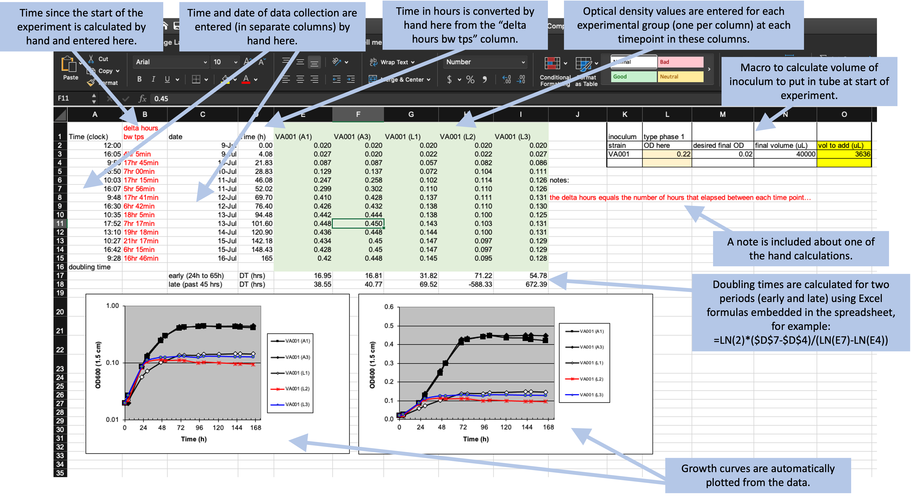
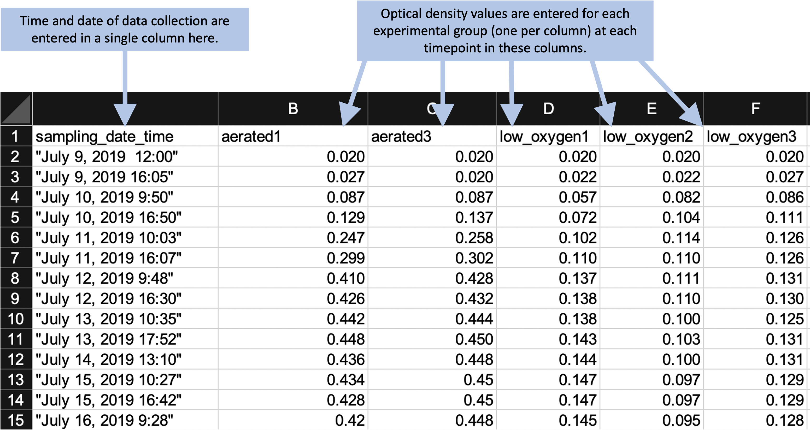

## Example: Creating a template for "tidy" data collection {#module5}

We will walk through an example of creating a template to collect data in a
"tidy" format for a laboratory-based research project, based on a research
project on drug efficacy in murine tuberculosis models. We will show the initial
"untidy" format for data recording and show how we converted it to a "tidy"
format. Finally, we will show how the data can then easily be analyzed and
visualized using reproducible tools.

**Objectives.** After this module, the trainee will be able to:

- Understand how the principles of "tidy" data can be applied for a real, complex research project;
- List advantages of the "tidy" data format for the example project 

In the last module, we covered three principles for designing tidy templates for 
data collection in a biomedical laboratory, motivated by an example dataset from 
a real experiment. In this module, we'll show you how to apply those principles
to create a tidier template for the example dataset from the last module.
As a reminder, those three principles are:

1. Limit the template to the collection of data.
2. Make sensible choices when dividing data collection into rows and columns.
3. Avoid characters or formatting that will make it hard for a computer program to process the data.

It is important to note that there's no reason that you can't continue to use a
spreadsheet program like Excel or Google Sheets to collect data. The spreadsheet
program itself can easily be used to create a simple template to use as you
collect data. In fact, we'll continue using a spreadsheet format in the rest of
this module and in the next one as we show how to redesign the data collection
for this example experiment. It is important, however, to think through how you
will arrange that template spreadsheet to make it most useful in the larger
context of reproducible research.

### Example data---Data on rate of bacterial growth 

Here, we'll walk through an example using real data collected in a laboratory
experiment. We described these data in detail in the previous module. As a
reminder, they were collected to measure the growth rate of *Mycobacteria
tuberculosis* under two conditions---high oxygen and low oxygen. They were
collected from five test tubes that were measured regularly over one week for
bacteria growth using a measure of optical density. Figure
\@ref(fig:growthexcel2) shows the original template that the research group used
to record these data.

```{r growthexcel2, fig.fullwidth = TRUE, echo = FALSE, out.width = "\\textwidth", fig.cap = "Example of an Excel spreadsheet used to record and analyze data for a laboratory experiment. Annotations highlight where data is entered by hand, where calculations are done by hand, and where embedded Excel formulas are used. The figures are created automatically using values in a specified column."}

```

In the previous module, we described features that make this template "untidy"
and potentially problematic to include in a larger pipeline of reproducible
research. In the next few sections of this module, we'll walk step-by-step
through changes that you could make to make this template tidier. We'll finish
the module by showing how you could then easily design a further step of the
analysis pipeline to visualize and analyze the collected data, so that the
advantages of real-time plotting from the more complex spreadsheet are not
missed when moving to a tidier template.

### Limiting the template to the collection of data

The example template (Figure \@ref(fig:growthexcel2)) includes a number of
"extra" elements beyond simple data collection---all the elements outside rows
1--15 of columns A--I. Outside this area of the original spread, there are a
number of extra elements, including plots that visualize the data, summaries
generated based on the data (rows 16--18, for example), notes about the data,
and even a macro (top right) that wasn't involved in data collection but instead
was used by the researcher to calculate the initial volume of inoculum to
include in each test tube. None of these "extras" can be easily read into a 
statistical program like R or Python---at best, they will be ignored by the program.
They can even complicate reading in the cells with measurements (rows
1--15 of columns A--I), as most statistical programs will try to read in all the 
non-empty cells of a spreadsheet unless directed otherwise. 

A good starting point, then, would be to start designing a tidy data collection
template for this experiment by extracting only the content from the box in
Figure \@ref(fig:extractraw). This would result in a template that looks like
Figure \@ref(fig:step1).

```{r step1, fig.fullwidth = TRUE, echo = FALSE, out.width = "\\textwidth", fig.cap = "First step in designing a tidy data collection template for the example project. A template has been created that focuses only on the raw data, removing all extra elements like plots, notes, macros, and summaries."}
knitr::include_graphics("figures/growth_curve_step1.png")
```

Notice that we've also removed any of the color formatting from the spreadsheet. It is fine to 
keep color in the spreadsheet if it will help the research to find the right spot to record data 
while working in the laboratory, but you should make sure that you're not using it to encode 
information about the data---all color formatting will be ignored when the data are read by a 
statistical program like R.

While the template shown in Figure \@ref(fig:step1) has removed a lot of the calculated values from the
original template, it has not removed all of them. Two of the columns are still values that were 
determined by calculation after the original data were collected. Column B and column D both provide
measures of the length of time since the start of the experiment, and both are calculated by 
comparing a measurement time to the time at the start of the experiment. 

The time since the start of the experiment can easily be calculated later in the analysis pipeline, 
once you read the data into a statistical program like R. By delaying this step, you can both 
simplify the data collection template (requiring fewer columns for the research in the laboratory 
to fill out) and also avoid the chance for mistakes, which could occur both in the hand calculations
of these values and in data entry, when the researcher enters the results of the calculations in the
spreadsheet cell. Figure \@ref(fig:step2) shows a new version of the template, where these calculated
columns have been removed. This template is now restricted to only data points originally collected 
in the course of the experiment, and has removed all elements that are based on calculations or other 
derivatives of those original, raw data points.

```{r step2, fig.fullwidth = FALSE, echo = FALSE, out.width = "\\textwidth", fig.cap = "Second step in designing a tidy data collection template for the example project. This template started from the previous one, but removed columns that were hand-calculated and then entered by the researcher in the previous template. This version has removed all calculated values on the template, limiting it to only the original recorded values required for the experiment."}
knitr::include_graphics("figures/growth_curve_step2.png")
```

### Making sensible choices about rows and columns

The second principle is to **make sensible choices when dividing data collection
into rows and columns**. There are many different ways that you could spread the
data collection into rows and columns, and in this step, you can consider which
method would meet a reasonable balance between making the template easy for the
researcher in the laboratory to use to record data and also making the resulting
data file easy to incorporate in a reproducible data analysis pipeline. 

For the example experiment, Figure \@ref(fig:extractraw) shows three examples 
that we can consider for how to arrange data collection across rows and columns.
All three build on the changes we made in the earlier step of "tidying" the template, 
which resulted in the template shown in Figure \@ref(fig:step2).

```{r columnoptions, fig.fullwidth = TRUE, echo = FALSE, out.width = "\\textwidth", fig.cap = "Examples of ways that data collection could be divided into rows and columns in the example template. Panel A shows an example where date and time are recorded in different columns. Panel B is similar to Panel A, but in this case, date and time are recorded in a single column. Panel C shows a classically 'tidy' data format, where each measurement date-time is repeated for each of the five test tubes, and columns give the test tube ID and absorbance measurement at that time for that tube (only part of the data is shown for this format, while remaining rows are off the page). While Panel C provides the 'tidiest' format, it may have some practical constraints when used in a laboratory setting. For example, it would require more data entry during data collection (since date-time is entered five times at each measurement time), and its long format prevent it all from being seen at once without scrolling on a computer screen."}
knitr::include_graphics("figures/growth_curve_column_options.png")
```

Panel A (an exact repeat of the template shown in Figure \@ref(fig:step2)) shows
an example where date and time are recorded in different columns. Panel B is
similar to Panel A, but in this case, date and time are recorded in a single
column. Panel C shows a classically "tidy" data format, where each measurement's
date-time is repeated for each of the five test tubes, and columns give the test
tube ID and absorbance measurement at that time for that tube (only part of the
data is shown for this format, while remaining rows are off the page). 

In this example, the template that may be the most reasonable is the one shown
in Panel B. While Panel C provides the "tidiest" format, it has some practical
constraints when used in a laboratory setting. For example, it would require
more data entry during data collection (since date-time is entered five times at
each measurement time), and its long format prevent it all from being seen at
once without scrolling on a computer screen. When comparing Panels A and B, the
template in Panel B has an advantage. The information on date and time are
useful together, but not individually. For example, to calculate the time since
the start of the experiment, you cannot just calculate the difference in dates
or just the difference in times, but instead must consider both the date and
time of the measurement in comparison to the date and time of the start of the
experiment. As a result, at some point in the data analysis pipeline, you'll
need to combine information about the date and the time to make use of the two
elements. While this combination of two columns can be easily done within a
statistical program like R, it can also be directly designed into the original
template for collecting the data. Therefore, unless there is a practical reason
why it would be easier for the researcher to enter date and time separately, the
template shown in Panel B is preferable to that shown in Panel A in terms of
allowing for the "tidy" collection of research data into a file that is easy to
include in a reproducible pipeline. Figure \@ref(fig:step3) shows the template
design at this stage in the process of tidying it, highlighting the column that
combines date and time elements in a single column. In this version of the
template, we've also been careful about how date and time are recorded, a
consideration that we'll discuss more in the next section.

```{r step3, fig.fullwidth = TRUE, echo = FALSE, out.width = "\\textwidth", fig.cap = "Third step in designing a tidy data collection template for the example project. This template started from the previous one, but combined collection of the date and time of the measurement into a single column and revised the format to include all date elements and to prevent automatic conversion by the spreadsheet program."}

```

### Avoiding problematic characters or formatting

The third principle is to **avoid characters or formatting that will make it
hard for a computer program to process the data**. There are a number of special 
characters and formatting conventions that can be hard for a statistical program to 
handle. In the example template shown in Figure \@ref(fig:step3), for example, 
the column names include spaces (for example, in "Date and time"), as well as 
parenthese (for example, in "VA 001 (A1)"). While most statistical programs have 
tools that allow you to handle and convert these characters once the data are 
read in, it's even simpler to use simpler column names in the original data collection
template, and this will save some extra coding further along in the analysis pipeline.
Two general rules for creating easy-to-use column names in a data collection template
are: (1) start each column name with a letter and (2) for the rest of the column 
name, use only letters, numbers, or the underscore character ("_"). For example, 
"aerated1" would work well, but "1--aerated" would not.

Within the cell values below the column names, there is more flexibility. For example, 
if you have a column that gives the IDs of different samples, it would be fine to include
spaces and other characters in those IDs. There are a few exceptions, however. A big one 
is with values that record dates or date-time combinations. First, it is important to include
all elements of the date (or date and time, if both are recorded). For example, the year 
should be included in the recorded date, even if the experiment only took a few days. 
This is because statistical programs have excellent functions for working with data that
are dates or date-times, but to take advantage of these, the data must be converted into 
a special class in the program, and conversion to that class requires specific elements
(for example, a date must include the year, month, and day of month). Second, it is 
useful to avoid recording dates and date-times in a way that results in a spreadsheet 
program automatically converting them. Surrounding the information about a date in 
quotation marks when entering it (as shown in Figure \@ref(fig:step3)) can avoid this.
Finally, consider using a format to record the date that is unambiguous and so less likely
to have recording errors. Dates, for example, are sometimes recorded using only numbers---for
example, the first date of "July 9, 2019" in the example data could be recorded as 
"7/9/2019" or "7/9/19", to be even more concise. However, this format has some ambiguity.
It can be unclear if this refers to July 9 or to September 7, both of which could be 
written as "7/9". For the version that uses two digits for the year, it can be unclear 
if the date is for 2019 or 1919 (or any other century). Using the format "July 9, 2019", 
as done in the latest version of the sample template, avoids this potential ambiguity.

Figure \@ref(fig:growthsimple2) shows the template for the example experiment after the 
column names have been revised to avoid any problematic characters. This template is now in 
a very useful format for a reproducible research pipeline---the data collected using this 
template can be very easily read into and processed using further statistical programs like 
R or Python.

```{r growthsimple2, echo = FALSE, out.width = "\\textwidth", fig.cap = "Example of an simpler format that can be used to record and analyze data for the same laboratory experiment as the previous figure. Annotations highlight where data is entered by hand. No calculations are conducted or figures created---these are all done later, using a code script."}

```

### Moving further data analysis to later in the pipeline

```{r growthreport2, fig.fullwidth = TRUE, echo = FALSE, out.width = "\\textwidth", fig.cap = "Examples of an automated report that can be created to quickly generate summaries and estimates of the data collected in the simplified data collection template for the example experiment."}
knitr::include_graphics("figures/growth_curve_report.png")
```

---------------------------------------------------------------------------

**Older text**

### Example---Data on rate of bacterial growth 

The first set of data are from a study on the growth of *Mycobacterium
tuberculosis*. The goal of this study was to compare growth yield and doubling
time of *Mycobacterium tuberculosis* grown in rich medium under two assay
conditions. One set of cultures were grown in tubes with a low culture volume
relative to a large air head space to allow free oxygen exchange. A second set
of cultures were grown in tubes filled to near capacity, resulting in limited
air head space which has been shown elsewhere to limit oxygen availability over
time. The caps on both sets of cultures were sealed to restrict air exchange
during the study.

Some background information is helpful in understanding these example data,
especially if you have not conducted this type of experiment. The increase in
the cell size and cell mass during the development of an organism is termed
growth. It is the unique characteristics of all organisms. The organism must
require certain basic parameters for their energy generation and cellular
biosynthesis. The growth of the organism is affected by both physical and
nutritional factors. There are multiple methods by which growth can be measured,
but the use of closed tissue culture tubes and a spectrophotometer to track
increases in optical density (absorbance at 600 nm) over time offers several
advantages: 1) it is less subject to technical error and contamination, 2) read
out is fast and simple, 3) growth as measure by increased absorbance (turbidity)
is directly proportional to increases in cell mass. There are four distinct
phases of bacterial growth. Lag phase, log (exponential phase), stationary
phase, death phase. From these data, bacterial generation times (doubling time)
during the exponential growth phase can be calculated.

$$
\mbox{Doubling time} = \frac{log(2)(t_1 - t_2)}{log(OD_{t_1} - log(OD_{t_2}))}
$$
where $t_1$ and $t_2$ are two time points and $OD_{t_1}$ and $OD_{t_2}$ are the 
optical densities at the two time points (all $log$s are natural in this case).

An excel-based workbook (Figure \@ref(fig:growthexcel2)) was created to allow the
student performing the work to (1) calculate the amount of initial inoculum
(cell culture) to add to each tube to begin the study, (2) record the raw data
absorbance measurements, (3) graph the data on both a log and linear scale, and
(4) calculate doubling time in two phases of growth using the equation listed
above. Columns were added to allow the student to track the time (column A), the
difference in time (hours) between each time point in which data were collected
(column B), the date on which data were gathered (column C), and the time in
hours for each data point from the start of the study for graphing purposes
(column D). Absorbance data for each sampling timepoint were listed in Columns
E-F (high oxygen conditions; VA001 A1, A3) or columns G-I (limited oxygen
conditions; VA001 L1, L2, L3).


What the researchers found appealing about the format of this Excel sheet was
the ease with which the student could accomplish the study goals. They also
cited transparency of the raw data and ease with which additional sampling data
points could be added. The data being graphed in real time and the inclusion of
a simple macro to calculate doubling time, allowed the student to see tangible
differences between the two assay conditions. This was also somewhat problematic
as the equation to calculate doubling time was based on anchored time points
built into the original spreadsheet resulting in two different results that were
not properly linked to the correct data time points.

Data that are saved in a format like that shown in Figure \@ref(fig:growthexcel2), 
however, are hard to read in for a statistical program like R, Perl, or Python.
In this format, the raw data (the time points each observation was collected and
the optical density for the sample at that time point) form only part of the 
spreadsheet. The spreadsheet also includes notes, automated figures, and 
cells where an embedded formula runs calculations behind the scenes.

Instead of this format, we can design a simpler format to collect the data. We'll
remove all figures and calculations, and instead save those to perform in a 
code script. Figure \@ref(fig:growthsimple) shows an example of a simpler 
format for collecting the same data. In this case, all the "extras" have been 
stripped out---this only has spaces for recording times points and the observed
optical density at those time points. In later chapters, we'll show how a code
script can be used to input these data into R and then perform calculations
and create figures. By separating out the steps of data recording from 
data analysis, you can ensure that all steps of analysis are clearly spelled 
out (and can be easily reproduced with other similar data) through a code 
script. Note that you can still collect the data in this simpler format using
a spreadsheet program, if you'd like---Figure \@ref(fig:growthsimple2) shows 
the data collection set up to be recorded in a spreadsheet program, for example.
Within the spreadsheet, you can choose to save the data in a plain text format
(a csv [comma-separated value] file, for example).


In this new data collection format, the data are not completely "tidy". This is because
there is still some information included in the column names that we might want to use 
for analysis and plotting---namely, the different experimental group names (e.g., 
"aerated1", "low_oxygen1"). However, there is a balance in creating data collection 
spreadsheets. They should be in a format that is easy to read into an interactive 
programming environment like R, as well as in a format that will be easy to convert
to a truly "tidy" format once they are read in. However, it's okay to balance these
needs with aims to make the data collection spreadsheet easy for a researcher to use.

The example shown in Figure \@ref(fig:growthsimple2) is designed to be easy to use 
when collecting data. All data points for a single collection time are grouped together
on a single row. When a researchers collects data for one time point, he or she can 
easy confirm visually that all the experimental groups have been measured for that 
time point. This format still makes it easy to read the data into an interactive 
programming environment, however, since they are in a clear two-dimensional format, 
with column names in the first row and values in the remaining rows. The removal of
extraneous elements---like embedded formulas, the results of hand calculations or 
automated calculations, and annotations through notes or colored highlighting---remove
barriers when reading the data into more sophisticated software. Once the data are
read into R, there can be converted into a truly tidy data format with just a few
command calls. 

The following code shows an example of how easy it is to read data into R in the simplified
format shown in Figure \@ref(fig:growthsimple2). It also shows how a few lines of code
can then be used to convert the data into a truly "tidy" format, and how easily 
sophisticated plots can then be made with the data.

```{r echo = TRUE, message = FALSE, warning = FALSE}
library("tidyverse")
library("readxl")

# Read data into R from the simplified data collection template
growth_curve <- read_excel("data/growth_curve_data_in_excel (1)/growth curve data_GR.xls", 
                           sheet = "simplified_template")

# Example of data
growth_curve

# Convert to a fully tidy format
growth_curve <- growth_curve %>% 
  pivot_longer(-sampling_date_time, 
               names_to = "experimental_group", 
               values_to = "optical_density")

# How the data look after this transformation
growth_curve

# Example of how easily sophisticated plots can be created with data in this format
growth_curve %>% 
  ggplot(aes(x = sampling_date_time, y = optical_density)) + 
  geom_line() + 
  facet_wrap(~ experimental_group)
```
In later chapters, we'll discuss R's "tidyverse", a collection of tools within R
that facilitate analyzing and visualizing data once they've been read into R. Here, we
only aim to give an example of how little R code is needed to create useful output from
the data, with the only requirement for gaining this power being that the data need to 
be collected in a format that is "tidy" or close enough to easily read into R.

### Example---Data on bacteria colony forming units

### Example---Data from multiple related experiments


### Issues with these data sets

1. Issues related to using a spread sheet program
    - Embedded macros
    - Use of color to encode information
2. Issues related to non-structured / non-two-dimensional data
    - Added summary row
    - Multiple tables in one sheet
    - One cell value is meant to represent values for all rows below, until next
      non-missing row
3. Issues with data being non-"tidy"

### Final "tidy" examples

### Options for recording tidy data

**Spreadsheet program.**

**Spreadsheet-like interface in R.**

### Examples of how "tidy" data can be easily analyzed / visualized


### Discussion questions

