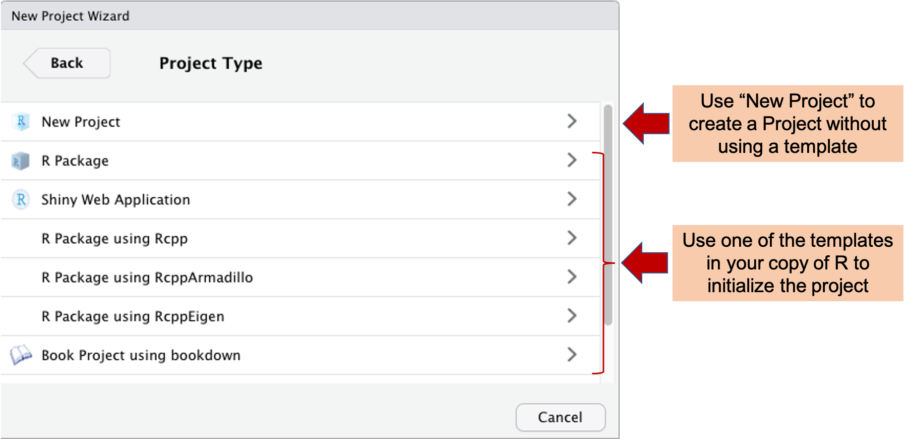
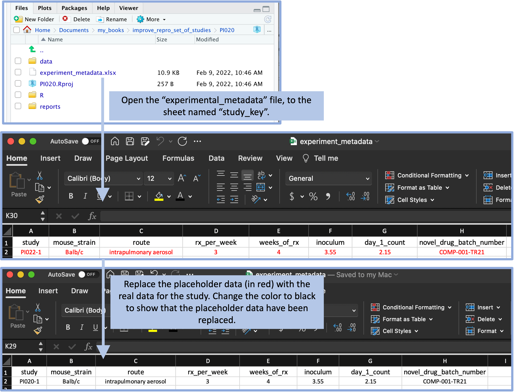
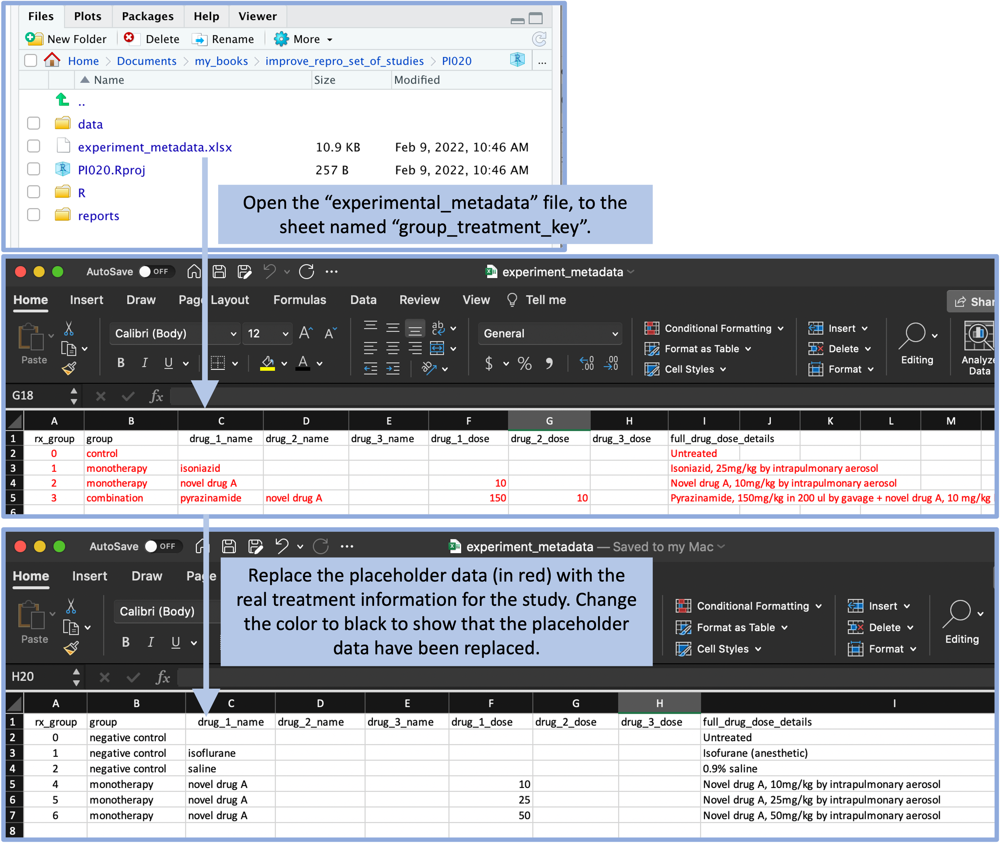
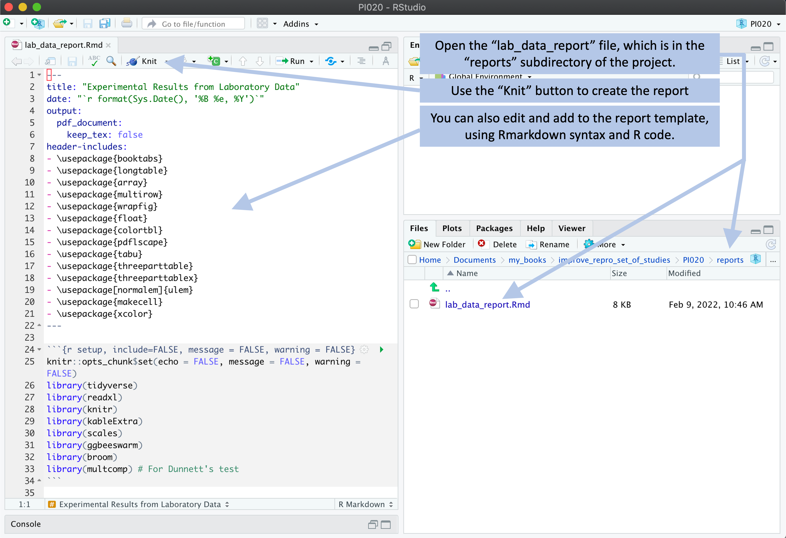
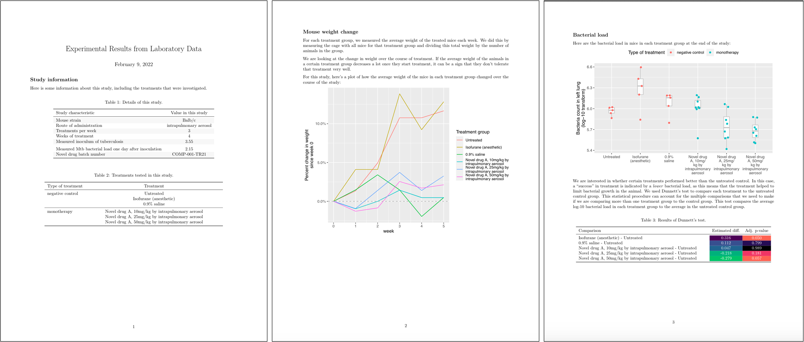
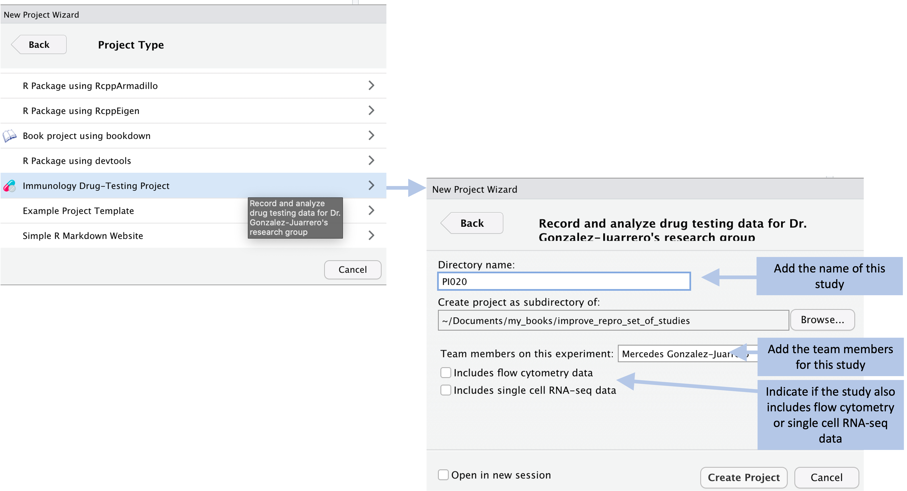

## Creating 'Project' templates {#module7}

Researchers can use RStudio's 'Projects' can facilitate collecting research
files in a single, structured directory, with the added benefit of easy use of
version control. Researchers can gain even more benefits by consistently
structuring all their 'Project' directories. We will demonstrate how to
implement structured project directories through RStudio, as well as how RStudio
enables the creation of a 'Project' for initializing consistently-structured
directories for all of a research group's projects.

**Objectives.** After this module, the trainee will be able to:

- Be able to create a structured `Project` directory within RStudio
- Understand how RStudio can be used to create 'Project' templates

The last module describe the advantages of organizing all the files for a 
research project within a single file directory, as well as the added 
advantages of making that file directory an RStudio "Project". In this 
module, we'll walk through the steps required to do that, as well as 
how to navigate and use the "Project" structure and functionality to 
make it easier to integrate project files, code, and final output like
reports and presentation slides. If you have created a standardized
file directory structure that you will use as a starting point for all of 
your research projects, then it can save time to create an RStudio Project
Template with this structure. This way, you can set up a new directory, 
including all the subdirectories you want to use and any code or report
templates that might be useful, by just opening a new project with this
template through RStudio. 

...


To start, let's look at how we can organize the files from this set of studies
into a directory in an efficient way. ...

...

The full directory of files for this example can be found at [GitHub address], 
where you can download them or explore them online. All files for this
project can be stored within a well-designed directory, and this directory 
can be enhanced into something called an R Project very easily. In this
module, we'll explore how to use an R Project and what advantages it 
offers compared to other ways of organizing the files associated with 
a study. In particular, we'll build on ideas from earlier modules about
creating reproducible data collection templates, as in this example, the 
use of a common template across many studies in a set makes it very 
easy to create and apply a common reporting template to the data, easily 
creating a reproducible report for each of the nineteen studies in the 
example set of studies. Further, we'll look at how this organization
allows not only for reporting on specific studies in a reproducible way, 
but also makes it easier to create an overall report that combines 
results and details from all studies in the set. 

...

### Making an existing file directory an RStudio Project

It's very easy to turn an existing file directory into an RStudio Project. 
Open RStudio, and then in its menu go to "File" and then "New Project". 
This will open a pop-up window with several options, including the option to
create a new RStudio Project from an existing directory. Choose this option, 
and then in the window that is opened, navigate through your file directories
to the directory with your project files. 

This will create a new RStudio Project with the same name as the file directory 
name of the directory you selected [check this]. Once you have created the 
directory, RStudio will automatically move you into that Project. When you 
close RStudio and reopen it, it will automatically open in the last Project
you had open. There is a small tab in the top right hand corner of the RStudio
window that lists the project you are currently in. To move to a different Project, 
you can click on the down arrow beside this project name. There will be a list
of your most recent projects, as well as options to open any Project on your 
computer. If you want to work in RStudio, but not in any of the Projects, you can 
choose to "Close Project".

When you are working in an RStudio Project, RStudio will automatically move your
working directory to be the top-level directory of the Project directory. This
makes it easy to write code that uses this directory as the presumed working 
directory, using relative file paths to identify and files within the directory. 
For example ... . Now if you share the project directory with someone else, they
can similarly open the RStudio Project in their own version of RStudio, and all 
the relative pathnames to files should work on their system without any problems.
This feature helps make code in an RStudio Project directory reproducible across 
different people's computers. 

The RStudio Project environment has some other features, as well, that may be
useful for some projects. For example, if you are tracking the project directory
under the git version control system, then when you open the RStudio Project, 
there will be a special tab in one of the panes to help in using git with the 
project. This tab provides a visual interface for you to commit changes you've made, 
so they are tracked and can be reversed if needed, and also so you can easily 
push and pull these committed changes to and from a remote repository, like a 
GitHub repository, if you are collaborating with others. 

For certain types of projects, you may also want to include a "Makefile". [More
about Makefiles]. If you add this to an RStudio Project, you will get a new
"Build" tab that allows you to run the Makefile for the project with the click of 
a button. For some more complex RStudio Projects, like projects that use RMarkdown
to create online books or websites using `bookdown` and `blogdown`, this "Build" 
pane will allow you to render the whole book. 

### Making an RStudio Project Template

If you have created a template directory for research projects for your group,
you can create an RStudio Project template to make it easy to set up a new
project directory every time you start a project. At its most basic, this can be
a directory that includes the subdirectories (with standardized names for each
subdirectory) that you want to include---for example, you may know that you will
always want the project directory to include subdirectories for "raw_data" (with
its own subdirectories for different types of data, for example for "cfus" and
"flow"), "data" (with clean versions of the data, after conducting and needed
preprocessing, like calculating CFUs in a sample based on data from plating at
different dilutions, or the output from gating flow cytometry data), "reports"
(for writing, posters, and presentation slides), and "R" (for common scripts
that you use for preprocessing, visualization, and data analysis).

As you progress, you may also want to add templates that serve as a starting point
for files within this project. For example, if you always want to collect 
observed data in a standard way, you could create a template for data collection, 
for example as a CSV file. Each researcher in your lab could copy and rename this 
file each time they collect a new set of data---by ensuring a common structure
when collecting the data, including file format, column names, and so on, you can
build code scripts that will work on data collected for all your experiments. You 
may also have some standard reports that you want to create with types of data
you commonly collect, and so you could include templates for those reports in your
R Project template. Again, these can be copied and adapted within the project---the
template serves as a starting point so you don't have to start with a blank slate 
with every project, but it is not restrictive and can be adapted to each project
as you work on that project.

[How to create a template]

You can have different templates to use when you create a new project. A
template will provide a basic set-up for the project. For example, R packages
are created within a directory, and package developers now often use an R
Project for that directory. Since R packages have a consistent set of usual
subdirectories---including subdirectories for R code, data, and documentation
and a file for metadata---there is now a Project Template specificially for R
package development, and this sets up a directory with some of the typical
subdirectories and files needed for these projects. 

You may find, similarly, that there are typical structures and files that your
research laboratory includes in the R Projects it creates for research projects. 
In this case, someone in your lab can create an R Project template that can 
be used each time a new project is initialized for the lab. This will help 
create consistency across projects in the directory structure, which can 
facilitate the use and re-use of automated tools like code scripts across
different experiments. 

When you create a new project in R, you will have the option to use any of 
the available project templates currently downloaded to your copy of R
[@rstudioprojecttemplate]. To create a new project, go to the "File" menu
in the top menu bar in RStudio, and then choose "New Project". This will open
a pop-up box like the one shown in Figure \@ref(fig:createnewproject). 

```{r createnewproject, fig.cap = "Creating a new project in RStudio. When you chose 'File' then 'New Project' from the RStudio menu, it opens the New Project Wizard shown here. You have the option to create a new project that is not based on a project template by selecting 'New Project'. You also have the chance to create a project using a template by selecting one of the templates. The listed templates will depend on which packages you have downloaded for your copy of R. For example, here the `bookdown` package has been installed for the local copy of R, and so a template is available for 'Book Project using bookdown'.", fig.fullwidth = TRUE, out.width = "\\textwidth"}

```

This pop-up contains the New Project Wizard in RStudio. Here, you can either
create a new Project without using a template (click on "New Project") or you
can create a Project starting from a template. The templates available in your
copy of R will be listed below the "New Project" listing. Depending on which
packages you've installed for your copy of R, you will have different choices of
project templates available, as project templates tend to be created and shared
within R packages [@rstudioprojecttemplate]. In the example shown in 
Figure \@ref(fig:createnewproject), for example, one of the template options is
for a "Book Project using bookdown", available because the `bookdown` R package
has been installed locally.

### Setting up a useful template


```{r replacingplaceholdermetadata, fig.fullwidth = TRUE, echo = FALSE, out.width = "\\textwidth", fig.cap = "The template includes a file with experiment metadata, with a sheet for recording the overall details of the experiment. A user can open this file and replace the placeholder values (in red) with real values for the experiment. By changing the text color to black, the user can have a visual confirmation that the placeholder data have been replaced with real study data."}

```

```{r replacingplaceholdertreatment, fig.fullwidth = TRUE, echo = FALSE, out.width = "\\textwidth", fig.cap = "The template includes a file with experiment metadata, with a sheet for recording the details of each treatment. A user can open this file and replace the placeholder values (in red) with real values for the treatments in the experiment. By changing the text color to black, the user can have a visual confirmation that the placeholder data have been replaced with real study data."}

```

```{r makingareport, fig.fullwidth = TRUE, echo = FALSE, out.width = "\\textwidth", fig.cap = "Example of how a user can create a report from the template. The template includes an example report, which is written using RMarkdown. The user can open this template report file and use the 'Knit' button in RStudio to render the file. As long as the experimental data are recorded using the data template files, the code for this report can process the data to generate a report from the data. The user can also make changes and additions to the template report."}

```

```{r examplereport1, fig.fullwidth = TRUE, echo = FALSE, out.width = "\\textwidth", fig.cap = "Example of the output from 'knitting' a report from the project template"}

```

### Creating 'Project' templates in RStudio 

```{r exampleprojectwizard, fig.fullwidth = TRUE, echo = FALSE, out.width = "\\textwidth", fig.cap = "To make it easier for members of a group to use a project template, the group can create an official R template for the type of project. Once this type of template is created, a user can access it as a choice when creating a new R Project from RStudio. When doing so, a box will pop up with options for setting up the project. In this example, the user can specify the members of the research team and indicate if the experiment will include data from flow cytometry or single cell RNA-sequencing, in which case the Project will include subdirectories to store these types of data, as well as data recorded in the laboratory."}

```

Your research group can create your own Project templates. You will need to
create them within an R package, but this package does not need to be posted to
a public site like CRAN. Instead, it can be shared exclusively among the
research group as a zipped file that can be installed directly from source onto
each person's computer. Alternatively, you can post the package code as a GitHub
repository, and there are straightforward tools for installing R package code
from GitHub onto each team member's computer. RStudio has provided a 
detailed guide to creating your own project template at 
https://rstudio.github.io/rstudio-extensions/rstudio_project_templates.html.
This topic has also been discussed through a short talk at the
yearly RStudio::conf: https://rstudio.com/resources/rstudioconf-2020/rproject-templates-to-automate-and-standardize-your-workflow/.

> "RStudio v1.1 introduces support for custom, user-defined project templates.
Project templates can be used to create new projects with a pre-specified
structure." [@rstudioprojecttemplate]

> "R packages are the primary vehicle through which RStudio project templates
are distributed. Package authors can provide a small bit of metadata describing
the template functions available in their package---RStudio will discover these
project templates on start up, and make them available in the New Project...
dialog." [@rstudioprojecttemplate]

> "R experts keep all the files associated with a project together---input data,
R scripts, analytical results, figures. This is such a wise and common practice
that RStudio has built-in support for this via **projects**." [@wickham2016r]

### Discussion questions
