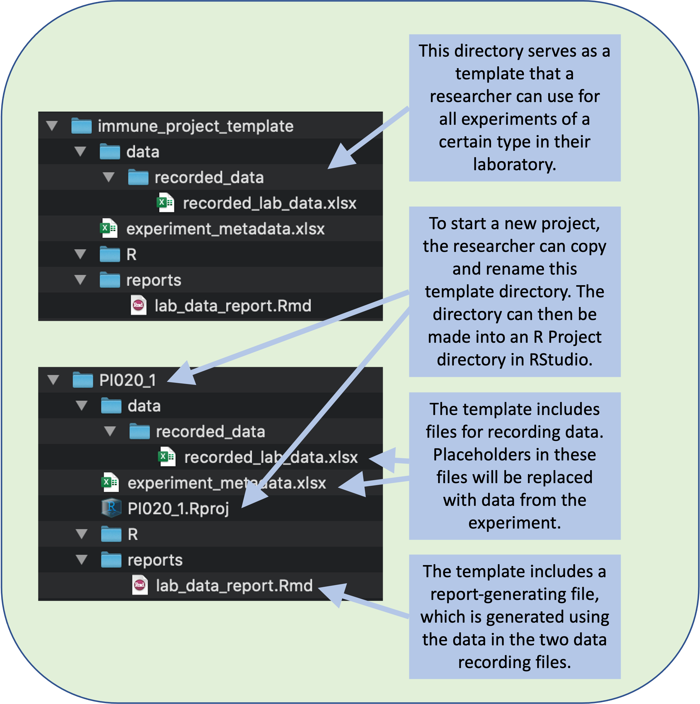
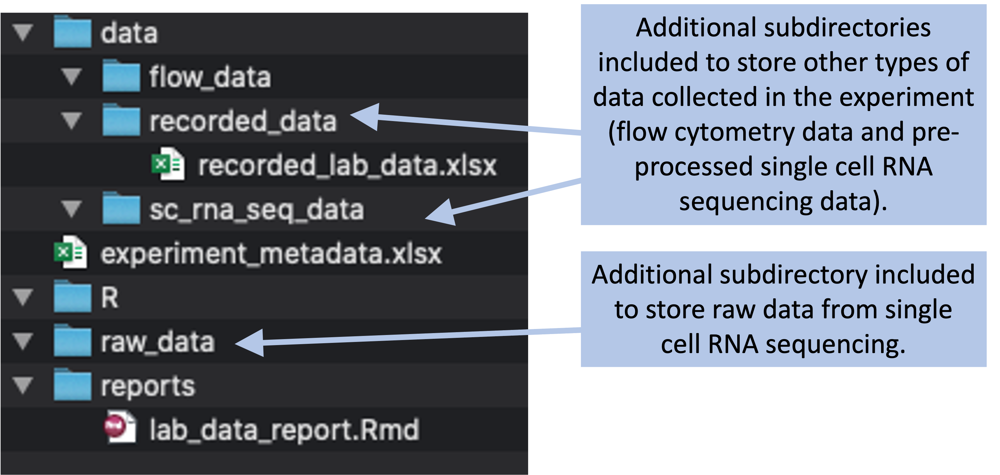
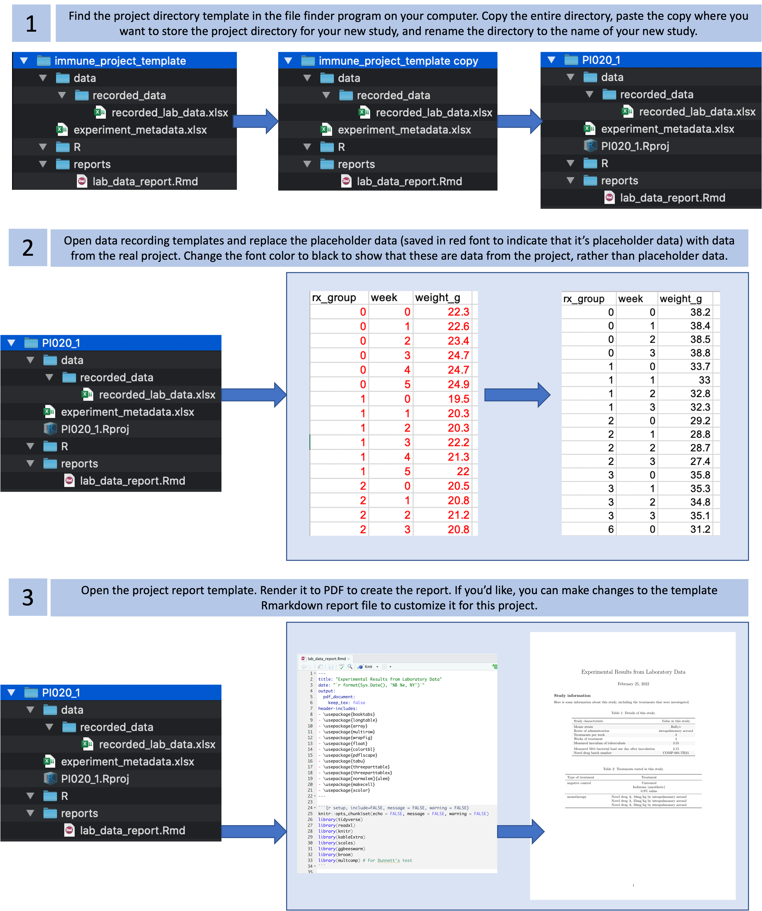

## Creating project directory templates {#module7}

Researchers can develop project directory templates to facilitate collecting research
files in a single, structured directory, with the added benefit of easy use of
version control. Researchers can gain even more benefits by consistently
structuring all their project directories. We will demonstrate how to
implement structured project directories through RStudio, as well as how RStudio
enables the creation of a 'Project' for initializing consistently-structured
directories for all of a research group's projects.

**Objectives.** After this module, the trainee will be able to:

- Be able to designed a structured project directory template for 
research projects
- Understand how RStudio can be used to create 'Project' templates

The last module described the advantages of organizing all the files for a
research project within a single file directory, and the added advantages of
using a consistent structure for the project directories for all of the
experiments or projects in your research group. In this module, we'll walk
through the steps required to design and create a template for your project
directories. In particular, we'll build on ideas from earlier modules about
creating reproducible data collection templates, as these can form key
components of the template for project directories.

At its most basic, a template for a project directory is a computer file
directory that includes the subdirectories (with standardized names for each
subdirectory) that you want to include---for example, you may know that you will
always want the project directory to include subdirectories for "raw_data" (with
its own subdirectories for different types of data, for example for "cfus" and
"flow"), "data" (with clean versions of the data, after conducting any needed
preprocessing, like calculating colony-forming units in a sample based on data
from plating at different dilutions, or the output from gating flow cytometry
data), "reports" (for writing, posters, and presentation slides), and "R" (for
common scripts that you use for preprocessing, visualization, and data
analysis). Creating and using a common template for you directory structure for
projects will help create consistency across projects in the directory
structure, which can facilitate the use and re-use of automated tools like code
scripts across different experiments.

```{r templatedirectory, fig.fullwidth = FALSE, echo = FALSE, out.width = "\\textwidth", fig.cap = "A research group can create a file directory that will serve as a template for all the experiments of a certain type in your laboratory. The template can include templates of files for data recording and for generating reports. To start recording data for a new experiment, a researcher can copy and rename this template directory."}

```

Designing a project template will include two parts---first, designing a 
*conceptual* template for your file organization and, second, creating a 
*physical* implementation of that concept. The conceptual template will 
develop a structure for how you'll organize and name files within a project
directory. The physical template will use these ideas to develop a blank file
directory that follows that organization and that you can copy, paste, and 
adapt each time you start a new project. 

This is a process of *designing*, and so you will find it helpful to follow
principles that facilitate the design process. For example, as you design, it's
useful to keep in mind the resources that you have available [@osann2020design].
In this case, the key resources are the file directory and organization system,
as well as simple file types, that are available through modern
computer operating systems. Many of these are based on the Unix file directory
system and file designs.

### Designing a project template 

One critical step in the design process is to iterate: make a first version of
something (a prototype) and then try it out to see how it works, then revise and
improve based on what you find out in practice [@osann2020design]. In this case,
that means creating a project directory template, but considering it a first
draft until you try it in practice. You can refine this template once you've
tried it and identified where it works and where it doesn't.

Before you open your computer to make a "physical" template, you should design
it. This involves deciding what types of data will go into a project directory,
how those files will be structured within the directory, the naming conventions
for files, and so on. In other words, you should create a blueprint from
your template before you make it on your computer.

The step of creating a blueprint for your project directory template is a design
process. As you work on it, you will want to prioritize how the template will
fit the needs of the user---your research group. One of the key early steps in
the design process is to observe [@osann2020design]. This lets you get a
firmer idea of what problem you're trying to solve and what is needed to solve
this. Another early step is to synthesize based on what you've observed
[@osann2020design]. This allows you to think about a variety of needs and
prioritize and refine them so that you have a very clear criteria to determine
if what you design is successful in addressing the problem you were trying to
solve.

As you decide how to organize project files within a directory, it is worthwhile
to take some time to think about the types of files that are often generated by
your research projects, because there are also big advantages to creating a
standard structure of subdirectories that you can use consistently across the
directories for all the projects in your research program. Of course, some
projects may not include certain files, and some might have a new or unusual
type of file, so you can customize the directory structure to some degree for
these types of cases, but it is still a big advantage to include as many common
elements as possible across all your projects.

One of the best ways to get an idea of what your research
group needs within a project directory is to take a survey of past research
projects from your group. Make a list of what types of data were collected and
what types of preprocessing and analysis were done using those data. For each
type of data, it's helpful to make a note of the file type it's usually stored
in and the typical size of the files. How are data for a specific assay divided
across files? Are the data for all animals and all timepoints included in a
single spreadsheet file? If so, are they saved in the same sheet, or divided
across sheets? Conversely, are different files used for the data from different
animals or different time points?

This is also a good stage to diagnose if there are data collection files that
are not successful in separating data collection from data preprocessing and
analysis (module 2.1). As you progress, you may also want to add templates that
serve as a starting point for data collection files and report files within this
project. For example, if you always want to collect observed data in a standard
way, you could create a template for data collection, for example as a CSV file.
This idea of creating data collection templates is described in detail in
modules 2.4 and 2.5.

With a data collection template for collecting a certain type of data, each
researcher in your lab could copy and rename this file each time they collect a
new set of data---by ensuring a common structure when collecting the data,
including file format, column names, and so on, you can build code scripts that
will work on data collected for all your experiments. You may also have some
standard reports that you want to create with types of data you commonly
collect, and so you could include templates for those reports in your R Project
template. Again, these can be copied and adapted within the project---the
template serves as a starting point so you don't have to start with a blank
slate with every project, but it is not restrictive and can be adapted to each
project as you work on that project.

In addition to the data that you record in the laboratory by hand, you may also
typically have data that's generated and recorded by laboratory equipment. For
example, the type of study may often include data collected from flow cytometry,
to measure certain cell populations in samples, or from mass spectometry, to
measure levels of certain molecules. For these data, the recording format will
typically be determined by the equipment, and so you won't need to create data
collection templates for the data. However, you should store these data files in
your project directory as well, where they are easy to access and integrate with
other data as you analyze the data for the study.

The recorded data files and the files that come directly from equipment can all
be considered raw data files. In addition, you may typically create some files
with pre-processed data. For example, if you have flow cytometry data, you may
initially get large files in a format specific to flow cytometry ("fcs" files)
from the equipment. You may use a program to pre-process these files, for
example, to manually gate the data to identify specific cell populations. In
addition to saving the raw data files directly from the flow cytometer, you'll
also want to save the processed data files in your project directory, since
these are the files that you'll analyze and integrate with other data from the
project.

You could create
subdirectories both for the raw data and for the processed data that result from
pre-processing steps. For example, you might want to store the raw fcs files
within a subdirectory called "data_raw" and the processed (gated) csv files
within a subdirectory called "data". 

With the previous steps, you will have determined the types of files you
normally have for this type of study, as well as structured the project
directory to organize these files. The next step is to create a template report.
You can create this using tools for reproducible reports---in R, a key tool for
this is RMarkdown. Here, we'll cover using this tool for creating a report
briefly, but there are many more details in modules 3.7 through 3.9. Briefly,
RMarkdown allows you to include both code and text meant for humans within a
single, plain text document. This document can then be rendered, a process that
executes the code and formats the text meant for humans, producing a document in
an easy-to-read format like Word or PDF.

Once you have determined the types of files that you'll normally include in your
project, you can decide how to organize them into subdirectories in a project
file directory. As you do this, it will be helpful to have example or template
files for each file type. For data that you will record yourself, these can be
the templates that you developed to collect the data in a tidy format (modules
2.3 through 2.5), while for data from equipment, these can just be one or more
example files from the equipment that you have collected for a past project.
Having these example files will help you to develop a template project report
that can input the type of data that you typically collect for this type of
project.


```{r projecttemplatecomplex, fig.cap = "Example of a more complex project directory structure that could be created, with directories added to store data collected through flow cytometry and single cell RNA sequencing.", fig.fullwidth = FALSE, out.width = "\\textwidth"}

```

> "Not all organizational methodologies are created equal. One could be spotlessly 
organized, with everything put away and labeled and color coded, and it could feel 
like a prison with the walls closing in around you. Another could be equally organized
but a bit more open and exposed, and it could untap creative genius like no other space 
you've worked in." [@savage2020every]

> "What truly unifies my shops, especially as I got more experienced, is that they are 
each built on two, simple philosophical pillars: 1) I want to be able to see everything
easily; and 2) I want to be able to reach everything easily." [@savage2020every]

When you create a project directory template, we recommend that you create a
subdirectory named something like "reports" to use to store any Rmarkdown report
files for the project. This organization will make it clear where you've stored
your reports in the project directory. You'll be able to use file and directory
pathnames to access all the data in the project, so it will be easy to use the
study's data in the report even if they're in separate subdirectories.

### Creating and using a project template

Once you have a blueprint for a template for your project directories, you can
create this template as a directory on your computer. This will serve as a
prototype to test. A prototype doesn't have to be fully refined, just built out
enough that the users can test it out [@osann2020design].

This process is, once you have designed the template, very easy. It involves no
fancy tools---in fact, it's so straightforward that at first it might seem too
simple to be useful. For this basic approach, you will create an example file
directory that includes template files and that captures you desired project
directory structure. When you are ready to start a new project, you will copy
this template, rename the copy to be specific to the new project, and then use
this directory to store and work with the data you collect for the project.

This process, therefore involves creating a basic file
directory with the desired template files and file directory structure and then
copying this file directory every time you want to start a new project for a
study in this set of studies. When you are ready to start a new project, you
will copy this template, rename the copy to be specific to the new project, and
then use this directory to store and work with the data you collect for the
project.

Within your templates, you may find it useful to include "placeholders". Instead
of leaving the areas where data will be recorded blank, you can put in examples
that show the format of how the data should be collected. By using a color for 
these placeholders, you can clarify that they are meant to be erased and replaced
with the real data once a person starts using the template. 

Figure \@ref(fig:replacingplaceholdertreatment) gives an example of how 
placeholders can work in a data collection template that's included in a 
project directory template. 

```{r replacingplaceholdertreatment, fig.fullwidth = TRUE, echo = FALSE, out.width = "\\textwidth", fig.cap = "The template includes a file with experiment metadata, with a sheet for recording the details of each treatment. A user can open this file and replace the placeholder values (in red) with real values for the treatments in the experiment. By changing the text color to black, the user can have a visual confirmation that the placeholder data have been replaced with real study data."}
knitr::include_graphics("figures/project_replacing_placeholder_treatment_data.png")
```

Here are some specific steps to create the files for the project directory
template:

1. Review the list of data you typically collect or files you create for that
type of study or experiment, a list you created when designing the blueprint for
the directory template
2. Create template files for any data collection that is typical for that type
of study or experiment. Use example or placeholder data to create examples of
those files.
3. Create a directory structure that divides the types of files into
subdirectories of similar types.
4. Create one or more templates of report files that access and report on the
data in the project template

In modules 2.4 and 2.5, we showed how you can create tidy data collection
templates to use to collect data, and how these can be paired with reproducible
reporting tools to separate the steps of data collection and reporting (modules
3.7 through 3.9 go into much more depth on these reproducible reporting tools).
Once you have decided on the types of data that you will usually collect for the
type of study that this template is for, you can use that process to create tidy
data collection templates for each type of data.

> "In parallel with this chronological directory structure, I find it useful to maintain a chronologically organized lab notebook. This is a document that resides in the root of the results directory and that records your progress in detail. Entries in the notebook should be dated, and they should be relatively verbose, with links or embedded images or tables displaying the results of the experiments that you performed. In addition to describing precisely what you did, the notebook should record your observations, conclusions, and ideas for future work. Particularly when an experiment turns out badly, it is tempting simply to link the final plot or table of results and start a new experiment. Before doing that, it is important to document how you know the experiment failed, since the interpretation of your results may not be obvious to someone else reading your lab notebook." [@noble2009quick]

Once you set up this template, a researcher in your group can initialize a project
for a new experiment by copying the template directory and renaming it to the name
of the experiment. They can then open the directory and replace any placeholder
data in the project files with real data from the experiment. 

Figure \@ref(fig:basicprojecttemplateuse) gives a basic walk-through of the
simple steps you'll use to start a new project directory once you've created
this type of template (we will cover this example in much more detail in the
next module). First, you will find the project directory template in your
computer's file system, copy it to where you'd like to save the files for the
new project, and rename the directory to your new project's name. Next, you'll open
the data collection template files and replace the placeholder example data in
the template (shown in red font) with the real data from your study. The
placeholder data can help you remember the format you should use to record the
real data. Finally, once you've recorded the data for the study or experiment,
you can open the example report template file. If you've designed this report
template well, it should run with the new data you've recorded to create a
report for the experiment. At this stage, you can add to the report or customize
it for the new project by changing the Rmarkdown file and re-rendering it to
update the report.

```{r basicprojecttemplateuse, fig.cap = "Steps in using a basic project directory template that you have created for a type of study or experiment.", fig.fullwidth = TRUE, out.width = "\\textwidth"}

```

This template is not restrictive---it serves as a starting point, but it can 
be adapted for each specific project. For example, if you are collecting 
data from an assay that you have not used in past experiments, you can add 
a new data subdirectory to your project directory to use for storing that new
type of data. However, you do want to keep a balance, where you avoid 
unneeded changes to the project template within each specific project's 
directory. This is because many of the benefits of standardizing (e.g., 
knowing where things are, building tools that leverage the standardized 
directory structure) are lost as the directories for specific projects grow
to be more and more different from each other. 

The report template is included in the project directory template, so it will be
copied and available for you to use anytime you start a new project using that
template. However, you are not obligated to keep the report identical to the
template. Instead, the template report serves as a starting point, and you can
add to it or adapt it as you work on a study.

### Project directories as RStudio Projects

If you are using the R programming language for data preprocessing, analysis,
and visualization---as well as RMarkdown for writing reports and
presentations---then you can use RStudio's "Project" functionality to make it
even more convenient to work with files within a research project's directory.
You can make any file directory a "Project" in RStudio by chosing "File" ->
"New Project" in RStudio's menu. This gives you the option to create a 
project from scratch or to make an existing directory and RStudio Project. 

When you make a file directory an RStudio Project, it doesn't change much in 
the directory itself except adding a ".RProj" file. This file keeps track of 
some things about the file directory for RStudio, including preferred settings
for RStudio to use when working in that project. Also, when you
open one of these Projects in RStudio, it will move your working directory 
into that projects top-level directory. This makes it very easy and practical 
to write code using relative pathnames that start from this top-level of the
project directory. This is good practice, because these relative pathnames
will work equally well on someone else's computer, whereas if you use file 
pathnames that are absolute (i.e., giving directions to the file from the root
directory on your computer), then when someone else tries on run the code on their
own computer, it won't work and they'll need to change the filepaths in the code, 
since everyone's computer has its files organized differently. For example, if you, 
on your personal computer, have the project directory stored in your "Documents" 
folder, while a colleague has stored the project directory in his or her "Desktop"
directory, then the absolute filepaths for each file in the directory will be
different for each of you. The relative pathnames, starting from the top level of 
the project directory, will be the same for both of you, though, regardless of 
where you each stored the project directory on your computer. 

There are some other advantages, as well, to turning each of your research
project directories into RStudio Projects. One is that it is very easy to
connect each of these Projects with GitHub, which facilitates collaborative work
on the project across multiple team members while tracking all changes under
version control. This functionality is described in modules 2.9 through 2.11.
 
Having your project directories as R Projects makes it easy to navigate among
different projects. When you close RStudio and reopen it, it will automatically
open in the last Project you had open. There is a small tab in the top right
hand corner of the RStudio window that lists the project you are currently in.
To move to a different Project, you can click on the down arrow beside this
project name. There will be a list of your most recent projects, as well as
options to open any Project on your computer. If you want to work in RStudio,
but not in any of the Projects, you can choose to "Close Project".

When you are working in an RStudio Project, RStudio will automatically move your
working directory to be the top-level directory of the Project directory. This
makes it easy to write code that uses this directory as the presumed working 
directory, using relative file paths to identify and files within the directory. 
Further, if you share the project directory with someone else, they
can similarly open the RStudio Project in their own version of RStudio, and all 
the relative pathnames to files should work on their system without any problems.
This feature helps make code in an RStudio Project directory reproducible across 
different people's computers. 

The RStudio Project environment has some other features, as well, that may be
useful for some projects. For example, if you are tracking the project directory
under the git version control system, then when you open the RStudio Project, 
there will be a special tab in one of the panes to help in using git with the 
project. This tab provides a visual interface for you to commit changes you've made, 
so they are tracked and can be reversed if needed, and also so you can easily 
push and pull these committed changes to and from a remote repository, like a 
GitHub repository, if you are collaborating with others. 

### Creating 'Project' templates in RStudio 

As you continue to use R and RStudio's Project functionality, you may want to
take the template directory for your project and create an RStudio Project
template based on its structure. Once you do, when you start a new research
project, you can create the full directory for your project's files from within
RStudio by going to "File" -> "New Project" and then choosing to create a new
project based on that template. The new project will already be set up with the
".RProj" file that allows you to easily navigate into and out of that project,
to connect it to GitHub, and all the other advantages of setting a file
directory as an RStudio Project. This takes a bit of time to set-up, but can
be a powerful tool in ensuring that researchers in your laboratory use a 
standardized format for project directories across many experiments.

When you create a new project in R, you will have the option to use any of 
the available project templates currently downloaded to your copy of R
[@rstudioprojecttemplate]. To create a new project, go to the "File" menu
in the top menu bar in RStudio, and then choose "New Project". This will open
a pop-up box like the one shown in Figure \@ref(fig:createnewproject). 

```{r createnewproject, fig.cap = "Creating a new project in RStudio. When you chose 'File' then 'New Project' from the RStudio menu, it opens the New Project Wizard shown here. You have the option to create a new project that is not based on a project template by selecting 'New Project'. You also have the chance to create a project using a template by selecting one of the templates. The listed templates will depend on which packages you have downloaded for your copy of R. For example, here the `bookdown` package has been installed for the local copy of R, and so a template is available for 'Book Project using bookdown'.", fig.fullwidth = TRUE, out.width = "\\textwidth"}
knitr::include_graphics("figures/create_new_project.png")
```

This pop-up contains the New Project Wizard in RStudio. Here, you can either
create a new Project without using a template (click on "New Project") or you
can create a Project starting from a template. The templates available in your
copy of R will be listed below the "New Project" listing. Depending on which
packages you've installed for your copy of R, you will have different choices of
project templates available, as project templates tend to be created and shared
within R packages [@rstudioprojecttemplate]. In the example shown in 
Figure \@ref(fig:createnewproject), for example, one of the template options is
for a "Book Project using bookdown", available because the `bookdown` R package
has been installed locally.


Your research group can create your own Project templates. This will allow 
you to use a standard template for your projects, just like we showed in the
last section. However, instead of needing to copy, paste, and rename the template
each time, if you create an official RStudio Project template, then the researcher
can chose to use this template under the "New Project" option in RStudio 
(Figure \@ref(fig:exampleprojectwizard)).

```{r exampleprojectwizard, fig.fullwidth = TRUE, echo = FALSE, out.width = "\\textwidth", fig.cap = "To make it easier for members of a group to use a project template, the group can create an official R template for the type of project. Once this type of template is created, a user can access it as a choice when creating a new R Project from RStudio. When doing so, a box will pop up with options for setting up the project. In this example, the user can specify the members of the research team and indicate if the experiment will include data from flow cytometry or single cell RNA-sequencing, in which case the Project will include subdirectories to store these types of data, as well as data recorded in the laboratory."}
knitr::include_graphics("figures/project_example_project_template.png")
```

To create your own Project template that can be used in this way, you will need to
create them within an R package, but this package does not need to be posted to
a public site like CRAN. Instead, it can be shared exclusively among the
research group as a zipped file that can be installed directly from source onto
each person's computer. Alternatively, you can post the package code as a GitHub
repository, and there are straightforward tools for installing R package code
from GitHub onto each team member's computer. RStudio has provided a 
detailed guide to creating your own project template at 
https://rstudio.github.io/rstudio-extensions/rstudio_project_templates.html.
This topic has also been discussed through a short talk at the
yearly RStudio::conf: https://rstudio.com/resources/rstudioconf-2020/rproject-templates-to-automate-and-standardize-your-workflow/.

> "RStudio v1.1 introduces support for custom, user-defined project templates.
Project templates can be used to create new projects with a pre-specified
structure." [@rstudioprojecttemplate]

> "R packages are the primary vehicle through which RStudio project templates
are distributed. Package authors can provide a small bit of metadata describing
the template functions available in their package---RStudio will discover these
project templates on start up, and make them available in the New Project...
dialog." [@rstudioprojecttemplate]

> "R experts keep all the files associated with a project together---input data,
R scripts, analytical results, figures. This is such a wise and common practice
that RStudio has built-in support for this via **projects**." [@wickham2016r]

### Discussion questions


------------------------------------------------------------------------

> "The goal of a research compendium is to provide a standard and easily
recognizable way for organizing the digital materials of a project to enable
others to inspect, reproduce, and extend the research. There are three generic
principles that define research compendia, independent of particular software
tools, and disciplinary contexts. 1. A research compendium should organize its
files according to the prevailing conventions of the scholarly community,
whether that be an academic discipline or a lab group. Following these
conventions will help other people recognize the structure of the project, and
also support tool building which takes advantage of the shared structure. 2. A
research compendium should maintain a clear separation of data, method, and
output, while unambiguously expressing the relationship between those three. In
practice, this means data files must be separate from code files. This is
important to let others easily identify how the original researcher operated on
the data to generate the results. Keeping data and method separate treats the
data as 'read-only,' so that the original data are untouched and all
modifications are transparently documented in the code. The output files should
be considered as disposable, with a mindset that one can always easily
regenerate the output using the code and data. The relationship between which
code operates on which data in which order to produce which outputs must be
specified as well. In his advice to industry data scientists, Ben Baumer’s
article in this collection similarly highlights the importance of keeping data
separate from the presentation of data, or research outputs. 3. A research
compendium should specify the computational environment that was used for the
original analysis. At its most basic, this could be a plain text file that
includes a short list of the names and version numbers of the software and other
critical tools used for the analysis. In more complex approaches, described
below, the computational environment can be automatically preserved or
reproduced as well." [@marwick2018packaging]

> "A third influential approach to organising research compendia can be found in lessons developed by the Reproducible-Research-Curriculum community (Curriculum Citation2016), the Data Carpentry (Teal et al. Citation2015) and Software Carpentry (Wilson Citation2013) organisations, Jenny Bryan’s (Citationn.d.) materials for her STAT545 course, and Karl Broman’s tutorials (Citation2016). These lessons are less prescriptive than Gandrud (Citation2013) and ProjectTemplate, focusing more on high-level guidance similar to the generic principles we described above."
[@marwick2018packaging]

Here are some key goals to consider when designing a template: 

- Keeping data collection and analysis separate
- Using simple file formats and tidy structures for recording data whenever 
possible (a larger number of simple files is easier to organize and work 
with than a smaller number of complex files)
- Create reports and analysis that incorporate data from different assays
for an experiment
- Make it easy to share all project files across the team
- Make it easy to share project files on a public repository
- Make it easy to track changes to files for a project

To "define the problem" [@osann2020design]: 

- Files for the project need to be stored in a single directory
- That directory needs to be easy to understand and navigate
- We want to have the same structure for many different projects, 
so it needs to be flexible enough to accomodate that
- Be able to find things easily

One paper (which goes even further and suggests structuring research project
files as R packages) suggests the following subdirectories in a project
directory [@vuorre2021sharing]: 

- data: Processed R datasets
- data-raw: Raw starting data, in any machine-readable format
- docs
- experiments: I think this is to write surveys, etc., that would run online?
- man: Help files for the R functions
- manuscript: Paper for the project, starting in a mark-up language and rendering to pdf
- model: Code for running models, can be rendered to pdf or HTML
- posters: Code for creating posters with RMarkdown (posterdown), renders to pdf or HTML
- R: Code for project-specific functions
- slides: Code for creating slides with RMarkdown, render to HTML
- vignettes

Here is the suggestion from another paper [@marwick2018packaging]: 

> "An ideal package-based file organization for a more complex project would look like this: 

> . A README.md file that describes the overall project and where to get started. It can be helpful to include graphical summary of the interlocking pieces of the project. 

> . Script files with reusable functions go in the R/ directory. If these functions are documented using Roxygen, then the documentation will be automatically generated in a man/ directory.

> .Raw data files are kept in the data/ directory. If your data are very large, or streaming, an alternative is to include a small-sample dataset so that people can try out the techniques without having to run very expensive computations.

> . Analysis scripts and reports files go in the analysis/ directory. In many cases it can be useful to give the analysis scripts ascending names, for example 001-load.R, 002-clean.R etc. This kind of file-naming helps with organisation, but it does not capture the full tree of dependencies in the way a Makefile or an R Markdown file does. To manage more complex workflows, the analysis/ directory could include either an R markdown file, a Makefile or a Makefile.R file. These files are important because they control the order of the code execution. In more complex projects, careful use of caching or a Makefile can save time by only running code that has not changed since it was last run.

> . A DESCRIPTION file in the project root provides formally structured, machine- and human-readable information about the authors, the project license, the software dependencies, and other metadata of the compendium. When a DESCRIPTION file is included along with the other items above, then the compendium is also a formal, installable R package. When your compendium is an R package, you can take advantage of many time-saving tools for package development, testing, and sharing (e.g., the devtools package that we noted above). R’s built-in citation() function can use that metadata, along with references to any publications that result from the project, to provide users with the necessary information to cite your work.

They provide some more details on some subdirectories: 

> "The R/ directory contains custom functions that are used repeatedly throughout the project. The man/ directory contains the manual (i.e., documentation) for the use of the functions." [@marwick2018packaging]

Another project (workflowr) suggests the following subdirectories [@blischak2019creating]: 

- analysis: Rmd files with code to visualize, model, etc.
- code: "intended for longer-running scripts, compiled code (e.g., C++)
and other source code supporting the data analysis" [@blischak2019creating]
- data: "for storing raw data files" [@blischak2019creating]
- docs: Generated results from Rmd files (HTMLs that can be posted online)
- output: "for saving processed data files and other outputs generated by 
the scripts and analyses" [@blischak2019creating]

They note that you want a directory setup that is "flexible and configurable"
[@blischak2019creating].

Another paper notes some of the key characteristics that can help make 
a project reproducible: 

> "Using this literature as a guideline, we identify several key features of reproducible work. These recommendations are a matter of opinion—due to the lack of agreement on which components of reproducibility are most important, we select those that are mentioned most often, as well as some that are mentioned less but that we view as important.
1. A well-designed file structure:
1. a. Separate folders for different file types.
1. b. No extraneous files.
1. c. Minimal clutter.
2. Good documentation:
2. a. Files are clearly named, preferably in a way where the order in which they should be run is clear.
2. b. A README is present.
2. c. Dependencies are noted.
2. d. Code files contain descriptive comments.
3. Reproducible file paths:
3. a. No absolute paths, or paths leading to locations outside of a project's directory, are used in code—only portable (relative) paths.
[Others not related to directory structure]." [@bertin2021creating]

One R package, designed to set-up a project directory structure, suggests
including a README file not only in the top-level directory, but also in 
each subdirectory [@prodigenr]. That project incorporates the following
subdirectories: 

- R, "Should contain the R scripts and functions used for the analysis"
- data, "If relevant, is where the processed (or simulated) data that is 
used for the project as well as the results of the project's analysis"
- data-raw "If relevant, is where the scripts that process the raw data
into the usable data are kept and, optionally where the raw data is 
also kept"
- doc, "Should contain the files related to presenting the project's 
scientific output. Already has the report / manuscript inside". Can 
include the report, but also slides and other reporting output. 

> "Within a given project, I use a top-level organization that is logical, with chronological organization at the next level, and logical organization below that. A sample project, called msms, is shown in Figure 1. At the root of most of my projects, I have a data directory for storing fixed data sets, a results directory for tracking computational experiments peformed on that data, a doc directory with one subdirectory per manuscript, and directories such as src for source code and bin for compiled binaries or scripts. Within the data and results directories, it is often tempting to apply a similar, logical organization. For example, you may have two or three data sets against which you plan to benchmark your algorithms, so you could create one directory for each of them under data. In my experience, this approach is risky, because the logical structure of your final set of experiments may look drastically different from the form you initially designed. This is particularly true under the results directory, where you may not even know in advance what kinds of experiments you will need to perform. If you try to give your directories logical names, you may end up with a very long list of directories with names that, six months from now, you no longer know how to interpret.
Instead, I have found that organizing my data and results directories chronologically makes the most sense. Indeed, with this approach, the distinction between data and results may not be useful. Instead, one could imagine a top-level directory called something like experiments, with subdirectories with names like 2008-12-19. Optionally, the directory name might also include a word or two indicating the topic of the experiment therein. In practice, a single experiment will often require more than one day of work, and so you may end up working a few days or more before creating a new subdirectory. Later, when you or someone else wants to know what you did, the chronological structure of your work will be self-evident.
Below a single experiment directory, the organization of files and directories is logical, and depends upon the structure of your experiment. In many simple experiments, you can keep all of your files in the current directory. If you start creating lots of files, then you should introduce some directory structure to store files of different types. This directory structure will typically be generated automatically from a driver script, as discussed below." [@noble2009quick]

This project also incorporates "TODO.md" in the top level of the project
directory, as well as a "DESCRIPTION" file that "includes metadata about
your project, in a machine readable format, and that also stores a list
of the R packages your project depends on" [@prodigenr].

