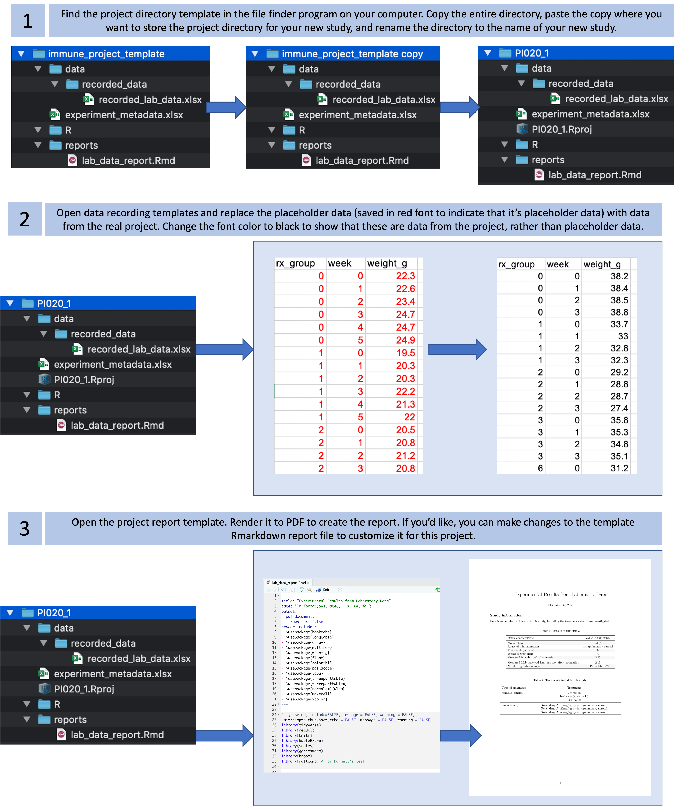

## Example: Creating a 'Project' template {#module8}

We will walk through a real example, based on the experiences of one of our
Co-Is, of establishing the format for a research group's 'Project' template,
creating that template using RStudio, and initializing a new research project
directory using the created template. This example will be from a
laboratory-based research group that studies the efficacy of tuberculosis drugs
in a murine model.

**Objectives.** After this module, the trainee will be able to:

- Create a 'Project' template in RStudio to initialize consistently-formatted
'Project' directories
- Initialize a new 'Project' directory using this template

For this module, we'll show how to create an R Project template to manage data
from the example set of studies that we described in module 2.7. As a reminder,
this example set of studies covers a group of studies to explore novel
treatments for tuberculosis. Each study investigates how mice that are
challenged with tuberculosis respond to different treatments, both in terms of
how well they handle the treatment (assessed by checking if their weight
decreases notably while on treatment) and also how well the treatment manages to
limit the growth of tuberculosis in the mouse's lungs.

We will walk through the process of creating a project directory template that could
be used to manage and analyze data from any of the specific studies in this set of 
studies. We'll cover two ways that you could do this. The first is simpler---it involves
creating a basic file directory with the desired template files and file directory 
structure and then copying this file directory every time you want to start a new
project for a study in this set of studies. The second way is a bit more complex and 
time-consuming to set up, but has the benefit of providing a very nice interface for 
members of your laboratory group to use when they start a new project. This second way
is to create a full R Project template that can be accessed from RStudio anytime you 
create a new R Project. This type of template may not be worth the extra set-up time
for project types that your research group only uses rarely, but for types of projects
that your group conducts time and time again, it can be a powerful way to enforce a common
project directory structure, and this in turn will allow your group to create reusable
tools that work in coordination with this project structure. 

### Creating and using a basic template

Let's start by looking at the more basic way to create a project template. This involves 
no fancy tools---in fact, it's so straightforward that at first it might seem to simple 
to be useful. For this basic approach, you will create an example file directory that 
includes template files and that captures you desired project directory structure, and
then members of your group will copy and rename that template every time they start a 
new project of that type. 

Figure \@ref(fig:basicprojecttemplateuse) gives a basic walk-through of the
simple steps you'll use to start a new project directory once you've created
this type of template. First, you will find the project directory template in
your computer's file system, copy it to where you'd like to save the files for
the new project, and rename the directory to your new project's name. At this
point, you can use RStudio to make this directory an RStudio Project. Next,
you'll open the data collection template files and replace the placeholder
example data in the template (shown in red font) with the real data from your
study. The placeholder data can help you remember the format you should use to
record the real data. Finally, once you've recorded the data for the study or 
experiment, you can open the example report template file. If you've designed
this report template well, it should run with the new data you've recorded to 
create a report for the experiment. At this stage, you can add to the report 
or customize it for the new project by changing the Rmarkdown file and re-rendering
it to update the report. 

```{r basicprojecttemplateuse, fig.cap = "Steps in using a basic project directory template that you have created for a type of study or experiment.", fig.fullwidth = TRUE, out.width = "\\textwidth"}

```

There are a few steps you'll need to take to create this type of basic project directory 
template: 

1. List the data you typically collect or files you create for that type of study or experiment
2. Create template files for any data collection that is typical for that type of study 
or experiment. Use example or placeholder data to create examples of those files.
3. Create a directory structure that divides the types of files into subdirectories of similar 
types.
4. Create one or more templates of report files that access and report on the data in the
project template

In modules [x], we showed how you can create tidy data collection templates to use to 
collect data, and how these can be paired with reproducible reporting tools to separate
the steps of data collection and reporting (modules [x] go into much more depth on these
reproducible reporting tools). Once you have decided on the types of data that you will 
usually collect for the type of study that this template is for, you can use that process
to create tidy data collection templates for each type of data.

In addition to the data that you record in the laboratory by hand, the type of study may 
also typically have data that's generated and recorded by laboratory equipment. For example, 
the type of study may often include data collected from flow cytometry, to measure certain 
cell populations in samples, or from mass spectometry, to measure levels of certain molecules. 
For these data, the recording format will typically be determined by the equipment, and 
so you won't need to create data collection templates for the data. However, you should store 
these data files in your project directory as well, where they are easy to access and integrate
with other data as you analyze the data for the study. 

The recorded data files and the files that come directly from equipment can all be considered
raw data files. In addition, you may typically create some files with pre-processed data. 
For example, if you have sequencing data [?], you may initially get large [what type] files
from the [what type] equipment. You may use a program like [what] to pre-process these files
to [do what]. In addition to saving the raw [what type] data files, you'll also want to 
save the processed data files in your project directory, since these are the files that you'll
analyze and integrate with other data from the project. 

Once you have determined the types of files that you'll normally include in your
project, you can decide how to organize them into subdirectories in a project
file directory. As you do this, it will be helpful to have example or template
files for each file type. For data that you will record yourself, these can be
the templates that you developed to collect the data in a tidy format (modules
[x]), while for data from equipment, these can just be one or more example files
from the equipment that you have collected for a past project. Having these example files
will help you to develop a template project report that can input the type of data that
you typically collect for this type of project. 

For the example set of studies for this module, there are a few types of data
that we plan to typically collect for each study. First, we will be recording
metadata for each experiment. This will include a study ID, as well as details
like the mouse strain that we used in that experiment, the route used to
administer the treatment, the treatments per week and total weeks of treatment,
the inoculum used for the challenge, and so on. Second, we'll be recording some
details about each experimental group that was tested. This includes the drug or
drugs that were tested, doses of each, and some exact details about the
treatment regimen for that group. Both of these types of data can be recorded at
the beginning of the study. Two other types of data will also be recorded, both
of them during the study rather than at the start. The first is weights of the
mice each week. These weights will be recorded for each treatment group each
week of treatment, to help see if there are drugs that are poorly tolerated by
the mice (which can show up through weight decreases in mice in that group). The
second is the bacterial load in the lungs of each mouse at the end of the
treatment period.

To create the project directory template for these studies, then, we'll create
data collection templates for each of these types of data. We'll create a
separate spreadsheet for each type of data, but we can group them into files if
we'd like. In our example, we created two files to store this type of data, one
for the metadata that are recorded at the start of the experiment (overall
experiment details and the details of each tested treatment) and one for the
data that are collected over the course of the experiment (mouse weights and
bacterial loads). Within each file, we've used separate sheets to record the 
different types of data. This allows us to keep similar types of data together
in the same file, while having a tidy collection format for each specific type
of data. [Figure] 

[Figure showing these files and sheets]

Now that we have these data collection templates for this type of study, we can 
decide how to organize the project directory into subdirectories with the different
types of data. In this case, we'll use a simple structure. We'll save the metadata
file in the top level of the project directory, since it provides metadata on the 
project as a whole. For the data that are collected during the experiment, we'll 
move that data collection file into a subdirectory called "data", with its own 
subdirectory for "recorded_data" (indicating that we recorded it by hand in the 
laboratory). If you had other types of data, you could create other subdirectories
for each type. For example, you could have a "flow_data" subdirectory for data
collected through flow cytometry. 

If you had raw data that required pre-processing, you could create
subdirectories both for the raw data and for the processed data that result from
pre-processing steps. For example, if you had data from [RNA sequencing?], you might
have [initial files] and [processed files], as well as a [bash?] script that you used
to generate the processed files from the initial raw data. You could create a directory 
called "raw_data" to use to store both the initial raw data and the script used to 
process that data, then a "rna_seq_data" subdirectory in the "data" subdirectory to 
store the smaller processed files. 

[Example of this kind of more complex directory set-up]

### Creating an R Project template


### Applied exercise
