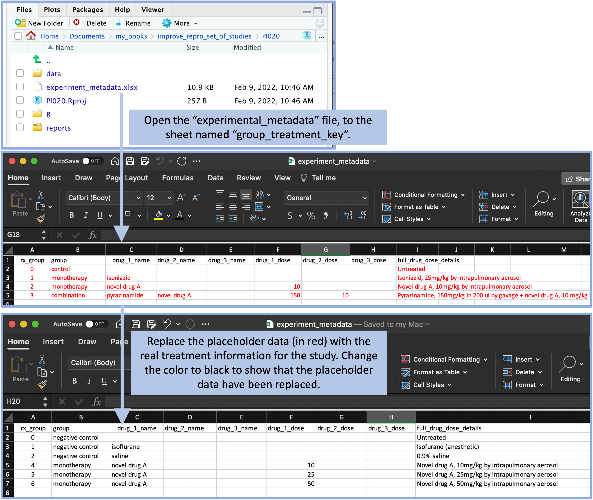

## Example: Creating a project template {#module8}

We will walk through a real example, based on the experiences of one of our
Co-Is, of establishing the format for a research group's 'Project' template,
creating that template using RStudio, and initializing a new research project
directory using the created template. This example will be from a
laboratory-based research group that studies the efficacy of tuberculosis drugs
in a murine model.

**Objectives.** After this module, the trainee will be able to:

- Create a 'Project' template in RStudio to initialize consistently-formatted
'Project' directories
- Initialize a new 'Project' directory using this template

For this module, we'll show how to create an R Project template to manage data
from an example set of projects. We will walk through the process of creating a
project directory template that could be used to manage and analyze data from
any of the specific studies in this set of studies.

The full directory of files for this example can be found at
https://github.com/geanders/example_for_improve_repro [need to make public],
where you can download them or explore them online. All files for this project
can be stored within a well-designed directory, and this directory can be
enhanced into something called an R Project very easily. In this module, we'll
explore how to use an R Project and what advantages it offers compared to other
ways of organizing the files associated with a study. In particular, we'll build
on ideas from earlier modules about creating reproducible data collection
templates, as in this example, the use of a common template across many studies
in a set makes it very easy to create and apply a common reporting template to
the data, easily creating a reproducible report for each of the nineteen studies
in the example set of studies. Further, we'll look at how this organization
allows not only for reporting on specific studies in a reproducible way, but
also makes it easier to create an overall report that combines results and
details from all studies in the set.

### Description of the example set of studies

As a motivating example, we'll use an example based on a set of real immunology
experiments. This example highlights how a research laboratory will often
conduct a similar type of experiment many times, so it lets us demonstrate how
the design of the project's files within a project directory can be reused
across similar experiments. It will allow us to show you how you can move from
designing a file directory for a single experiment to designing one that can be
used repeatedly, and then how you can take advantage of consistency in the
directory structure across projects to make tools and templates that can be
reused.

This example set of studies covers a group of studies to explore novel
treatments for tuberculosis. While treatments exist for tuberculosis, the
current treatment regime is lengthy and involves a combination of multiple
drugs. If the treatment is not completed, it can result in the development and
spread of drug-resistant tuberculosis strains, and so the treatment is sometimes
required to be done under observation [@barry2009new]. If the patient has a
strain of tuberculosis that is resistant to some of the first-line drugs, they
need to be treated with second-line drugs, which can have serious side effects
[@barry2009new]. There is a critical need to develop more candidate drugs
against this disease, given all the limitations and struggles of the current
treatment regime.

Each study investigates how mice that are challenged with tuberculosis respond
to different treatments, both in terms of how well they handle the treatment
(assessed by checking if their weight decreases notably while on treatment) and
also how well the treatment manages to limit the growth of tuberculosis in the
mouse's lungs.

These example studies were conducted with similar designs and similar
goals---all aimed to test candidate treatments for tuberculosis. Most studies in
this set tested one or more treatments as well as one or more controls. The
controls could include negative controls, like saline solution, or positive
controls, like a drug already in use to treat the disease, isoniazid. A few of
the studies tested only controls, to help in developing baseline expectations
for things like the bacterial load in different mouse strains used in studies in
the set. The set of studies tested some treatments that were monotherapies (only
one drug given to the animal) as well as some that were combinations of two or
three different drugs. For many of the drugs that were tested, they were tested
at different doses and, in some cases, different methods of delivery or
different mouse models.

Each of the treatments were given to several mice that had been infected with
*Mycobacterium tuberculosis*. During the treatment, the mice were weighed
regularly. This weight measurement helps to determine if a particular treatment
is well-tolerated by the animals---if not, it may show through the treated mice
losing weight during treatment. For convenience, the mice were not weighed
individually. Instead, mice with the same treatment were kept in a single cage,
and the entire cage was weighed, the weight of the cage itself factored out, and
the average weight of mice for that treatment determined by dividing the weight
of all mice in the cage by the number of mice in the cage. After a period of
time, the mice were sacrificed and one lobe from their lungs was used to
determine each mouse's bacterial load, through plating the material from the
lobe and counting the colony forming units (CFUs). One aim of the data analysis
is to compare the bacterial load of mice under various treatments to the
bacterial load of mice in the control group.

The full set of studies included 19 different studies. These were conducted at
different times, but the data for all of the studies can be collected using a
common format. In this module, as well as the following two, we'll be exploring
how you can use RStudio's Project functionality to organize data from one or
more studies. We'll particularly focus on how, by using a common format for data
collection, you can create tools that can be used repeatedly for different
experiments to ensure that methods are the same across all studies of a similar
type, as well as to improve the reproducibility of the studies. 

There are a few steps you'll need to take to create this type of basic project directory 
template: 

1. List the data you typically collect or files you create for that type of study or experiment
2. Create template files for any data collection that is typical for that type of study 
or experiment. Use example or placeholder data to create examples of those files.
3. Create a directory structure that divides the types of files into subdirectories of similar 
types.
4. Create one or more templates of report files that access and report on the data in the
project template

### Step 1: Survey of data collected for the projects

For the example set of studies for this module, there are a few types of data
that we plan to typically collect for each study. First, we will be recording
metadata for each experiment. This will include a study ID, as well as details
like the mouse strain that we used in that experiment, the route used to
administer the treatment, the treatments per week and total weeks of treatment,
the inoculum used for the challenge, and so on. Second, we'll be recording some
details about each experimental group that was tested. This includes the drug or
drugs that were tested, doses of each, and some exact details about the
treatment regimen for that group. Both of these types of data can be recorded at
the beginning of the study. Two other types of data will also be recorded, both
of them during the study rather than at the start. The first is weights of the
mice each week. These weights will be recorded for each treatment group each
week of treatment, to help see if there are drugs that are poorly tolerated by
the mice (which can show up through weight decreases in mice in that group). The
second is the bacterial load in the lungs of each mouse at the end of the
treatment period.

Let's walk through the types of data that were collected for each study. First,
there was some metadata recorded for each study. Figure \@ref(fig:metadata)
gives an example. This includes information about the strain of mouse that was
used in the study, treatment details (including the method of giving the drug or
drugs, how often they were given each week, and for how many weeks), how much
bacteria the animals were exposed to (measured both in terms of the inoculum
they were given and their bacterial load one day after they were given that
inoculum, which was based on sacrificing one animal the day after challenging
all the animals with the bacteria), and, if the study included a novel drug as
part of the tested treatment, the batch number of that drug.

```{r metadata, fig.fullwidth = TRUE, echo = FALSE, out.width = "\\textwidth", fig.cap = "Example of recording metadata for a study in the set of example studies for this module."}
knitr::include_graphics("figures/project_metadata.png")
```

Next, the researchers recorded some information about each treatment group
within the experiment. This typically included at least one negative control. In
some cases, there was also a positive control, in which the animals were treated
with a drug that's in standard use against tuberculosis already (e.g.,
isoniazid). Most studies would also test one or more treatments, which could
include monotherapies or combined therapies. Figure \@ref(fig:treatmentdetails)
shows an example of the data that were recorded on each treatment in the study.
These data include the names and doses of up to three drugs in each treatment,
as well as a column where the researcher can provide detailed specifications of
the treatment.

```{r treatmentdetails, fig.fullwidth = TRUE, echo = FALSE, out.width = "\\textwidth", fig.cap = "Example of recording treatment details for a study in the set of example studies for this module."}
knitr::include_graphics("figures/project_treatment_details.png")
```

Once the animals were challenged with the bacteria, treatment began, and two
main types of data were measured and recorded. First, the mice were weighed once
a week. For convenience, the mice were not weighed
individually. Instead, mice with the same treatment were kept in a single cage,
and the entire cage was weighed, the weight of the cage itself factored out, and
the average weight of mice for that treatment determined by dividing the weight
of all mice in the cage by the number of mice in the cage. These weights were converted to a measure of the percent change in
weight since the start of treatment. If the animals' weights decrease during the
treatment, it is a marker that the treatment is not well-tolerated by the
animals. Figure \@ref(fig:mouseweight) shows an example of how these data were
recorded. All animals within a treatment group were kept in the same cage, and
this cage was measured once a week. By dividing the weight of all animals in the
cage by the number of animals, the researchers could estimate the average weight
of animals in that treatment group, which is recorded as shown in Figure
\@ref(fig:mouseweight).

```{r mouseweight, fig.fullwidth = TRUE, echo = FALSE, out.width = "\\textwidth", fig.cap = "Example of recording weekly weights of mice in each treatment group for the example set of studies."}
knitr::include_graphics("figures/project_mouse_weights.png")
```

Finally, after the treatment period, the mice were sacrificed and a portion of
each mouse's lung was used to estimate the bacterial load in that mouse. Figure
\@ref(fig:bacterialload) shows an example of how the data on the bacterial load
in each mouse was recorded.

```{r bacterialload, fig.fullwidth = TRUE, echo = FALSE, out.width = "\\textwidth", fig.cap = "Example of recording the bacterial load in the lungs of each mouse at the end of treatment for the example set of studies."}

```

As you can see, these data were all recorded using templates that were designed
for the tidy collection of laboratory data (see modules 2.4 and 2.5). These
spreadsheets were used only to record the data, and then processing, analysis,
and visualization were done in a separate file.

To create the project directory template for these studies, then, we'll create
data collection templates for each of these types of data. We'll create a
separate spreadsheet for each type of data, but we can group them into files if
we'd like. In our example, we created two files to store this type of data, one
for the metadata that are recorded at the start of the experiment (overall
experiment details and the details of each tested treatment) and one for the
data that are collected over the course of the experiment (mouse weights and
bacterial loads). Within each file, we've used separate sheets to record the 
different types of data. This allows us to keep similar types of data together
in the same file, while having a tidy collection format for each specific type
of data. [Figure] 

```{r projectdatacollection, fig.cap = "Data collection templates for the example project directory template. These templates were created in two files, one for metadata, which is saved in the main directory of the project, and one for data collected in the laboratory during the experiment, which is saved in the 'data' subdirectory. Each file is saved as a spreadsheet file, with two sheets in each file to store different types of data.", fig.fullwidth = TRUE, out.width = "\\textwidth"}
knitr::include_graphics("figures/project_data_collection.png")
```

All of these data collection files are designed using the principles of tidy
data collection. In modules 2.4 and 2.5, we showed how you can create tidy data
collection templates to use to collect data, and how these can be paired with
reproducible reporting tools to separate the steps of data collection and
reporting (modules 3.7 through 3.9 go into much more depth on these reproducible
reporting tools). Once you have decided on the types of data that you will
usually collect for the type of study that this template is for, you can use
that process to create tidy data collection templates for each type of data.

In addition to the data that you record in the laboratory by hand, the type of
study may also typically have data that's generated and recorded by laboratory
equipment. For example, the type of study may often include data collected from
flow cytometry, to measure certain cell populations in samples, or from mass
spectometry, to measure levels of certain molecules. For these data, the
recording format will typically be determined by the equipment, and so you won't
need to create data collection templates for the data. However, you should store
these data files in your project directory as well, where they are easy to
access and integrate with other data as you analyze the data for the study.

When we created the template for each type of data, we added placeholder data
(formatted in red to indicate that it is placeholder, rather than final 
data). This is so the researcher can see an example of how to enter data in 
the template when they start a new project. 

Figure \@ref(fig:replacingplaceholdermetadata) gives an example of this process.
One of the files that is included in the example template directory shown
earlier is a spreadsheet to record metadata on the experiment. This spreadsheet
file has two sheets, one that records overall metadata on the study (for
example, the weeks of treatment given and the strain of mouse used) and one that
records details on each of the treatments that was tested. In the file in the
template directory, these spreadsheet pages include placeholder data. These are
formatted in red, so that they visually can be identified as placeholders. By
including these placeholder data, the researcher can see an example of the
format that you expect to be used in recording data in this file. Once the
project template is copied, the researcher will replace these data with the real
data, and then change the font color to black to indicate that the placeholder
data have been replaced (Figure \@ref(fig:replacingplaceholdermetadata)).

```{r replacingplaceholdermetadata, fig.fullwidth = TRUE, echo = FALSE, out.width = "\\textwidth", fig.cap = "The template includes a file with experiment metadata, with a sheet for recording the overall details of the experiment. A user can open this file and replace the placeholder values (in red) with real values for the experiment. By changing the text color to black, the user can have a visual confirmation that the placeholder data have been replaced with real study data."}
knitr::include_graphics("figures/project_replace_placeholder_metadata.png")
```

Another sheet of this spreadsheet allows the researcher to record the details of
each of the treatments that were tested in the experiment. Again, placeholder
data are included in the template in a red font to help show the researcher how
to record the data, and these are meant to be replaced with real data from the
specific experiment (Figure \@ref(fig:replacingplaceholdertreatment2)). A
similar format is used in the template file to record data from the experiment,
including the weights of each animal over each week of treatment and the final
bacterial load in each animal at the end of treatment. Again, there are
placeholder values in the template file, which the researcher will replace with
real data after copying the project template for a new experiment.

```{r replacingplaceholdertreatment2, fig.fullwidth = TRUE, echo = FALSE, out.width = "\\textwidth", fig.cap = "The template includes a file with experiment metadata, with a sheet for recording the details of each treatment. A user can open this file and replace the placeholder values (in red) with real values for the treatments in the experiment. By changing the text color to black, the user can have a visual confirmation that the placeholder data have been replaced with real study data."}

```


### Step 2: Organizing a project directory

Let's look at a more basic way to create a project template. This
involves no fancy tools---in fact, it's so straightforward that at first it
might seem to simple to be useful. For this basic approach, you will create an
example file directory that includes template files and that captures you
desired project directory structure, and then members of your group will copy
and rename that template every time they start a new project of that type.

You first need to determine the types of files that you'll normally include in your
project and create any needed data collection templates, as shown in the last 
section. You can then decide how to organize them into subdirectories in a project
file directory. As you do this, it will be helpful to have example 
files for each file type you plan to include.

[How to organize and name subdirectories]

### Step 3: Designing a report template

With the previous steps, you will have determined the types of files you
normally have for this type of study, as well as structured the project
directory to organize these files. The next step is to create a template report.
You can create this using tools for reproducible reports---in R, a key tool for
this is RMarkdown. Here, we'll cover using this tool for creating a report
briefly, but there are many more details in modules 3.7 through 3.9.  Having
example files will help you to develop a template project report that can input
the type of data that you typically collect for this type of project.

When you create a project directory template, we recommend that you create a
subdirectory named something like "reports" to use to store any Rmarkdown report
files for the project. This organization will make it clear where you've stored your
reports in the project directory. You'll be able to use file and directory pathnames
to access all the data in the project, so it will be easy to use the study's data
in the report even if they're in separate subdirectories. There's only one tool 
you'll need to do this---you'll need to learn how to use relative pathnames 
within R code to access files in a different part of your project directory. 

We created an Rmarkdown file that does this analysis and visualization and
included it in the project template directory. This means that the report file
will be copied and available each time someone copies the project template
directory at the start of a new project. We wrote the code in a way that will
input data that are stored in the data collection files that also come with the
project directory template. Since we named those files in the directory
template, we can refer to them with the same name in the code for the report. We
wrote the code in the report in a way that it will still run if there are more
or fewer observations in any of the data collection files, so the report
template has some flexibility in terms of how each study in the set of studies
might vary. For example, in the example set of studies, some of the experiments
were run using only a control group of mice, while others were run to test as
many as [x] different treatment groups. The report template can accommodate
these differences across studies in the set of studies.


Specifically, for this set of studies a preliminary report was designed, with an
example shown in Figure \@ref(fig:prelimreport). This report uses the first page
to provide a nicely format version of the metadata for the study, including a
table with overall details and a table with details for each specific treatment
that was tested. The second page provides a graph that shows the percent weight
change for mice in each treatment group compared to the weight of that group at
the start of treatment. The third page provides a graph that shows the bacterial
loads in each mouse, grouped by treatment, as well as the results of running a
statistical test to test, for each treatment group, the hypothesis that the mean
of a transformed version of the measure of bacterial load (log-10) for the group
was the same as for the untreated control group.

```{r prelimreport, fig.fullwidth = TRUE, echo = FALSE, out.width = "\\textwidth", fig.cap = "Example of the preliminary report generated for each study in the set of example studies for this module. The first page includes metadata on the study, as well as details on each treatment that was tested. The second page shows how mouse weights in each treatment group changed over the course of treatment, to help identify if a treatment was well-tolerated. The third page graphs the bacterial load in each mouse, grouped by treatment, and gives the result of a statistical analysis to test which treatment groups had outcomes that were significantly different from the untreated control group."}
knitr::include_graphics("figures/project_prelim_report.png")
```

Let's take a closer look at a few of these elements. For example, Figure
\@ref(fig:studytable) shows the tables from the first page of the report shown
in Figure \@ref(fig:prelimreport). If you look back to the data collection for
this study (e.g., Figures \@ref(fig:metadata) and \@ref(fig:treatmentdetails)),
you can see that all of the information in these tables was pulled from data
recorded at the start of the study.

```{r studytable, fig.fullwidth = TRUE, echo = FALSE, out.width = "\\textwidth", fig.cap = "Example of one element of the preliminary report generated for each study in the set of example studies for this module. The first page provides tables with metadata about the study and details about each treatment that was tested."}
knitr::include_graphics("figures/project_study_info_table.png")
```

Figure \@ref(fig:mouseweightsplot) shows the second page of the report. This
figure has taken the mouse weights---which were recorded in one of the data
collection templates for the project (Figure \@ref(fig:mouseweight))---and used
them to generate a plot of how average mouse weight in each treatment group
changed over the course of the treatment.

```{r mouseweightsplot, fig.fullwidth = TRUE, echo = FALSE, out.width = "\\textwidth", fig.cap = "Example of one element of the preliminary report generated for each study in the set of example studies for this module. The second page provides a plot of how the weights of mice in each treatment changed over the course of treatment."}
knitr::include_graphics("figures/project_mouse_weights_graph.png")
```

Figure \@ref(fig:bactcompare) shows the last page of the report. This page
starts with a figure that shows the bacterial load in the lungs of each mouse in
the study at the end of the treatment period. In this figure, the measurement
for each mouse is shown with a point, and these points are grouped by the
treatment group of the mouse. Boxplots are added to show the distribution across
the mice in each group. The color is used to show whether the treatment was a
negative control, a positive control, a monotherapy, or a combined therapy. The
second part of the page gives a table with the results from running a
statistical analysis to compare the bacterial load for mice in each treatment
group to the bacterial load in the mice in the untreated control group. Color is
added to the table to highlight treatments that had a large difference in
bacterial load from the untreated control, as well as treatments for which the
difference from the untreated control was estimated to be statistically
significant. All the data for these results, including the labels for the plot,
are from the data collected in the data collection templates shown earlier.

```{r bactcompare, fig.fullwidth = TRUE, echo = FALSE, out.width = "\\textwidth", fig.cap = "Example of one element of the preliminary report generated for each study in the set of example studies for this module. The third page provides results on how bacterial load in the lungs compares among treatments at the end of the treatment period."}
knitr::include_graphics("figures/project_bact_compare_plot.png")
```
 
In the report, we'll design the script for the report (the RMarkdown file) so
that it can leverage the order in how we've arranged files in the file system,
since this is enforced by the project directory template and so is the same
across different projects. This will let us repeat and reuse code scripts across
all the projects that use this template. This strategy is used often in handling
complex bioinformatics data [@buffalo2015bioinformatics], but it can also be
leveraged to improve the reproducibility and reliability when only using less
complex data recorded in the laboratory, as with the data shown in the example
for this module.

When it comes to project directories, it turns out that you can use the
directory structure in your favor when you create script-based reports, like
RMarkdown reports. There are functions in R, for example, that will allow you to
print all the files in a specified subdirectory. Say that you have several flow
cytometry files in a subdirectory of the "data" subdirectory called "flow_data".
You could use this function in R to create a list of all the files in that
subdirectory, and then you can run other functions to do the same operations on
all of those files.

The project template also includes a file that provides a template to create a report
based on the data from the experiment. This file is created using the RMarkdown format, 
which combines text with executable code. You can create this template so that it 
inputs the experimental data from the file formats created for the data recording
files in the project template. By doing this, the researcher should be able to "knit" 
this report for a new experiment, and it should recreate the report based on the 
data recorded for that experiment (Figure \@ref(fig:makingareport)). By knitting
this template report, you can create a nicely formatted version of the report for
the experimental data (Figure \@ref(fig:examplereport1)).

```{r makingareport, fig.fullwidth = TRUE, echo = FALSE, out.width = "\\textwidth", fig.cap = "Example of how a user can create a report from the template. The template includes an example report, which is written using RMarkdown. The user can open this template report file and use the 'Knit' button in RStudio to render the file. As long as the experimental data are recorded using the data template files, the code for this report can process the data to generate a report from the data. The user can also make changes and additions to the template report."}
knitr::include_graphics("figures/project_opening_and_running_report.png")
```

```{r examplereport1, fig.fullwidth = TRUE, echo = FALSE, out.width = "\\textwidth", fig.cap = "Example of the output from 'knitting' a report from the project template"}
knitr::include_graphics("figures/project_example_report_study001.png")
```


### Step 4: Testing the project template and refining it

- Edge cases: For example, sometimes only one treatment condition, so not 
possible to run a statistical test comparing conditions
- Didn't think of something: Maybe they add an assay?
- Iterative process to refine what goes in the report. What do we need 
to know from each experiment?

In many cases, you may have a more complex design for your project directory. For
example, if you were collecting flow cytometry data for the project as well, then 
you would want a subdirectory in the project that is specifically designed to 
store files from the flow cytometry component of the experiment. This subdirectory
would likely include several files, rather than just one. Further, you would not
know ahead of time what the name of these files would be (as you do with the data
collection template files that are included in the template directory). However, 
you can still easily write code for a template report file that will work with 
multiple files of a similar type, even if you don't know what the names will be, 
as long as you know what the name of their subdirectory will be. There are functions
in R like `list.files` that can be used to list all the file names for the files 
in a given directory. You can use this function to create a vector of all the file
names. For example, you could run: 

```{r eval = FALSE}
flow_filepaths <- list.files("../data/flow_data", full.names = TRUE)
```

to get an object (`flow_filepaths`) that lists each of the filepaths for the files
stored in the "flow_data" subdirectory within the "data" subdirectory of the 
project. You could then "map" a function or group of functions across these
files to read them in, process them, and join them into a single dataframe in R. 
By using this process, you can write template code in the report for the project
that should work in most cases for the data that you collect for a given type of 
study. 

The report template is included in the project directory template, so it will be
copied and available for you to use anytime you start a new project using that 
template. However, you are not obligated to keep the report identical to the template. 
Instead, the template report serves as a starting point, and you can add to it or
adapt it as you work on a study. 

For example, in our example template report, we've included the results of
applying a statistical test that compares each treatment group to the control
group. Instead, for a specific study of this type, you may want to control
treatments against each other. For example, some of the studies in this example
set of studies include a positive control group, where the mice are treated with
a drug that is already in common use for the disease. In some cases, the
researcher may want to control the bacterial load in groups treated with a novel
drug to groups treated with the positive control. You could easily add to the
report template in that case, adding statistical tests where you compare
different treatment groups to each other.

In the example, there was one clear edge case that came up a few times. 
For some experiments, only only treatment group was used. In these cases, 
we can create a report with most of the usual elements, but we can't 
run a statistical analysis that compares groups because there is only 
one group. 

We discovered this edge case as we tried applying our project template to 
multiple experiments. Once we identified it, there were a few approaches
we could take. First, we could adapt the reports by hand in cases where
this happens. To do this, we just need to open the Rmd report for the
report file for those projects and remove the part that compares across 
groups. If this edge case happens rarely, this can be a reasonable 
approach. 

Another approach is to write code in the report template that addresses 
these cases. Because the full report is in code, we can write in code 
that checks how many treatment groups were included and only runs the 
statistical analysis if it was more than one group. This is the 
approach we took in this example. 

### Step 5: Using the project template

- Value comes from using it consistently
- This example is for a set of very similar studies---the same idea can 
apply for developing project templates for a wider range of studies, but 
it will require more thought to have something that works across more
variety

Figure \@ref(fig:basicprojecttemplateuse) gives a basic walk-through of the
simple steps you'll use to start a new project directory once you've created
this type of template. First, you will find the project directory template in
your computer's file system, copy it to where you'd like to save the files for
the new project, and rename the directory to your new project's name. At this
point, you can use RStudio to make this directory an RStudio Project. Next,
you'll open the data collection template files and replace the placeholder
example data in the template (shown in red font) with the real data from your
study. The placeholder data can help you remember the format you should use to
record the real data. Finally, once you've recorded the data for the study or 
experiment, you can open the example report template file. If you've designed
this report template well, it should run with the new data you've recorded to 
create a report for the experiment. At this stage, you can add to the report 
or customize it for the new project by changing the Rmarkdown file and re-rendering
it to update the report. 

```{r basicprojecttemplateuse2, fig.cap = "Steps in using a basic project directory template that you have created for a type of study or experiment.", fig.fullwidth = TRUE, out.width = "\\textwidth"}
knitr::include_graphics("figures/project_template_basic_use.png")
```

### Applied exercise
