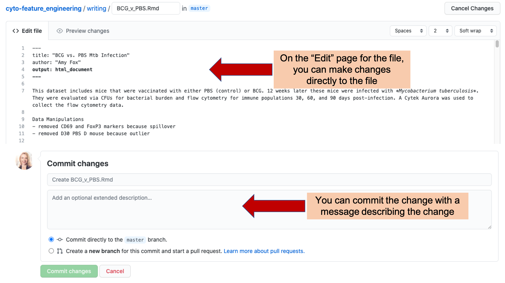

## Using git and GitLab to implement version control {#module11}

For many years, use of version control required use of the command line,
limiting its accessibility to researchers with limited programming experience.
However, graphical interfaces have removed this barrier, and RStudio has
particularly user-friendly tools for implementing version control. In this
module, we will show how to use *git* through RStudio's user-friendly
interface and how to connect from a local computer to *GitLab* through
RStudio.

**Objectives.** After this module, the trainee will be able to:

- Understand how to set up and use *git* through RStudio's interface 
- Understand how to connect with *GitLab* through RStudio to collaborate on  
research projects while maintaining version control

### How to use version control

In this chapter, we will give you an overview of how to use git and GitHub
for your laboratory research projects. If you prefer an open-source version 
control platform, GitLab has similar functionality and can be installed on 
a server you own.

We'll address two separate groups, in separate sections. As the main focus of
this module, we'll provide an overview of how you can leverage and use these
tools as the director or manager of a project, without knowing how to code in a
language like R. We are focusing on this audience in this module, as we see this
as an area where there aren't a lot of available resources to provide guidance.
GitHub provides a number of useful tools that can be used by anyone, providing a
common space for managing the data recording, analysis and reporting for a
scientific research project. In this case, there would need to be at least one
member of your team who is comfortable with a programming language, but all team
members can participate in many features of the GitHub repository regardless of
programming skill.

The other audience for information on using git and GitHub are researchers who
are comfortable coding. Fortunately, there are many good resources available for
this audience. We'll end the module by providing advice to this audience to
point them to resources where they can go to learn more and fully develop these
skills.

As an example, we'll show different elements from a real GitHub repository, used
for scientific projects and papers. The repository is available at
https://github.com/aef1004/cyto-feature_engineering. It provides example data
and code to accompany a published article on a pipeline for flow cytometry
analysis [@fox2020cyto].

### Leveraging git and GitHub as a project director

Because `git` has a history in software development, and because most
introductions to it quickly present arcane-looking code commands, you may have
hesitations about whether it would be useful in your scientific research group.
This is particularly likely to be the case if you, and many in your research
group, do not have experience programming.

This is not at all the case, and in fact, the combination of git and GitHub can
become a secret weapon for your research group if you are willing to encourage
those in your group who do know some programming (or are willing to learn a bit)
to take the time to learn to set up a project in this environment for project
management. Once a project has been set up in GitHub, there are a number of
features that can be used by all team members, whether they code or not. These
features facilitate collaboration between coders and non-coders as the data and
analysis code evolve. The major features and advantages of git and GitHub are
described in modules 2.9 and 2.10.

As mentioned in the previous two modules, repositories that are tracked with
git and shared through GitHub provide a number of tools that are useful in
managing a project, both in terms of keeping track of what's been done in the
project and also for planning what needs to be done next, breaking those goals
into discrete tasks, assigning those tasks to team members, and maintaining a
discussion as you tackle those tasks.

While `git` itself traditionally has been used with a command-line interface
(think of the black and green computer screens shown when movies portray
hackers), GitHub has wrapped `git`'s functionality with an attractive and easy
to understand graphical user interface. This is how you will interact with a
project repository if you are online and logged into GitHub, rather than
exploring it on your own computer (although there are also graphical user
interfaces you can use to more easily explore git repositories locally, on your
computer).

Successfully using GitHub to help track and manage a research project does not
require using all of the available tools, and in fact you can go a long way by
just starting with a subset. At the end of this module, there is a video
demonstration that walks you through the elements we've highlighted. Key project
management tools for GitHub that you can leverage, all demonstrated in
subsections below, are:

- Exploring commits and commit history
- Tracking and making progress on issues
- Managing repository access and ownership

GitHub is free to join; while there are paid plans, the free plan is adequate
for getting started, and academic researchers can request free use of some of 
the more extensive versions if needed. To create an account, visit 
https://github.com/. Even if you are not coding, you will need to be logged in 
to your GitHub account to contribute to a repository. For some actions, you need
to be a collaborator on a project to take the action; in the later sections of 
this module, we describe how people can be added as collaborators in a GitLab
repository. 

**Exploring commits and the commit history**

Each time a team member makes a change to files in a GitHub repository, the
change is recorded as a *commit*, and the team member must include a short
*commit message* describing the change. Each file in the project will have its
own page on GitHub (Figure \@ref(fig:githubcommits1) shows an example). You can
see the history of changes to that files by clicking the "History" link on that
page.

```{r githubcommits1, fig.cap = "Example of a file page within a GitHub repository. Each file in a repository has its own page. On this page, you can see the history of changes made to the file by looking at 'History'. You can also make a commit an edit directly in GitHub by clicking on the 'Edit' icon.", fig.fullwidth = TRUE, out.width = "\\textwidth"}
knitr::include_graphics("figures/github_commits1.png")
```

For team members who are working a lot on coding, they will usually make changes
to a file locally, on the repository copy on their own computers and then push
their latest changes to the GitHub version. This workflow will allow them to
test the code locally before they update the GitHub version.

However, it is also possible to make a commit directly on GitHub, and this may
be a useful option for team members who are not coding and would like to make
small changes to the writing files. On the file's page on GitHub, there is an
"Edit" icon (Figure \@ref(fig:githubcommits1)). By clicking on this, you will
get to a page where you can directly edit the file (Figure
\@ref(fig:githubcommits2) shows an example of what this page looks like). Once
you have made your edits, you will need to commit them, along with a short
description of the commit, the "commit message". If you would like to include a
longer explanation of your changes, there is space for that, as well, when you
make the commit (Figure \@ref(fig:githubcommits2)). These commits will show up 
in the repository's history, attributed to you and with your commit message
attached to the change.

```{r githubcommits2, fig.cap = "Committing changes directly in GitHub. When you click on the 'Edit' button in a file's GitHub page (see previous figure), it will take you to a page where you can edit the file directly. You save the changes with a 'commit', including a commit message describing why you made the change. The change will be tagged with the message and your name.", fig.fullwidth = TRUE, out.width = "\\textwidth"}

```

You can see the full history of changes that have been made to each file in the
project, as shown in the example in Figure \@ref(fig:githubcommithistory). Each
change is tracked through a commit, which includes markers of who made the
change and a message describing the change. This allows you to quickly pinpoint
changes in a file in your research project. Near the commit message are listings
of which team member made the commit and when it was made. This also helps you
see how team members have contributed as the file evolves.

```{r githubcommithistory, fig.cap = "Commit history in GitHub. Each file in a repository has a 'History' page, where you can explore each change commited for the file. Each commit has a unique identifier and commit message describing the change. You can click on the entry for any of these commits to see the changes made to the file with the commit (see next figure).", fig.fullwidth = TRUE, out.width = "\\textwidth"}
knitr::include_graphics("figures/github_commit_history.png")
```

If you click on one of the commits listed on a file's History page (Figure
\@ref(fig:githubcommithistory) points to one example of where you would click),
it will take you to a page providing information on the changes made with that
commit (Figure \@ref(fig:githubcommithistory2)). This page provides a
line-by-line view of each change that was made to project files with that
commit, as well as the commit message for that commit. If the person
committing the change included a longer description or commentary,
this information will also be included. 

Within the body of the page, you can see the changes made with the commit. Added
lines will be highlighted in green while deleted lines are highlighted in red.
If only part of a line was changed, it will be shown twice, once in red as its
version before the commit, and once in green showing its version following the
commit. You can visually compare the two versions of the line to see how it was
changed with the commit.

```{r githubcommithistory2, fig.cap = "Commit history in GitHub. Each commit has its own page, where you can explore what changes were made with the commit, who made them, and when they were committed.", fig.fullwidth = TRUE, out.width = "\\textwidth"}
knitr::include_graphics("figures/github_commit_history2.png")
```

**Issues**

GitHub, as well as other version control platforms, includes functionality that
will help your team collaborate on a project. A key tool is the "Issues"
tracker. Each repository includes this type of tracker, and it can be easily
used by all team members, whether they are comfortable coding or not. Figure
\@ref(fig:githubissues1) gives an example of [the Issues tracker
page](https://github.com/aef1004/cyto-feature_engineering/issues) for the
repository we are using as an example.

```{r githubissues1, fig.cap = "Issues tracker page for an example GitHub repository. Arrows highlight the tab to click to get to the Issues tracker page in a repository, as well as where to go to find open and closed Issues for the repository.", fig.fullwidth = TRUE, out.width = "\\textwidth"}
knitr::include_graphics("figures/github_issues.png")
```

The main Issues tracker page provides clickable links to all open issues for
the repository. You can open a new issue using the "New Issue" on this main 
page or on the specific page of any of the repository's issues. See Figure
\@ref(fig:githubissues2) for an example of this button. 

```{r githubissues2, fig.cap = "Conversation about an Issue on Issues tracker page of an example GitHub repository. In this example, you can see how GitHub Issues trackers allow you to discuss how to resolve an issue across your team. From this page, you can read the current conversation about Issue \\#1 of the repository and add your own comments. Once the Issue is resolved, you can 'Close' the Issue, which moves it off the list of active issues, but allows you to still re-read the conversation and, if necessary, re-open the issue later. You can also open a new issue from this page, using the button highlighted at the top right.", fig.fullwidth = TRUE, out.width = "\\textwidth"}
knitr::include_graphics("figures/github_issues2.png")
```

On the page for a specific issue (e.g., Figure \@ref(fig:githubissues2)), you
can have a conversation with your team to determine how to resolve the issue.
This conversation can include web links, figures, and "To-do" check boxes, to
help you discuss and plan how to resolve the issue. Each issue is numbered,
which allows you to track each individually as you work on the project.

Once you have resolved an issue, you will close it. This moves the issue
from the active list into a "Closed" list. Each closed issue still has its
own page, where you can read through the conversation describing how it 
was resolved. If you need to, you can re-open a closed issue later, if you 
determine that it was not fully resolved.

```{r githubissues3, fig.cap = "Labeling and assigning Issues. The GitHub Issues tracker allows you to assign each issue to one or more team members, clarifying that they will take the lead in resolving the issue. It also allows you to tag each issue with one or more labels, so you can easily navigate to issues of a specific type or identify the category of a specific issue.", fig.fullwidth = TRUE, out.width = "\\textwidth"}
knitr::include_graphics("figures/github_issues3.png")
```

The Issues tracker page includes some more advanced functionality, as well
(Figure \@ref(fig:githubissues3)). For example, you can assign an issue to one
of more team members, indicating that they are responsible for resolving that
issue. You can also tag each issue with one of more labels, allowing you to
group issues into common categories. For example, you could tag all issues that
cover questions about pre-processing the data using a "pre-processing" label,
and all that are related to creating figures for the final manuscript with a
"figures" label.

**Repository access and ownership**

Repositories include functionality for inviting team members, assigning
roles, and otherwise managing access to the repository. First, a repository 
can be either public or private. For a public repository, anyone will be
able to see the full contents of the repository through GitHub. You can 
also set a repository to be private. In this case, the repository can only 
be seen by those who have been invited to collaborate on the repository, and
only when they are logged in to their GitHub accounts. The private / public
status of a repository can be changed at any time, so if you want you can 
maintain a repository for a project as private until you publish the results, 
and then switch it to be public, to allow others to explore the code and data
that are linked to your published results.

You can invite team members to collaborate on a repository, as long as they have
GitHub accounts (these are free to sign up for). While public repositories can
be seen by anyone, the only people who can add to or change the contents of the
repository are people who have been invited to collaborate on the repository.
The person who creates the repository (the repository "owner") can invite other
collaborators through the "Settings" tab of the repository, which will have a
"Manage access" function for the repositories maintainer. Only the owner of the
repository will have access to this tab for the repo. On this page, you can
invite other collaborators by searching using their GitHub "handle" (the short
name they chose to be identified by in GitHub). You can also change access
rights, for example, allowing some team members to be able to make major changes
to the repository---like deleting it---while others can make only smaller
modifications.

[Add: Roles on a repository]

[Add: README with Markdown]

If you are planning to use GitHub as a way to share the project directory, you
will find it useful to create the README file using a file format called
"Markdown". [Automatically renders in a nice format when you put it on GitHub]

### Leveraging git and GitHub as a scientist who programs

To be able to leverage GitHub to manage projects and share data, you will need
to have at least one person in the research group who can set up the initial
repository. GitHub repositories can be created very easily starting from an
RStudio Project, a format for organizing project files that was described in
module 3.7. 

There are many excellent resources that provide instructions on this topic
meant for researchers who are comfortable with using R and RStudio. An 
excellent place to start is with 

[Jenny Bryan's book]

Once you've explored that resource, here are some others you might also find 
useful: 

[Other resources]

### Applied exercise
