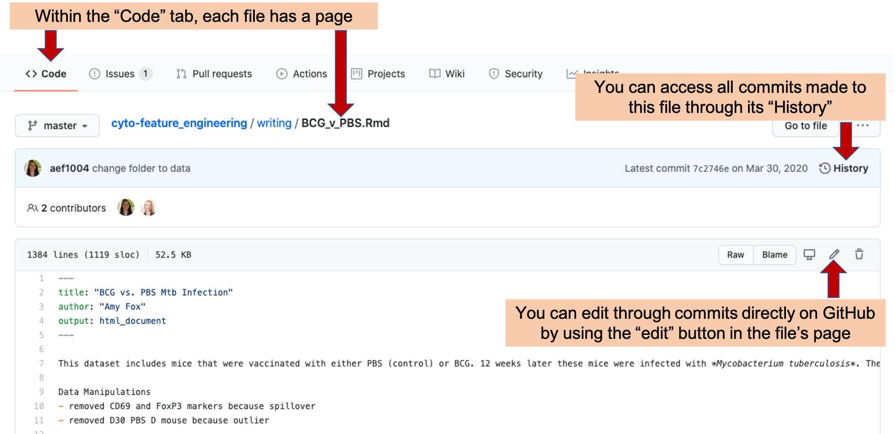
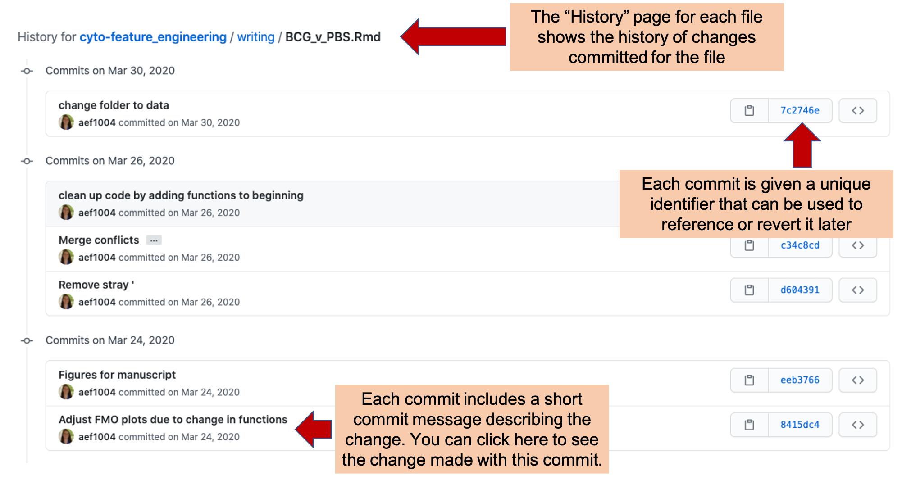
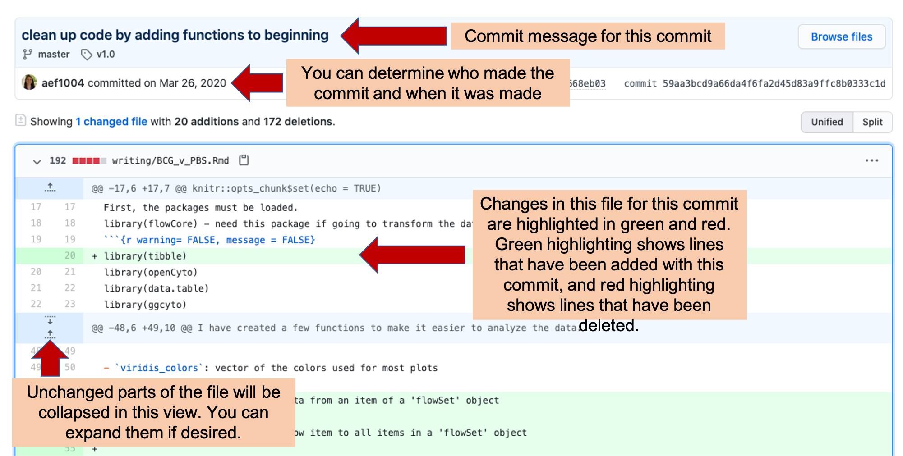
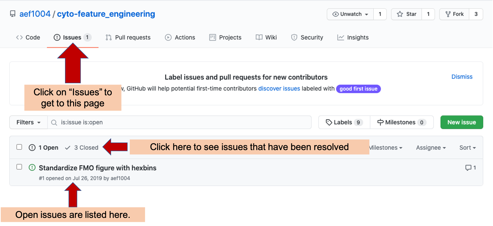
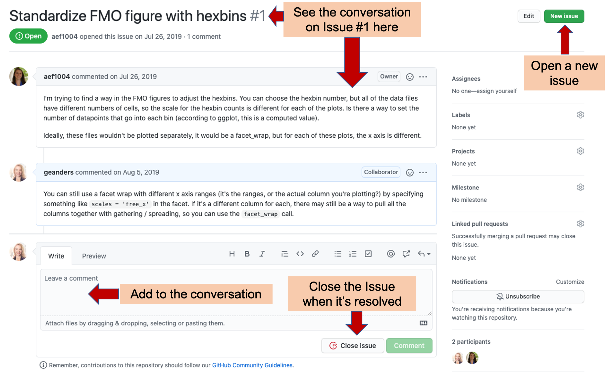
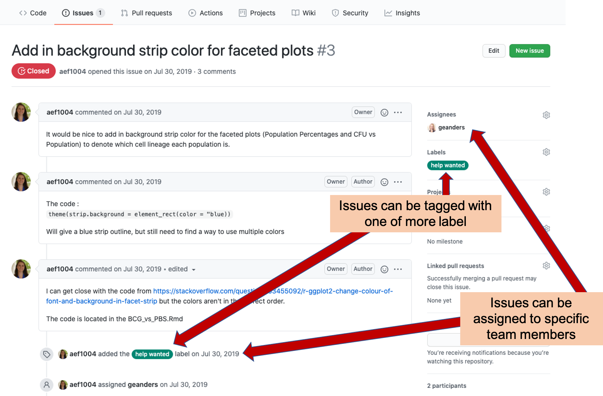
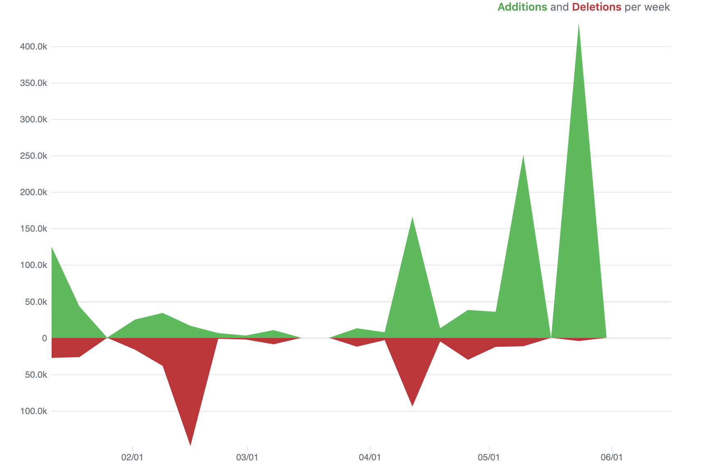
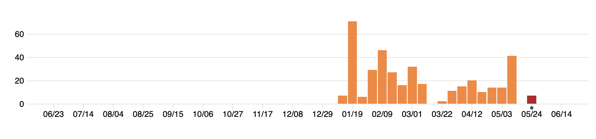

## Using git and GitLab to implement version control

For many years, use of version control required use of the command line,
limiting its accessibility to researchers with limited programming experience.
However, graphical interfaces have removed this barrier, and RStudio has
particularly user-friendly tools for implementing version control. In this
module, we will show how to use *git* through RStudio's user-friendly
interface and how to connect from a local computer to *GitLab* through
RStudio.

**Objectives.** After this module, the trainee will be able to:

- Understand how to set up and use *git* through RStudio's interface 
- Understand how to connect with *GitLab* through RStudio to collaborate on  
research projects while maintaining version control

### How to use version control

In this chapter, we will give you an overview of how to use git and GitHub
for your laboratory research projects. In this chapter, we'll address two
separate groups, in separate sections. First, we'll provide an overview of how
you can leverage and use these tools as the director or manager of a project, 
without knowing how to code in a lanugage like R. GitHub provides a number of
useful tools that can be used by anyone, providing a common space for managing
the data recording, analysis and reporting for a scientific research project.
In this case, there would need to be at least one member of your team who is
comfortable with a programming language, but all team members can participate
in many features of the GitHub repository regardless of programming skill.

Second, we'll provide some details on the "how-tos" of setting up and using
git and GitHub for scientists who *are* programmers or learning to program in 
a language like R or Python. We will not be exhaustive in this section, as there
are a number of excellent resources that already go into depth on these topics. 
Instead, we provide an overview of getting starting, and what tools you might
want to try within projects, and then provide advice on more references to follow
up with to learn more and fully develop these skills.

As an example, we'll show different elements from a real GitHub repository, used
for scientific projects and papers. The first repository is available at
https://github.com/aef1004/cyto-feature_engineering. It provides example data
and code to accompany a published article on a pipeline for flow cytometry
analysis [@fox2020cyto].

### Leveraging git and GitHub as a project director

Because `git` has a history in software development, and because most
introductions to it quickly present arcane-looking code commands, you may have
hesitations about whether it would be useful in your scientific research group
if you, and many in your research group, do not have experience programming.
This is not at all the case, and in fact, the combination of git and GitHub can
become a secret weapon for your research group if you are willing to encourage
those in your group who do know some programming (or are willing to learn a bit)
and to take them time to try out this environment for project managemment.

As mentioned in the previous two chapters, repositories that are tracked with
git and shared through GitHub provide a number of tools that are useful in
managing a project, both in terms of keeping track of what's been done in the
project and also for planning what needs to be done next, breaking those goals
into discrete tasks, assigning those tasks to team members, and maintaining a
discussion as you tackle those tasks.

While `git` itself traditionally has been used with a command-line interface
(think of the black and green computer screens shown when movies portray hackers), 
GitHub has wrapped `git`'s functionality with an attractive and easy to 
understand graphical user interface. This is how you will interact with a project
repository if you are online and logged into GitHub, rather than exploring it
on your own computer (although there are also graphical user interfaces you can 
use to more easily explore git repositories locally, on your computer).

Key project management tools for GitHub that you can leverage, all covered in 
subsections below, are: 

- Commits and commit history
- Issues
- Repository access and ownership
- Insights

Successfully using GitHub to help track and manage a research project does not
require using all of these tools, and in fact you can go a long way by just starting
with a subset. The first four covered (Commits, Issues, Commit history, and Repository access
and ownership) would be a great set to try out in a first project.

**Commits**

Each time a team member makes a change to files in a GitHub repository, the change is
recorded as a **commit**, and the team member must include a short **commit message** 
describing the change. Each file in the project will have its own page on GitHub
(Figure \@ref(fig:githubcommits1)), and you can see the history of changes to that
files by clicking the "History" link on that page. 

```{r githubcommits1, fig.cap = "Example of a file page within a GitHub repository. Each file in a repository has its own page. On this page, you can see the history of changes made to the file by looking at 'History'. You can also make a commit an edit directly in GitHub by clicking on the 'Edit' icon.", fig.fullwidth = TRUE, out.width = "\\textwidth"}

```

You can make changes to a file locally, on the repository copy on your own computer. 
For team members who are working a lot on coding, this will likely be the primary 
method they use to make commits, as this allows you to test the code locally before
you commit it. 

However, it is also possible to make a commit directly on GitHub, and this may be a 
useful option for team members who are not coding and would like to make small changes
to the writing files. On the file's page on GitHub, there is an "Edit" icon 
(Figure \@ref(fig:githubcommits1)). By clicking on this, you will get to a page where you 
can directly edit the file (Figure \@ref(fig:githubcommits2)). Once you have made your
edits, you will need to commit them, and a short description of the commit is required. 
If you would like to include a longer explanation of your changes, there is space for
that, as well, when you make the commit (Figure \@ref(fig:githubcommits2)).

```{r githubcommits2, fig.cap = "Committing changes directly in GitHub. When you click on the 'Edit' button in a file's GitHub page (see previous figure), it will take you to a page where you can edit the file directly. You save the changes with a 'commit', including a commit message describing why you made the change. The change will be tagged with the message and your name.", fig.fullwidth = TRUE, out.width = "\\textwidth"}

```

You can see the full history of changes that have been made to each file in the
project (Figure \@ref(fig:githubcommithistory)). Each change is tracked through
a commit, which includes markers of who made the change and a message describing
the change. Further, this history page for the file provides a line-by-line
history of when each line in the file was last changed and what that change
is---this allows you to quickly pinpoint changes in a particular part of the
file.

```{r githubcommithistory, fig.cap = "Commit history in GitHub. Each file in a repository has a 'History' page, where you can explore each change commited for the file. Each commit has a unique identifier and commit message describing the change. You can click on the entry for any of these commits to see the changes made to the file with the commit (see next figure).", fig.fullwidth = TRUE, out.width = "\\textwidth"}

```

If you click on one of the commits listed on a file's History page (Figure
\@ref(fig:githubcommithistory), it will take you to a page providing information
on the changes made with that commit (Figure \@ref(fig:githubcommithistory2)).
This page provides a line-by-line view of each change that was made to project
files with that commit. This page includes the commit message for that commit.
If the person committing the change included a longer description or commentary
on the commit, this information will also be included on this page. Near the
commit message are listings of which team member made the commit and when it was
made. Within the body of the page, you can see the changes made with the commit.
Added lines will be highlighted in green while deleted lines are highlighted in
red. If only part of a line was changed, it will be shown twice, once in red as
its version before the commit, and once in green showing its version following
the commit.

```{r githubcommithistory2, fig.cap = "Commit history in GitHub. Each commit has its own page, where you can explore what changes were made with the commit, who made them, and when they were committed.", fig.fullwidth = TRUE, out.width = "\\textwidth"}

```

**Issues**

GitHub, as well as other version control platforms, includes functionality 
that will help your team collaborate on a project. A key tool is the 
"Issues" tracker. Each repository includes this type of tracker, and it
can be easily used by all team members, whether they are comfortable 
coding or not. 

Figure \@ref(fig:githubissues1) gives an example of [the Issues tracker page](https://github.com/aef1004/cyto-feature_engineering/issues) for the 
repository we are using as an example. 

```{r githubissues1, fig.cap = "Issues tracker page for an example GitHub repository. Arrows highlight the tab to click to get to the Issues tracker page in a repository, as well as where to go to find open and closed Issues for the repository.", fig.fullwidth = TRUE, out.width = "\\textwidth"}

```

The main Issues tracker page provides clickable links to all open issues for
the repository. You can open a new issue using the "New Issue" on this main 
page or on the specific page of any of the repository's issues (see Figure
\@ref(fig:githubissues2) for an example of this button). 

```{r githubissues2, fig.cap = "Conversation about an Issue on Issues tracker page of an example GitHub repository. In this example, you can see how GitHub Issues trackers allow you to discuss how to resolve an issue across your team. From this page, you can read the current conversation about Issue \\#1 of the repository and add your own comments. Once the Issue is resolved, you can 'Close' the Issue, which moves it off the list of active issues, but allows you to still re-read the conversation and, if necessary, re-open the issue later. You can also open a new issue from this page, using the button highlighted at the top right.", fig.fullwidth = TRUE, out.width = "\\textwidth"}

```

On the page for a specific issue (e.g., Figure \@ref(fig:githubissues2)), you
can have a conversation with your team to determine how to resolve the issue.
This conversation can include web links, figures, and "To-do" check boxes, to
help you discuss and plan how to resolve the issue. Each issue is numbered,
which allows you to track each individually as you work on the project.

Once you have resolved an issue, you can "Close" it. This moves the issue
from the active list into a "Closed" list. Each closed issue still has its
own page, where you can read through the conversation describing how it 
was resolved. If you need to, you can re-open a closed issue later, if you 
determine that it was not fully resolved.

```{r githubissues3, fig.cap = "Labeling and assigning Issues. The GitHub Issues tracker allows you to assign each issue to one or more team members, clarifying that they will take the lead in resolving the issue. It also allows you to tag each issue with one or more labels, so you can easily navigate to issues of a specific type or identify the category of a specific issue.", fig.fullwidth = TRUE, out.width = "\\textwidth"}

```

The Issues tracker page includes some more advanced functionality, as well
(Figure \@ref(fig:githubissues3)). For example, you can "assign" an issue to one
of more team members, indicating that they are responsible for resolving that
issue. You can also tag each issue with one of more labels, allowing you to
group issues into common categories. For example, you could tag all issues that
cover questions about pre-processing the data using a "pre-processing" label,
and all that are related to creating figures for the final manuscript with a
"figures" label.

**Repository access and ownership**

[Make it so people can see and make changes to the repository]

**Insights**

Each GitHub repository also provides an "Insights" page, which lets you see who is
contributing to the project and, as well when and how much they have contributed, as
tracked by the commits they've made. 

First, this page provides some repository-wide summaries, regardless of who was 
contributing. The figure below shows an example of the "Code frequency" graph, 
showing the number of additions and deletions to the code each week (here, "code" means
any data in the tracked files, so it would include data recorded for the project or
text written up for a project report or presentation [double-check that this is the
case]). 

```{r}

```

During periods when the research team is collecting data, you would expect
a lot more additions that deletions, and you could check this plot to ensure that the
team is committing data soon after it's recorded (i.e., that there are lots of additions
on weeks with major data collection for the experiment, not several weeks after). 
Periods with a lot of deletions, aren't bad, but instead likely indicate that a lot of
work is being done in editing reports and manuscripts. For example, if a paper is being 
prepared for publication, you'd expect a lot of delections as the team edits it to meet
word count requirements.

The "Insights" page on a GitHub repository also lets you track the frequency of commits
to the project, where each commit could be something small (like fixing a typo) or 
large (adding new data files for all data recorded for a timepoint for the experiment). 
However, the frequency of these commits can help identify periods when the team is working
on the project. For example, the commit history graph shown below is for the GitHub
repository for a website for a spring semester course in 2020. It's clear to see the 
dates when the course was in session, as well as how the project required a lot of 
initial set up (shown by the number of commits early in the project period compared
to later). You can even see spring break in mid-March (the week in the middle with no
commits).

```{r}

```

This window also allows you to track the number and timing of commits of each contributor
to the project.

### Leveraging git and GitHub as a scientist who programs

[More on how to get started with GitHub if you're a programmer]

- Interfacing with RStudio
- Initiating a repository and first commit
- Subsequent commits and commit messages
- Fixing merge conflicts when team members make concurrent changes
- Using branches and forks / pull requests to try out new things
- Using GitHub Actions for automation (e.g., automatic testing?)
- [Odds and ends---.DS_Store, $Word_doc]
- More resources for learning to use git and GitHub

### Notes

While this method of merging two sets of changes to a file generally works very well in 
integrating what members of the team have typed into the file in their edits (i.e., the
actual text), it doesn't do *anything* to check the logic. If that text is computer
code, then the latest version, with code integrated from two people, could be "broken", 
even if each person confirmed that the code worked on their own computers before merging, 
because a change in one spot in code could break something somewhere else in the code. 
One way to try to quickly identify this kind of a problem is to create small pieces of 
code that can be run whenever you'd like to check that your code is still behaving like you
want it to. These pieces of code are called "unit tests". They allow you to define how
you *expect* your code to behave---for example, if you have created a function in your code that
counts the number of letters in a word, you expect it to always give back "5" for "fever"
and "0" for "". You can write a bit of code that runs the function, using inputs of 
"fever" and "", and then tests to see if what it gets in return is "5" and "0". If it does, 
great! You won't hear anything else. If it doesn't though, it will print out a message 
to warn you that one of the functions in your code didn't return what you were expecting
it to. 

You can collect all of these unit tests in one part of the project directory, and you 
can even set up a "hook" with your version control program to run all of those tests
every time you merge in new changes from team members. 
If everything still works fine after
merging in new changes, it will be a silent success, but if a merge breaks something, 
you'll get a noisy failure which, while certainly worse that a silent success, is much, 
much better than a silent failure. As Mark Twain (supposedly) said, "What gets us into 
trouble is not what we don't know. It's what we know for sure that just ain't so."

> "It is possible to put hook scripts in [some version control program's] repository
that will fire at various interesting times---notably before each commit, or after. 
Hook scripts can be used for many purposes, including enforcing fine-grained access 
control and sending automated commit notifications to mailing lists, bug trackers, 
or even IRC channels." [@raymondunderstanding]


> "When the system prints the prompt `$` and you type commands that get 
executed, it's not the kernel that is talking to you, but a go-between called
the command interpreter or *shell*. The shell is just an ordinary program like
`date` or `who`, although it can do some remarkable things. The fact that the shell
sits between you and the facilities of the kernel has real benefits, some of which
we'll talk about here. There are three main ones: (1) Filename shorthands: you can 
pick up a whole set of filenames as arguments to a program by specifying a 
pattern for the names---the shell will find the filenames that fit your pattern; 
(2) Input-output redirection: you can arrange for the output of any program to 
go into a file instead of onto the terminal, and for the input to come from 
a file instead of the terminal. Input and output can even be connected to 
other programs. (3) Personalizing the environment: you can define your own 
commands and shorthands." [@kernighan1984unix]

> "Suppose you're typing a large document like a book. Logically this divides into many small pieces, 
like chapters and perhaps sections. Physically it should be divided too, because it is cumbersome
to edit large files. Thus you should type the document as a number of files. You might have separate
files for each chapter, called 'ch1', 'ch2', etc. ... With a systematic naming convention, you can tell at
a glance where a particular file fits into the whole. What if you want to print the whole book? You could 
say `$ pr ch1.1 ch1.2 ch 1.3 ...`, but you would soon get bored typing filenames and start to make mistakes.
This is where filename shorthand comes in. If you say `$ pr ch*` the shell takes the `*` to mean 'any
string of characters,' so ch* is a pattern that matches all filenames in the current directory that 
begin with ch. The shell creates the list, in alphabetical order, and passes the list to `pr`. The
`pr` command never sees the `*`; the pattern match that the shell does in the current directory 
generates aa list of strings that are passed to `pr`. The crucial point is that filename shorthand
is not a property of the `pr` command, but a service of the shell. Thus you can use it to generate
a sequence of filenames for *any* command." [@kernighan1984unix]

> "One of the virtues of the Unix system is that there are several ways to bring it closer to 
your personal taste or the conventions of your local computing environmentl. ... If there is a file
named '.profile' in your login directory, the shell will execute the commands in it when you log in,
before printing the first prompt. So you can put commands into '.profile' to set up your environment
as you like it, and they will be executed every time you log in. ...
Some of the properties of the shell are actually controlled by so-called *shell variables*, with 
values that you can access and set yourself. For example, the prompt string, which we have been showing
as `$`, is acually stored in a shell variable called 'PS1', and you can set it to anything you like, like
this `PS1='Yes dear?'`. ... Probably the most useful shell variable is the one that controls where the shell
looks for commands. Recall that when you type the name of a command, the shell normally looks for it 
first in the current directory, then in '/bin', and then in '/usr/bin'. This sequence of directories
is called the *search path*, and is stored in a shell variable called 'PATH'. If the default search 
path isn't what you want, you can change it, again usually in your '.profile'. ... It is also possible
to use variables for abbreviation. If you find yourself frequently referring to some directory with 
a long name, it might be worthwhile adding a line like `d=/horribly/long/directory/name` to your profile,
so that you can say things like `$cd $d`. Personal variables like `d` are conventionally spelled 
in lower case to distinguish them from those used by the shell itself, like `PATH`." [@kernighan1984unix]

> "The culmination of your login efforts is a *prompt*, usually a single character, indicating that the 
system is ready to accept commands from you. The prompt is most likely to be a dolloar sign or a percent
sign, but you can change it to anything you like... The prompt is actually printed by a program called
the *command interpreter* or *shell*, which is your main interface to the system. ... Once you receive 
the prompt, you can type *commands*, which are requests that the system do something. We will use *program*
as a synonym for command." [@kernighan1984unix]


> "While checksums are a great method to check if files are different, they don't tell
us *how* the files differ. One approach to this is to compute the *diff* between 
two files using the Unix tool *diff*. Unix's *diff* works line by line, and outputs
blocks (called *hunks*) that differ between files (resembling Git's *git diff* command)."
[@buffalo2015bioinformatics]

> "**Use version control.** An example is git. This takes time to learn, but the
time is well invested. In the long run, it will be infinitely better than all your 
self-grown attempts at managing evolving code with version numbers, switches, 
and the like. Moreover, this is the sanest option for collaborative work on code, 
and it provides an extra backup of your codebase, especially if the server is 
distinct from your personal computer." [@holmes2018modern]


### Applied exercise
