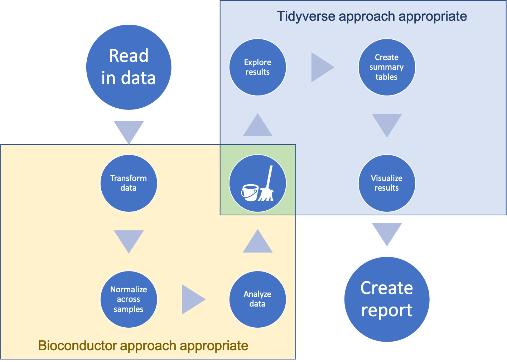

## Complex data types in experimental data pre-processing {#module15}

Raw data from many biomedical experiments, especially those that use
high-throughput techniques, can be very large and complex. Because of the scale
and complexity of these data, software for pre-processing the data in R often
uses complex, 'untidy' data formats. While these formats are necessary for
computational efficiency, they add a critical barrier for researchers wishing to
implement reproducibility tools. In this module, we will explain why use of
complex data formats is often necessary within open-source pre-processing
software and outline the hurdles created in reproducibility tool use among
laboratory-based scientists.

**Objectives.** After this module, the trainee will be able to:

- Explain why R software for pre-processing biomedical data often stores 
data in complex, 'untidy' formats 
- Describe how these complex data formats can create barriers to 
laboratory-based researchers seeking to use reproducibility tools for 
data pre-processing

In previous modules, we have gone into a lot of detail about all of the
advantages of the tidyverse approach. In some cases, though, data might be
poorly suited to a tidyverse approach at some part of your pipeline. However as
you work with biomedical data, you may find that it is unreasonable to start
with a tidyverse approach from the first steps of pre-processing the data. This
is particularly the case if you are working with data from complex research
equipment, liek mass spectrometers and flow cytometers.

It can be frustrating to realize that you can't use your standard tools
in some steps of working with the data you collect in your experiments. 
For example, you may have taken an R course or workshop, and be at the 
point where you are starting to feel pretty comfortable with how to use
R to work with standard datasets. You can feel like you're starting at 
square one when you realize that approach won't work for some steps of 
working with the data you're collecting for your own research. 

This module aims to help you navigate this process. 
It is helpful to understand how the Bioconductor approach differs from 
the tidyverse approach, to start developing a framework and tools for 
navigating both approaches. 

The primary difference between the two approaches is how the data objects
are structured. When you work with data in R, it is kept in an "object", 
which you can think of as a structured container for the data. In the 
tidyverse approach, the primary data container is the dataframe. A 
dataframe is made up of a set of object types called vectors (each column
in the dataframe is a vector). Therefore, to navigate the tidyverse 
approach, the only data structures you need to understand well are the 
dataframe structure and the vector structure. Tools in the tidyverse
use these simple structures over and over.

By contrast, the Bioconductor approach uses a collection of more complex 
structured containers to store data as it's used. There are a number of 
reasons for this, which we'll discuss in this module. 

As a note, it is very possible that in the near future, all steps of even
complex pipelines will be manageable with a tidyverse approach. More 
R developers are embracing the tidyverse approach and making tools and packages
within its framework. In some areas with complex data, there have been 
major inroads, allowing a tidyverse approach throughout the pipeline even
when working with complex data. One example of this is with spatial data, 
where the `sf` package, and related tools, now make it possible to stay in 
a tidyverse framework when working with large and complex geospatial data. 
We will end this module by discussing the outlook for similar developments
in the area of biomedical data. 

### How the Bioconductor and tidyverse approaches differ

The heart of the difference between the tidyverse and Bioconductor approaches
comes down to how data are structured within pipelines in the two approaches.
There are more differences than this one, but most of the other differences
result from this main difference.

As we've described in detail in earlier modules (modules 2.3 and 3.5), in the
tidyverse approach, data are stored throughout the pipeline in a dataframe
structure. These dataframes are composed of vectors, which make up their
columns. Almost every function in the tidyverse is designed to input either a
dataframe or a vector. And almost every function is designed to output the same
type of data container (dataframe or vector) that it inputs. As a result, the
tidyverse approach can mix and match functions in different orders to tackle
complex processes through a chain of many small steps.

By contrast, most packages in Bioconductor use more complex data structures 
to store data. Often, a Bioconductor pipeline will use different data 
structures at different points in its pipeline. For example, your data might
be stored in one type of a data container after it's first read into R, and 
another type once you've done some pre-processing.

As a result, with the Bioconductor approach, there will be more types of data
structures that you will have to learn how to use and navigate. Another
result is that, often, the functions that you use in your
pipeline will only work with a specific data structure. You therefore will need
to keep track of which type of data structure is required as the input to each
function.

This also means that you are more constrained in how you chain together
different functions to make a pipeline. In the tidyverse approach, you can often
chain the functions in any order, since each function inputs and outputs the
same data structure. With a Bioconductor pipeline, however, there
will be functions that input one data structure and output a different one.
As a result, Bioconductor functions, instead of being "small"
functions that do one simple thing, often carry out a number of complex 
steps within each function call. 

This difference will also make a difference in how you work when you modify a
pipeline of code. In the tidyverse approach, you will change the functions you
include and the order in which you call them, rearranging the small tools to
create different pipelines. For a Bioconductor pipeline, it's more common that
to customize it, you will adjust parameter settings within functions, but will
still call a standard series of functions in a standardized order.

Because of those differences, it can be hard to pick up the Bioconductor
approach if you're used to the tidyverse approach. However, Bioconductor is
critical to learn if you are working with many types of biomedical data, as many
of the key tools and algorithms for genomic data are shared through that
project. This means that, for many biomedical researchers who are now generating
complex, high-throughput data, it is worth learning how to use complex data
structures in R.

To be clear, a pipeline in R that includes these complex data structures
will typically still be modular, in the sense that you can adapt and 
separate specific parts of the pipeline. However, they tend to be much 
less flexible than pipelines developed with a tidyverse approach. The 
data structure changes often, with certain functions outputing a data
structure that is needed for the next step, then the function of the 
next step outputting the data in a different structure, and so on. This
changing data structure means that the functions for each step often are
constrained to always be put in the same order. By comparison, the small 
tools that make up tidyverse functions can often be combined in many different
orders, letting you build a much larger variety of pipelines with them. 
Also, many of the functions that work with complex data types will do 
many things within one function, so they can be harder to learn and 
understand, and they are often much more customized to a specific action, 
which means that you have to learn more functions (since each does one
specific thing). 


### Why is the Bioconductor approach designed as it is?

It can be helpful to understand why the Bioconductor approach is designed
in the way it is. First, there are some characteristics of complex data
that can make it unsuitable for a tidyverse approach. In the next section 
of the module, we'll discuss some of these characteristics, as well as 
provide examples of how biomedical data can have these characteristics. 

However, there are also some historical and cultural reasons for the 
Bioconductor design. It is helpful to have an introduction to this, as it 
can help you navigate as you work within the Bioconductor framework. 

Bioconductor predates the tidyverse approach. In fact, it has been around
almost as long as R itself---the first version of R was first released 
in 2000, and Bioconductor started in 2003. 

The Bioconductor project had an ambitious aim---allow people around the world to
coordinate to make tools for pre-processing and analyzing genomic and other
high-throughput data. Anyone is allowed to make their own extension to R as a
package, including a Bioconductor package. This is similar to the approach taken
by Andy Warhol, the famous pop artist. He had a studio where the door was always
open, and people were free to walk in off the street to help create new things
[@judkins2016art].

Imagine how complex it is to try to harness all these contributions. Within 
the Bioconductor project, this is managed by using some general design principles,
centered on some standard data structures. Each person who writes
code for Bioconductor can use these data structures, writing functions that 
input and output data within these defined structures. If they are working 
on something where there isn't yet a defined structure, they can define new
ones within their package, which others can then use in their own packages. 

The different Bioconductor data structures, then, were implemented to help many
people coordinate to make software extensions to R to handle complex biomedical
data. As Susan Holmes and Wolfgang Huber note in their book *Modern Statistics
for Modern Biology*: 

> "The Bioconductor project has defined specialized data containers to represent
complex biological datasets. These help to keep your data consistent, safe and 
easy to use." [@holmes2018modern]

Indeed, in an article on software for computational biology, Robert Gentleman---one
of the developers of R and founders of the Bioconductor project---is quoted 
as saying: 

> "We defined a handful of data structures that we expected people to use. For
instance, if everybody puts their gene expression data into the same kind of
box, it doesn’t matter how the data came about, but that box is the same and can
be used by analytic tools. Really, I think it’s data structures that drive
interoperability." --- Robert Gentlemen in [@altschul2013anatomy]

### Why is it sometimes necessary to use a Bioconductor approach with biomedical data

There are some characteristics of some types of biomedical data that make
non-tidy data structures sometimes very useful. Specifially, there are two main
features---of data collected from complex laboratory equipment like flow
cytometers and mass spectrometers, in particular---that make it useful to use
more complex data structures in R in the earlier stages of pre-processing the
data rather directly using a tidy data structure. First, the data are often very
large, in some cases so large that it is difficult to read them into R. Second,
the data might combine various elements, each with their own natural structures,
that you'd like to keep together as you move through the steps of pre-processing
the data.

The first reason why dataframe structures don't always work for data from
biological experiments has to do with the size of data (and so how much
memory it requires). Very large datasets are common in biomedical data, 
including genomics data. As Holmes and Huber note: 

> "Biology, formerly a science with sparse, often only qualitative data, has
turned into a field whose production of quantitative data is on par with high
energy physics or astronomy and whose data are wildly more heterogeneous and
complex." [@holmes2018modern]

A computer has several ways that it can store data. The primary storage is
closely connected with the computer's processing unit, where calculations are
made, and so data stored in this primary storage can be processed by code very
quickly. This storage is called the computer's random access memory, or RAM. R
uses this approach, and so when you load data in R to be stored in one of its
traditional data structures, that data is moved into part of the computer's RAM
[@burns2011r; @gillespie2016efficient].

Data can also be stored in other devices on a computer, including hard drives
and solid state drives that are built into the computer or even onto storage
devices that can be removed from the computer, like USB drives or external hard
drives. The size of available storage in these devices tends to be much, much
larger than the storage size of the computer's RAM. However, it takes longer to
access data in these secondary storage devices because they aren't directly
connected to the processor, and instead require the data to move into RAM before
it can be accessed by the processor, which is the only part of the computer that
can do things to analyze, modify, or otherwise process the data.

The traditional dataframe structure in R is built after
reading data into RAM. However, many biological experiments now create
data that is much too large to read into memory for R in a reasonable way
[@lawrence2014scalable; @hicks2021mbkmeans]. If you try to read in a dataset
that's too large for the RAM, R can't handle it. As Roger Peng notes in 
*R Programming for Data Science*: 

> "Reading in a large dataset for which you do not have enough RAM is one easy
way to freeze up your computer (or at least your R session). This is usually an
unpleasant experience that usually requires you to kill the R process, in the
best case scenario, or reboot your computer, in the worst case."  [@peng2016r]

More complex data structures can allow more sophisticated ways to handle massive
data, and so they are often necessary when working with massive biological
datasets, particularly early in pre-processing, before the data can be
summarized in an efficient way. For example, a more complex data structure could
allow much of the data to be left on disk, and only read into memory on demand,
as specific portions of the data are needed [@gatto2013msnbase;
@hicks2021mbkmeans]. This approach can be used to iterate across subsets of the
data, only reading parts of the data into memory at a time
[@lawrence2014scalable]. Such structures can be designed to work in a way that,
if you are the user, you won't notice the difference in where the data is kept
(on disk versus in memory)---this means you won't have to worry about these
memory management issues, but instead can just gain from everything going
smoothly, even as datasets get very large [@gatto2013msnbase].
As one article notes: 

> "These advances have helped to ensure that R and Bioconductor remain relevant
in the age of high-throughput sequencing. We plan to continue in this direction
by designing and implementing abstractions that enable user code to be agnostic
to the mode of data storage, whether it be memory, files or databases. This will
bring much needed agility to resource allocation and will enable the user to be
more resourceful, without the burden of increased complexity."
[@lawrence2014scalable]

The second reason that tidy dataframes aren't always best for biomedical data
has to do with the complexity of the data. Dataframes are very clearly and
simply organized. However, they can be too restrictive in some cases. Sometimes,
you might have data that do not fit well within the two-dimensional, non-ragged
structure that is characteristic of the dataframe structure. For example, some
biomedical data may have data that records characteristics at several levels of
the data. It may have records on the levels of gene expression within each
sample, separate information about each gene that was measured, and another
separate set of information that characterizes each of the samples. While it is
critical to keep "like" measurements aligned with data like this---in other
words, to ensure that you can connect the data that characterizes a gene with
the data that provides measures of the level of expression of that gene in each
sample---these data do not naturally have a two-dimensional structure and so do
not fit naturally into a dataframe structure.

Finally, one of the advantages of these complex data structures for biomedical
data pre-processing is that they can be leveraged to develop very powerful
algorithms for working with complex biomedical data. These include reading data
in from the specialized file formats that are often output by laboratory
equipment. As Holmes and Huber note: 

> "Bioconductor packages support the reading of many of the data types and formats
produced by measurement instruments used in modern biology, as well as the 
needed technology-specific 'preprocessing' routines. This community is 
actively keeping these up-to-date with the rapid developments in the 
instrument market." [@holmes2018modern]

### Combining Bioconductor and tidyverse approaches in a workflow

Work with research data will typically require a series of steps for
pre-processing, analysis, exploration, and visualization. Collectively, these
form a *workflow* or *pipeline* for the data analysis. With large, complex
biological data, early steps in this workflow might require a Bioconductor
approach, given the size and complexity of the data, or because you'd like to
use a method or algorithm available through Bioconductor. However, this doesn't
mean that you must completely give up the power and efficiency of the tidyverse
approach described in earlier modules. 

Instead, you can combine the two, in a workflow like that shown in Figure
\@ref(fig:combinedworkflow). In this combined approach, you start the workflow
in the Bioconductor approach and transition when possible to a tidyverse
approach, transitioning by "tidying" from a more complex data structure to a
simpler dataframe data structure along the way. In this module, we will describe
how you can make this transition to create this type of combined workflow. This
is a useful approach, because once your workflow has advanced to a stage where
it is straightforward to store the data in a a dataframe, there are a large
advantages to shifting into the tidyverse approach as compared to using more
complex object-oriented classes for storing the data, in particular when it
comes to data analysis and visualization at later stages in your workflow.

```{r combinedworkflow, echo = FALSE, out.width = "\\textwidth", fig.cap = "An overview of a workflow that moves from a Bioconductor approach---for pre-processing of the data---through to a tidyverse approach one pre-processing has created smaller, simpler data that can be reasonably stored in a dataframe structure.", fig.fullwidth = TRUE}

```

Key to this kind of combined pipeline are tools that can convert between
specialized data structures for Bioconductor to tidy dataframes. A set of tools
for doing this are available through the `biobroom` package. You will use
functions in this package applied to certain types of Bioconductor data objects,
and the function will be able to extract parts of the data into a tidy data
frame.

The `biobroom` package includes three main generic functions (also called
"methods"), which can be used on a number of Bioconductor object classes. When
applied to object stored in one of these Bioconductor classes, these functions
will extract part of the data into a tidy dataframe format. In this format, it
is easy to use the tools from the tidyverse to further explore, analyze, and
visualize the data.

The three generic functions of `biobroom` are the functions `tidy`, `augment`,
and `glance`. These function names mimic the names of the three main functions
in the `broom` package, which is a more general purpose package for extracting
tidy datasets from more complex R object containers [@robinson2014broom]. The
`broom` package focuses on the output from functions in R for statistical
testing and modeling, while the newer `biobroom` package replicates this idea,
but for many of the common object classes used to store data through
Bioconductor packages and workflows.

As an example, we can look at how the `biobroom` package can be used to convert
output generated by functions in the `edgeR` package. The `edgeR` package is a
popular Bioconductor package that can be used on gene expression data to explore
which genes are expressed differently across experimental groups (*differential
expression analysis*) [@edgeR]. Before using the functions in the package, the
data must be pre-processed to align sequence reads from the raw data and then to
create a table with the counts of each read at each gene across each sample. The
`edgeR` package includes functions for pre-processing through its own functions,
as well, including capabilities for filtering out genes with low read counts
across all samples and model-based normalization across samples to help handle
technical bias, including differences in sequencing depth [@chen2014edger].

The `edgeR` package operates on data stored in a special object class defined by
the package, the `DGEList` object class [@chen2014edger]. This object class
includes areas for storing the table of read counts, in the form of a matrix
appropriate for analysis by other functions in the package, as well as other
spots for storing information about each sample and, if needed, a space to store
annotations of the genes [@chen2014edger]. Then functions from the `edgeR`
package can perform differential expression analysis on the data in the
`DGEList` class. The result is an object in the `DGEExact` class, which is
defined by the `edgeR` package.  To extract data from this class in a tidy
format, you can use the `tidy` and `glance` functions from `biobroom`.

### Outlook for a tidyverse approach to biomedical data

Finally, it is quite likely better tools will continue to evolve, and that in
the future there might be tidy dataframe formats that are adaptable enough to
handle earlier stages in the data pre-processing for genomics data. The tidyverse
dataframe approach has already been adapted to enable tidy dataframes to include
more complex types of data within certain columns of the data frame as a special
list-type column. This functionality is being leveraged through the `sf`
package, for example, to enable a tidy approach to working with geographical
data. This allows those who are working with geographical data, for example data
from shapefiles for creating maps, to use the standard tidyverse approaches
while still containing complex data needed for this geographical information
within a tidy dataframe. It seems very possible that similar approaches may be
adapted in the near future to allow for biomedical or genomic data to be stored
in a way that both accounts for complexity early and pre-processing of these
data but also allows for a more natural integration with the wealth of powerful
tools available through the tidyverse approach.

-----------------------------------------------------------------------

Many excellent
resources exist for learning the tidyverse approach, and so we won't recover that
information here. Instead, we will focus on how to interface between this
approach and the object-based approach that's more common with Bioconductor
packages. Bioconductor packages often take an object-based approach, and with
good reason because of the complexity and size of many early versions of
biomedical data in the pre-processing process. There are also resources for
learning to use specific Bioconductor packages, as well as some general
resources on Bioconductor, like *R Programming for Bioinformatics* [ref].
However, there are fewer resources available online that teach how to coordinate
between these two approaches in a pipeline of code, so that you can leverage the
needed power of Bioconductor approaches early in your pipeline, as you
pre-process large and complex data, and then shift to use a tidyverse approach
once your data is amenible to this more straightforward approach to analysis and
visualization.

The heart of making this shift is learning how to convert data, when possible, 
from a more complex, class-type data structure (built on the flexible list 
data structure) to the simpler, more standardized two-dimensional dataframe 
structure that is required for the tidyverse approach. In this subsection, we'll 
cover approaches for converting your data from Bioconductor data structures to 
dataframes. 

If you are lucky, this might be very straightforward. A pair of packages called
`broom` and `biobroom` have been created specifically to facilitate the conversion
of data from more complex structures to dataframes. The `broom` package was 
created first, by David Robinson, to convert the data stored in the objects that 
are created by fitting statistical models into tidy dataframes. Many of the functions
in R that run statistical tests or fit statistical models output results in a 
more complex, list-based data structure. These structures have nice "print" methods, 
so if fitting the model or running the test is the very last step of your pipeline, 
you can just read the printed output from R. However, often you want to include 
these results in further code---for example, creating plots or tables that show
results from several statistical tests or models. The `broom` package includes 
several functions for pulling out different bits of data that are stored in the 
complex data structure created by fitting the model or running the test and convert
those pieces of data into a tidy dataframe. This tidy dataframe can then be 
easily used in further code using a tidyverse approach. 

The `biobroom` package was created to meet a similar need with data stored in some
of the complex structures commonly used in Bioconductor packages.


-----------------------------------------------------------------------

Some of the most important data structures in Bioconductor are [@huber2015orchestrating] (from Table 2 in this reference):

- `ExpressionSet` (`Biobase` package) 
- `SummarizedExperiment` (`GenomicRanges` package)
- `GRanges` (`GenomicRanges` package) 
- `VCF` (`VariantAnnotation` package)
- `VRanges` (`VariantAnnotation` package) 
- `BSgenome` (`BSgenome` package) 


> "The Bioconductor project distributes the software as a number of different R
packages, including Rsamtools, IRanges, GenomicRanges, GenomicAlignments,
Biostrings, rtracklayer, biovizBase and BiocParallel. The software enables the
analyst to conserve computational resources, iteratively generate summaries and
visualize data at arbitrary levels of detail. These advances have helped to
ensure that R and Bioconductor remain relevant in the age of high-throughput
sequencing. We plan to continue in this direction by designing and implementing
abstractions that enable user code to be agnostic to the mode of data storage,
whether it be memory, files or databases. This will bring much needed agility to
resource allocation and will enable the user to be more resourceful, without the
burden of increased complexity."  [@lawrence2014scalable]


> "The biobroom package contains methods for converting standard objects in Bioconductor into a 'tidy format'. It serves as a complement to the popular broom package, and follows the same division (tidy/augment/glance) of tidying methods."
[@biobroom]

> "Tidying data makes it easy to recombine, reshape and visualize bioinformatics analyses. Objects that can be tidied include: ExpressionSet object,
GRanges and GRangesList objects, RangedSummarizedExperiment object, MSnSet object,
per-gene differential expression tests from limma, edgeR, and DESeq2, qvalue object for multiple hypothesis testing." [@biobroom]

> "We are currently working on adding more methods to existing Bioconductor objects." [@biobroom]

> "All biobroom tidy and augment methods return a tbl_df by default (this prevents them from printing many rows at once, while still acting like a traditional data.frame)." [@biobroom]

> "The concept of 'tidy data' offers a powerful framework for structuring data
to ease manipulation, modeling and visualization. However, most R functions,
both those builtin and those found in third-party packages, produce output that
is not tidy, and that is therefore difficult to reshape, recombine, and
otherwise manipulate. Here I introduce the broom package, which turns the output
of model objects into tidy data frames that are suited to further analysis,
manipulation, and visualization with input-tidy tools." [@robinson2014broom]

> "Tools are classified as 'messy-output' if their output does not fit into this
[tidy] framework. Unfortunately, the majority of R modeling tools, both from the
built-in stats package and those in common third party packages, are
messy-output. This means the data analyst must tidy not only the original data,
but the results at each intermediate stage of an analysis." [@robinson2014broom]

> "The broom package is an attempt to solve this issue, by bridging the gap from
untidy outputs of predictions and estimations to create tidy data that is easy
to manipulate with standard tools. It centers around three S3 methods, tidy,
augment, and glance, that each take an object produced by R statistical
functions (such as lm, t.test, and nls) or by popular third-party packages (such
as glmnet, survival, lme4, and multcomp) and convert it into a tidy data frame
without rownames (Friedman et al., 2010; Therneau, 2014; Bates et al., 2014;
Hothorn et al., 2008). These outputs can then be used with input-tidy tools such
as dplyr or ggplot2, or downstream statistical tests. broom should be
distinguished from packages such as reshape2 and tidyr, which rearrange and
reshape data frames into different forms (Wickham, 2007b, 2014b). Those packages
perform essential tasks in tidy data analysis but focus on manipulating data
frames in one specific format into another. In contrast, broom is designed to
take data that is not in a data frame (sometimes not anywhere close) and convert
it to a tidy data frame." [@robinson2014broom]

> "`tidy` constructs a data frame that summarizes the model’s statistical
components, which we refer to as the component level. In a regression such as
the above it may refer to coefficient estimates, p-values, and standard errors
for each term in a regression. The tidy generic is flexible- in other models it
could represent per-cluster information in clustering applications, or per-test
information for multiple comparison functions. ... `augment` add columns to the
original data that was modeled, thus working at the observation level. This
includes predictions, residuals and prediction standard errors in a regression,
and can represent cluster assignments or classifications in other applications.
By convention, each new column starts with . to ensure it does not conflict with
existing columns. To ensure that the output is tidy and can be recombined,
rownames in the original data, if present, are added as a column called
.rownames. ... Finally, `glance` constructs a concise one-row summary of the
model level values. In a regression this typically contains values such as R2 ,
adjusted R2 , residual standard error, Akaike Information Criterion (AIC), or
deviance. In other applications it can include calculations such as cross
validation accuracy or prediction error that are computed once for the entire
model. ... These three methods appear across many analyses; indeed, the fact
that these three levels must be combined into a single S3 object is a common
reason that model outputs are not tidy. Importantly, some model objects may have
only one or two of these methods defined. (For example, there is no sense in
which a Student’s T test or correlation test generates information about each
observation, and therefore no augment method exists). " [@robinson2014broom]

> "While model inputs usually require tidy inputs, such attention to detail
doesn’t carry over to model outputs. Outputs such as predictions and estimated
coefficients aren’t always tidy. For example, in R, the default representation
of model coefficients is not tidy because it does not have an explicit variable
that records the variable name for each estimate, they are instead recorded as
row names. In R, row names must be unique, so combining coefficients from many
models (e.g., from bootstrap resamples, or subgroups) requires workarounds to
avoid losing important information. This knocks you out of the flow of analysis
and makes it harder to combine the results from multiple models."
[@wickham2014tidy]

> "Right now, in labs across the world, machines are sequencing the genomes of the life 
on earth. Even with rapidly decreasing costs and huge technological advancements in 
genome sequencing, we're only seeing a glimpse of the biological information contained
in every cell, tissue, organism, and ecosystem. However, the smidgen of total biological 
information we're gathering amounts to mountains of data biologists need to work with. At 
no other point in human history has our ability to understand life's complexities been so 
dependent on our skills to work with and analyze data." [@buffalo2015bioinformatics]

> "Bioinformaticians are concerned with deriving biological understanding from large
amounts of data with specialized skills and tools. Early in biology's history, the 
datasets were small and manageable. Most biologists could analyze their own data after
taking a statistics course, using Microsoft Excel on a personal desktop computer.
However, this is all rapidly changing. Large sequencing datasets are widespread, and will 
only become more common in the future. Analyzing this data takes different tools, new skills,
and many computers with large amounts of memory, processing power, and disk space."
[@buffalo2015bioinformatics]

> "Unfortunately, many of the biologist's common computational tools can't scale to the
size and complexity of modern biological data. Complex data formats, interfacing 
numerous programs, and assessing software and data make large bioinformatics datasets 
difficult to work with." [@buffalo2015bioinformatics]

> "Bioconductor's pakcage system is a bit different than those on the Comprehensive R 
Archive Network (CRAN). Bioconductor packages are released on a set schedule, twice 
a year. Each release is coordinated with a version of R, making Bioconductor's versions
tied to specific R versions. The motivation behind this strict coordination is that it 
allows for packages to be thoroughly tested before being released for public use. 
Additionally, because there's considerable code re-use within the Bioconductor project, 
this ensures that all package versions within a Bioconductor release are compatible
with one another. For users, the end result is that packages work as expected and 
have been rigorously tested before you use it (this is good when your scientific
results depend on software reliability!). If you need the cutting-edge version of a 
package for some reason, it's always possible to work with their development branch."
[@buffalo2015bioinformatics]

> "When installing Bioconductor packages, we use the `biocLite()` function. `biocLite()`
installs the correct version of a package for your R version (and its corresponding
Bioconductor version)." [@buffalo2015bioinformatics]


### Practice quiz

