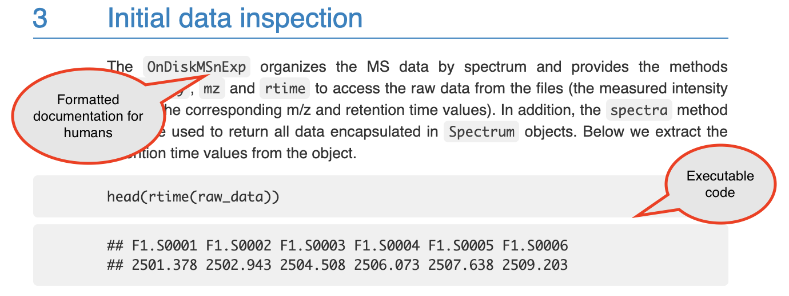
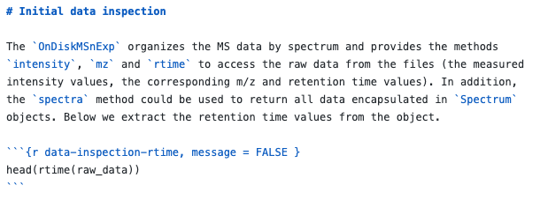
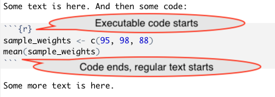
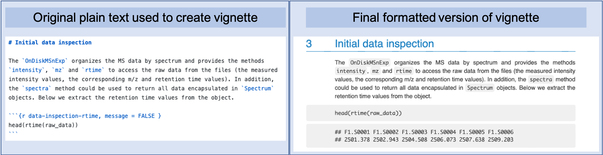

## Introduction to reproducible data pre-processing protocols {#module18}

Reproducibility tools can be used to create reproducible data pre-processing
protocols---documents that combine code and text in a "knitted" document, which
can be re-used to ensure data pre-processing is consistent and reproducible
across research projects. In this module, we will describe how reproducible data
pre-processing protocols can improve reproducibility of pre-processing
experimental data, as well as to ensure transparency, consistency, and
reproducibility across the research projects conducted by a research team.

**Objectives.** After this module, the trainee will be able to:

- Define a "reproducible data pre-processing protocol" 
- Explain how such protocols improve reproducibility at the data pre-processing
phase
- List other benefits, including improving efficiency and consistency of data
pre-processing
- Understand how a "knitted" document can be used to combine text and 
executable code to create a reproducible data pre-processing protocol

### Introducing reproducible data pre-processing protocols

If you have ever worked in a laboratory, you are likely familiar with protocols.
For a wet lab, protocols are used as "recipes" for conducting certain
experiments or processes. They are written to be clear enough that everyone in
the lab could follow the same steps in the process by following the protocol. In
this way, they help to standardize processes done in the laboratory, and they
can also play a role in improving safety and the quality of data collection.
Protocols are similarly used for medical procedures and
tests, as well as for clinical trials. In all cases, they help to define in
detail the steps of the procedure, so they can be done in a way that is
comparable from one case to the next and with high precision.

```{marginfigure, echo = TRUE}
On clinical imaging protocols: "When one is composing a protocol, it is helpful
to imagine that all the technologists at the facility won the
lottery and quit. What would a newly hired technologist
need to know to image a patient in the exact same manner
as in the past to produce the same results?"

[@thomas2015write]
```

You can apply a similar idea to pre-processing and analyzing the data that you 
collect in a laboratory. Just as a wet lab protocol can help standardize your
data collection to the point that the data are recorded, a separate protocol 
can help define how you manage and work with that data. 
The basic content of a data-focused protocol will include a description of the type of data
you expect to input, the type of data you expect at the end of the process, 
and the steps you take to get from the input to the output.
A data-focused protocol can include steps for quality control of the 
collected data, as well as pre-processing steps like transformations and 
scaling of the data. 

In module 3.9, we'll walk through an example of creating a data pre-processing
protocol that focuses on data collected by plating samples to estimate
bacterial load. In this case, a key step in pre-processing the data is to
identify a "good" dilution to be used for estimating bacterial load in each
sample---each sample is plated at several dilutions, and to work with the data,
you must identify a dilution for each sample for which enough bacteria grew to
be countable, but not so many that there are too many colonies to count. In high
throughput experiments, like RNA-seq experiments, there may be important steps
in the data pre-processing that help check for batch effects across samples, for
signs of a poor-quality sample, or for normalizing and scaling the data in
preparation for applying other algorithms, like algorithms to estimate
differential expression across samples or to identify clusters within the data.

A data-focused protocol brings many of the same advantages as wet lab protocols. 
It can help standardize the process of data pre-processing across members of
the laboratory, as well as from experiment to experiment. It can also help 
ensure the quality of the data collection, by defining clear rules, 
steps, and guidelines for completing the data pre-processing. Finally, it can
help ensure that someone else could recreate the process at a later time, and
so can improve the reproducibility of the experiment. 
Not only do data-focused protocols help with improving quality and reproducibility, 
but they also help improve efficiency. These protocols should include
clearly defined steps, as well as explanations for each step, and they should illustrate
these with example data. By having this "recipe", a new lab member can quickly 
learn how to do the data pre-processing, and a long-term lab member remember
the exact steps more quickly. 

You can create a data pre-processing protocol using any document processing
program that you'd like. For example, you could write one in Google Docs or in
Word. However, there is a better format. With programming languages like R and
Python, you can created a type of document called a **knitted document**. A
knitted document interweaves two elements: first, text written for humans and
second, executable code meant for the computer. These documents can be
"rendered" in R or another programming language, which executes all the code and
adds all the output from that code at the appropriate place in the text. The end
result is a document in a format that is easy to share and read (PDF, Word, or
HTML), which includes text, example code, and output. You can use these
documents to record the data pre-processing process for a type of data in your
laboratory, and by using a knitted document, you ensure that the code is
"checked" every time you render the document. In this module,
we will give an overview of how these knitted documents work, as well as how they
can improve the reproducibility and efficiency of experimental work. In the
next module, we'll show how you can make them in the free RStudio software. 
Finally, in module 3.9, we'll walk through a full example of writing a data pre-processing
protocol in this way---you can take a look now to get an idea by downloading the
example protocol
[here](https://github.com/geanders/improve_repro/raw/master/data/bactcountr_example_data/example_protocol.pdf).
There are also some excellent data-focused protocols that have been published in
journals like *Nature Protocols*. Some recent examples of such protocols include
@schrode2021analysis, @quintelier2021analyzing, and @majumder2021cognitive. You
may find it useful to take a look at one or more to get an idea of how
data-focused protocols can be useful.


<!-- ### Improving reproducibility with protocols -->

<!-- Just like a protocol for a laboratory procedure, a protocol for data -->
<!-- pre-processing should be thorough and detailed. In a protocol, every step of the -->
<!-- process should be clearly documented [@thomas2015write]. The steps should be -->
<!-- detailed enough that the reader can start from the example input data and get -->
<!-- the same resulting output data. -->

<!-- One thing that helps to ensure this level of detail is to do all pre-processing -->
<!-- steps using code scripts and include this code in the protocol. While there  -->
<!-- are a number of software tools available that let you pre-process or analyze -->
<!-- data using point-and-click software, data pre-processing that is done with  -->
<!-- this type of software can be hard to document and reproduce. As an alternative,  -->
<!-- you could use code for a program like R or Python to complete the same steps,  -->
<!-- and this allows you to record each step that was taken in the process.  -->

<!-- As an example, let's consider the process of gating flow cytometry data. Flow -->
<!-- cytometry data is often collected in immunology research, where it can be used -->
<!-- to characterize the population size of different types of immune cells, like T -->
<!-- cells and B cells. The data can therefore be used to help measure an animal's -->
<!-- immune response following vaccination or a challenge with a pathogen. Flow -->
<!-- cytometry data is collected by ... There are some steps that a researcher must -->
<!-- take to get from the raw data that is output by the flow cytometry equipment to -->
<!-- the measurement they're interested in, which might be something like the -->
<!-- population size of CD4+ T cells in the sample. The researcher must go through -->
<!-- the data in steps, comparing along one or two of the measured [markers?] at each -->
<!-- step, looking at the univariate or bivariate distributions along those markers. -->
<!-- As they do this, they'll apply "gates" to isolate the cells in a specific part -->
<!-- of the distribution, and only use those cells in continuing steps. For example, -->
<!-- they might start by isolating only cells that are live and are "singlets" -->
<!-- (measurements of single cells, rather than "doublets", which represent two or -->
<!-- more cells stuck together).  -->

<!-- This gating process can be done with point-and-click software. When such -->
<!-- software is used, the researcher will sit at the computer and go through a -->
<!-- series of screens, using their mouse at each stage to add a gate to subset to -->
<!-- certain cells. As an alternative, a researcher could conduct this process using -->
<!-- a code script. The script would use algorithms to apply specific rules to the -->
<!-- gating process at each step. It will be much easier to make a reproducible data -->
<!-- pre-processing protocol if the researcher uses a code script for the process -->
<!-- rather than the point-and-click software. With code, all relevant details of the -->
<!-- process can be found by investigating either the code or the software that the -->
<!-- code draws on (which, for software like R and Python, is open-source and so can -->
<!-- be explored). Therefore, the code itself provides thorough and detailed -->
<!-- documentation of the process. By contrast, to document the point-and-click -->
<!-- method, the researcher would need to describe each screen they see during the -->
<!-- process and where they click on each screen. This could be done with screenshots -->
<!-- and explanations, but it can be hard to describe thoroughly enough to ensure -->
<!-- that the process could be exactly reproduced. Further, the layout of some  -->
<!-- screens may change in the future, in which case the described process may  -->
<!-- no longer work. While the open-source software behind coding-based approaches -->
<!-- can also change, all former versions tend to be archived so they can be  -->
<!-- accessed in the future if needed to reproduce an earlier process.  -->
<!-- (Fortunately, some point-and-click software systems have begun creating a way to  -->
<!-- save workflows and apply them later, which is more similar to the process -->
<!-- of writing a script to do the analysis. These do help with reproducibility,  -->
<!-- including consistency across samples for an experiment and across analyses  -->
<!-- done by different people. However, they may not always be as transparent  -->
<!-- and easy to decipher as a well-documented code script, and they won't interface -->
<!-- as well with other valuable tools, like the RMarkdown system for creating  -->
<!-- reproducible reports.) -->

<!-- A data pre-processing protocol can also help in improving the quality of the -->
<!-- pre-processing. If your research group uses the protocol to explain and  -->
<!-- document why each step is taken, the process of writing the protocol helps -->
<!-- to think deeply about each step of pre-processing. You can include references -->
<!-- in the protocol to recent papers to help justify certain steps, and you can -->
<!-- revisit and update the protocol at regular periods to make sure that it  -->
<!-- reflects the current best practices [@thomas2015write]. In doing so, you can create versions -->
<!-- of the protocol, so that you can both reproduce work done using an earlier -->
<!-- version, while still allowing the protocol to be a "living" document that  -->
<!-- changes as new data pre-processing methods become available.  -->

<!-- [Example---scRNA-seq, normalization?] -->

<!-- ### Improving efficiency with protocols -->

<!-- Data pre-processing protocols can also help improve the efficiency of working -->
<!-- with biomedical data. As an example, let's revisit the flow cytometry example -->
<!-- that we discussed in the last section. If the process has been documented using -->
<!-- a code script, then the entire process can often be redone on a new sample just -->
<!-- by changing the input data for the code. By contrast, if data pre-processing was -->
<!-- done using point-and-click software, the researcher typically must go through -->
<!-- each step anew with the data for each sample. The use of code---including code -->
<!-- that is embedded in a reproducible protocol---can therefore save the researcher -->
<!-- a lot of time in this scenario. While the use of code for the pre-processing -->
<!-- plays a large role in this gain in efficiency, there is also some gain from -->
<!-- using not just a code script but one within a protocol, as the protocol can help -->
<!-- the researcher quickly figure out any changes that should be made for a new -->
<!-- sample compared to the example data used within the protocol---the text and -->
<!-- explanations in the protocol can help in figuring out if anything about -->
<!-- processing the new sample should be done differently from the standard process. -->

<!-- ... -->

### Using knitted documents for protocols

When it comes to protocols that are focused on data pre-processing and 
analysis, there are big advantages to creating them as something called
**knitted documents**. In this section, we'll walk through what a knitted
document is, and in the next section we'll cover some of the advantages of using this format to 
create data-focused protocols. 

A knitted document is one that is written in plain text in a way that "knits"
together text with executable code. Once you have written the document, you can
render it, which executes the code, adds to the document results from this
execution (figures, tables, and code output, for example), and formats all text
using the formatting choices you've specified. The end result is a nicely format
document, which can be in one of several output formats, including PDF, Word, or
HTML. Since the code was executed to create the document, you can ensure that
all the code has worked as intended.

If you have coded using a scripting language like R or Python, you likely have
already seen many examples of knitted documents. For both these languages, there
are many tutorials available that are created as knitted documents. Figure
\@ref(fig:xcmsexample) shows an example from the start of a vignette for the
`xcms` package in R. This is a package that helps with pre-processing and
analyzing data from liquid chromatography--mass spectrometry (LC--MS)
experiments. You can see that this document includes text to explain the package
and also example code and the output from that code.
As a larger example, all the modules in this online book were written as knitted
documents.

```{r xcmsexample, echo = FALSE, out.width = "\\textwidth", fig.cap = "An example of a knitted document. This shows a section of the online vignette for the `xcms` package from Bioconductor. The two types of content are highlighted: formatted text for humans to read, and executable computer code."}

```


You can visualize the full process of creating and rendering a knitted document
in the following way. Imagine that you write a document by hand on sheets of
paper. There are parts where you need a team member to add their data or to run
a calculation, so you include notes in square brackets telling your team member
where to do these things. Then, you use some editing marks to show where
text should be italicized and which text should be section a header:

```
# Results

We measured the bacterial load of 
*Mycobacterium tuberculosis* for each 
sample. 

[Kristina: Calculate bacterial loads for 
each sample based on dilutions and
add table with results here.]
```

You send the document to your team member Kristina first, and she does her
calculations and adds the results at the indicated spot in the paper, so that
the note to her gets replaced with results. She focuses on the notes to her in
square brackets and ignores the rest of the document. Next, Kristina sends the
document, with her additions, to an assistant, Tom, to type up the document. Tom
types the full document, paying attention to any indications that are included
for formatting. For example, he sees that "Results" is meant to be a section
heading, since it is on a line that starts with "#", your team's convention for
section headings. He therefore types this on a line by itself in larger font. He
also sees that "Mycobacterium tuberculosis" is surrounded by asterisks, so he
types this in italics.

Knitted documents work in the same way, but the computer does the steps that
Kristina and Tom did in this toy example. The way the document was written in
this example is analogous to writing up a knitted document in plain text with
appropriate "executable" sections, designated with special markings, and with
other markings used to show how the text should be formatted in its final
version. When Kristina looked for the section that was marked for her, generated
results in that section, and replaced the note with the results, it was
analogous to the first stage of rendering a knitted document, where the document
is passed through software that looks for executable code and ignores everything
else, executing that code and adding in results in the right place. 
When Tom took that output and used formatting marks in the text to create a
nicely formatted final report, the step was analogous to the second stage of
rendering a formatted document, when a software program takes the output of the
first stage and formats the full document into an attractive, easy-to-read final
document, using any markings you include to format the document.

Knitted documents therefore build on two key techniques. The first is the
ability to include executable code in a document, in a way that a computer can
go through the document, find that code, execute it, and fill in the results at 
the appropriate spot in the document. The second is a set of conventions for 
formatting marks that can be put in the plain text of the document to indicate
formatting that should be added, like headers and italic text. Let's take a closer
look at each of these necessary techniques. 

The first technique that's needed to create knitted documents is the ability to
include executable code within the plain text version of the document.
The idea here is that you can use special markers to indicate in the document
where code starts and where it ends. With these markings, a computer program can
figure out the lines of the document that it should run as code, and the ones it
should ignore when it's looking for executable code. In the toy example above, 
notes to Kristina were put in square brackets, with content that started with 
her name and a colon. To "process" this document, then, she could just scan 
through it for square brackets with her name inside and ignore everything else 
in the document. 

The same idea happens with knitted documents, but a computer program takes the
place of Kristina in the example. With markings in place to indicate executable
code, the document will be run through two separate programs as it is rendered.
The first program will look for code to execute and ignore any other lines of
the file. It will execute this code and then place any results, like figures,
tables, or code output, into the document right after that piece of code. We 
will talk about the second program in just a minute, when we talk about markup 
languages.

This technique comes from an idea that you could include code to be executed in
a document that is otherwise easy for humans to read. This is an incredibly
powerful idea. It originated with a famous computer scientist named Donald
Knuth, who realized that one key to making computer code sound is to make sure
that it is clear to humans what the code is doing. Computers will faithfully do
exactly what you tell them to do, so they will do what you're hoping they will
as long as you provide the correct instructions. The greatest room for error,
then, comes from humans not giving the right instructions to computers. To 
write sound code, and code that is easy for yourself and others to maintain and
extend, you must make sure that you and other humans understand what it is 
asking the computer to do. Donald Knuth came up with a system called "literate
programming" that allows programmers to write code in a way that focuses on 
documenting the code for humans, while also allowing the computer to easily 
pull out just the parts that it needs to execute, while ignoring all the text
meant for humans. This process flips the idea of documenting code by including
plain text comments in the code---instead of the code being the heart of the 
document, the documentation of the code is the heart, with the code provided
to illustrate the implementation. When used well, this technique results in
beautiful documents that clearly and comprehensively document the intent and 
the implementation of computer code. The knitted documents that we can build
with R or Python through systems like RMarkdown and Jupyter Notebooks build 
on these literate programming ideas, applying them in ways that complement
programming languages that can be run interactively, rather than needing to 
be compiled before they're run. 

The second technique required for knitted documents is one that allows you to
write text in plain text, include formatting specifications in that plain text,
and render this to an attractive output document in PDF, Word, or HTML. This
part of the process uses a tool from a set of tools called **Markup languages**.
Here, we will use a markup language called **Markdown**. It is one of the easiest
markup languages to learn, as it has a fairly small set of formatting indicators
that can be used to "markup" the formatting in a document. This small set,
however, covers much of the formatting you might want to do, and so this
language provides an easy introduction to markup languages while still providing
adequate functionality for most purposes. 

The Markdown markup language evolved starting in spaces where people could
communicate in plain text only, without point-and-click methods for adding
formatting like bold or italic type [@buffalo2015bioinformatics]. For example,
early versions of email only allowed users to write using plain text. These
users eventually evolved some conventions for how to "mark-up" this plain text,
to serve the purposes normally served by things like italics and bold in formatted text
(e.g., emphasis, highlighting). For example, to emphasize a word, a user could
surround it with asterisks, like:

```
I just read a *really* interesting article!
```

In this early prototype for a markup language, the reader's mind was doing 
the "rendering", interpreting these markers as a sign that part of the text
was emphasized. In Markdown, the text can be rendered into more attractive
output documents, like PDF, where the rendering process has actually 
changed the words between asterisks to print in italics. 

```{marginfigure, echo = TRUE}
"Markdown originates from the simple formatting conventions used in plain-text 
emails. Long before HTML crept into email, emails were embellished with simple
markup for emphasis, lists, and blocks of text. Over time, this became a defacto
plain-text email formatting scheme. This scheme is very intuitive: underscores or 
asterisks that flank text indicate emphasis, and lists are simply lines of text 
beginning with dashes." 

[@buffalo2015bioinformatics]
```

The Markdown language has developed a set of these types of marks---like
asterisks---that are used to "mark up" the plain text with the formatting that
should be applied when the text is rendered. There are marks that you can use
for a number of formatting specifications, including: italics, bold, underline,
strike-through, bulleted lists, numbered lists, web links, headers of different
levels (e.g., to mark off sections and subsections), horizontal
rules, and block quotes. Details and examples of the Markdown syntax can be
found on the Markdown Guide page at https://www.markdownguide.org/basic-syntax/,
and we'll cover more examples of using Markdown in the next two modules. Once a
document is run through a program to execute any code, it will then be run
through a program that interprets this formatting markup (a markup renderer),
which will format the document based on any of the mark up indications and will
output an attractive document in a format like PDF, Word, or HTML.

### Advantages of using knitted documents for data-focused protocols

There are several advantages to using knitted documents when writing code to
pre-process or analyze research data. These include improvements in terms of
reliability, efficiency, transparency, and reproducibility.

First, when you have written your code within a knitted document, this code is
checked every time you render the document. In other words, you are checking
your code to ensure it operates as you intend throughout the process of writing
and editing your document, checking the code each time you render the document
to its formatted version. This helps to increase the **reliability** of the code
that you have written. Open-source software evolves over time, and by continuing
to check code as you work on protocols and reports with your data, you can
ensure that you will quickly identify and adapt to any such changes. Further,
you can quickly identify if updates to your research data introduce any issues
with the code. Again, by checking the code frequently, you can identify any
issues quickly, and this often will allow you to easily pinpoint and fix these
issues. By contrast, if you only identify a problem after writing a lot of code,
it is often difficult to identify the source of the issue. By including code
that is checked each time of document is rendered, you can quickly identify when
a change in open source software affects the analysis that you were conducting
or the pre-processing and work to adapt to any changes quickly.

Second, when you write a document that includes executable code, it allows you
to easily rerun the code as you update your research data set, or adopt the code
to work with a new data set. If you are not using a knitted document to write
pre-processing protocols and research reports, then your workflow is probably to
run all your code---either from a script or the command line---and copy the
results into a document in a word processing program like Word or Google Docs.
If you do that, you must recopy all your results every time you adapt any part
of the code or add new data. By contrast, when you use a knitted document, the
rendering process executes the code and incorporates the results directly and
automatically into a nicely formatted final document. The use of knitted
documents therefore can substantially improve the **efficiency** of
pre-processing and analyzing your data and generating the reports that summarize
this process.

Third, documents that are created in knitted format are created using plain
text. Plain text files can easily be tracked well and clearly using version
control tools like git, and associated collaboration tools like GitHub, as
discussed in earlier modules (modules 2.9--2.11). This substantially increases the **transparency**
of the data pre-processing and analysis. It allows you to clearly document
changes you or others make in the document, step-by-step. You can document who
made the change, and that person can include a message about why they made the
change. This full history of changes is recorded and can be searched to explore
how the document has evolved and why.

The final advantage of using knitted documents, especially for pre-processing
research data, is that it allows the code to be clearly and thoroughly
documented. This can help increase the **reproducibility** of the process. In
other words, it can help ensure that another researcher could repeat the same
process, making adaptations as appropriate for their own data set, or ensuring
they arrive at the same results if using the original data. It also ensures that
you can remember exactly what you did, which is especially useful if you plan to
reuse or adopt the code to work with other data sets, as will often be the case
for a pre-processing protocol. If you are not using a knitted document, but are
using code for preprocessing, then as an alternative you may be documenting your
code through comments in a code script. A code script does allow you to include
documentation about the code through these code comments, which are demarcated
from code in the script through a special symbol (`#` in R). However these code
comments are much less expressive and harder to read than nicely formatted text,
and it is hard to include elements like mathematical equations and literature
citations in code comments. A knitted document allows you to write the
documentation in a format that is clear and attractive for humans to read, while
including code that is clear and easy for a computer to execute.

### How knitted documents work

Now that we've gotten a top-level view of the idea of knitted documents, let's take a 
closer look at how they work. We'll wrap up this module by covering some of
the mechanics of how all knitted documents work, and then in the next module (3.8)
we'll look more closely at how you can leverage these techniques in the 
RMarkdown system specifically.

There are seven components of how these documents work. It is helpful to
understand these to understand these to begin creating and adapting knitted
documents. Knitted documents can be created through a number of programs, and
while we will later focus on Rmarkdown, these seven components are in play
regardless of the exact system used to create a knitted document, and therefore
help in gaining a general understanding of this type of document. We have listed
the seven components here and in the following paragraphs will describe each
more fully:

1. Knitted documents start as plain text;
2. A special section at the start of the document (**preamble**) gives some
overall directions about the document;
3. Special combinations of characters indicate where the executable code starts;
4. Other special combinations show where the regular text starts (and the
executable code section ends);
5. Formatting for the rest of the document is specified with a **markup
language**;
6. You create the final document by **rendering** the plain text document. This
process runs through two software programs; and
7. The final document is attractive and **read-only**---you should never make
edits to this output, only to your initial plain text document.

First, a knitted document should be written in plain text. In an earlier module,
we described some of the advantages of using plain text file formats, rather
than proprietary and/or binary file formats, especially in the context of saving
research data (e.g., using csv file formats rather than Excel file formats).
Plain text can also be used to write documentation, including through knitted
documents. Figure \@ref(fig:xcmsexampleplain) shows an example of what the plan text might look like for the
start of the `xcms` tutorial shown in Figure \@ref(fig:xcmsexample).

```{r xcmsexampleplain, echo = FALSE, out.width = "\\textwidth", fig.cap = "An example of a the plain text used to write a knitted document. This shows a section of the plain text used to write the online vignette for the `xcms` package from Bioconductor. The full plain text file used for the vignette can be viewed on GitHub [here](https://github.com/sneumann/xcms/blob/master/vignettes/xcms.Rmd)."}

```

There are a few things to keep in mind when writing plain text. First, you
should always use a text editor rather than a word processor when you are
writing a document in plain text. Text editors can include software programs
like Notepad on Microsoft operating systems and TextEdit on Mac operating
systems.  You can also use a more advanced text editor, like vi/vim or emacs.
Rstudio can also serve as a text editor, and if you are doing other work in
Rstudio, this is often the most obvious option as a text editor to use to write
knitted documents.

You must use a text editor to write plain text for knitted documents for the
same reasons that you must use one to write code scripts. Word processors often
introduce formatting that is saved through underlying code rather than clearly
evident on the document that you see as you type. This hidden formatting can
complicate the written text. Conversely, text written in a text editor will not
introduce such hard-to-see formatting. Word processing programs also tend to
automatically convert some symbols into slightly fancier versions of the symbol.
For example, they may change a basic quotation symbol into one with shaping,
depending on whether the mark comes at the beginning or end of a quotation. This
subtle change in formatting can cause issues in both the code and the formatting
specifications that you include in a knitted document.

Further, when are writing plain text, typically you should only use characters
from the American Standard Code for Information Interchange, or ASCII. This is a
character set from early in computing that includes 128 characters. Such a small
character set enforces simplicity: this character set mostly includes what you
can see on your keyboard, like the digits 0 to 9, the lowercase and uppercase
alphabet, some symbols, including punctuation symbols like the exclamation point
and quotation marks, some mathematical symbols like plus, minus, and division,
and some control codes, including ones for a new line, a tab, and even ringing a
bell. The full set of characters included in ASCII can be found in a number of
sources including a very thorough Wikipedia page on this character set (https://en.wikipedia.org/wiki/ASCII).  

Because the character set available for plain text files is so small, you will
find that it becomes important to leverage the limited characters that are
available. One example is **white space**. White space can be created in ASCII
with both the space character and with the new line command. It is an important
component that can be used to make plain text files clear for humans to read. As
we begin discussing the convention for markdown languages, we will find that
white space is often used to help specify formatting as well.

The second component of how knitted documents work is that each knitted document
will have a special section at its start called the **preamble**. This preamble
will give some overall directions regarding the document, like its title and
authors and the format to which it should be rendered. Knitted documents are
created using a **markup language** to specify formatting for the document, and
there are a number of different markup languages including HTML, LaTeX, and
Markdown. The specifications for the document's preamble will depend on the
markup language being used. 

In Rmarkdown, we will be focusing on Markdown, for which the preamble is
specified using something called YAML (short for YAML Ain’t Markup Language).
Here is an example of the YAML for a sample pre-processing protocol created
using RMarkdown:

```
  ---
  title: "Preprocessing Protocol for LC-MS Data"
  author: "Jane Doe"
  date: "1/25/2021"
  output: pdf_document
  ---
```

This YAML preamble specifies information about the document with **keys** and
**values**. For example, the title is specified using the YAML key `title`, 
followed by a colon and a space, and then the desired value for that 
component of the document, `"Preprocessing Protocol for LC-MS Data"`. 
Similarly, the author is specified with the `author` key and the desired
value for that component, and the date with the `date` key and associated
component. 

Different keys can take different types of values in the YAML
(this is similar to how different parameters in a function can take different values). For example, the keys of `author`, `title`, and `date` all take
a character string with any desired character combination, and the quotation
marks surrounding the values for each of these keys denote those character strings. By contrast, the `output` key---which specifies the format that
that the knitted document should be rendered to---can only take one of a 
few set values, each of which is specified without surrounding 
quotation marks (`pdf_document` in this case, to render the document 
as a PDF report). 

The rules for which keys can be included in the preamble will depend on the
markup language being used. Here, we are showing an example in Markdown, but you
can also use other markup languages like LaTeX and HTML, and these will have
their own convention for specifying the preamble. In the next module, when we
talk more specifically about Rmarkdown, we will give some resources where you
can find more about how to customize the preamble in Rmarkdown specifically. If
you are using a different markup language, there are numerous websites,
cheatsheets, and other resources you can use to find which keywords are
available for the preamble in that markup language, as well as the possible
values those keywords can take.

The next characteristic of knitted documents is that they need to clearly
demarcate where executable code starts and where regular formatted text starts
(in other words, where the executable code section ends). To do this, knitted
documents have two special combination of characters, one that can be used in
the plain text to indicate where executable code starts and and one to indicate
where it ends. For example, Figure \@ref(fig:demarcatecode) shows the plain text
that could be used in an Rmarkdown document to write some regular text, then
some executable code, and then indicate the start of more regular text:

```{r demarcatecode, echo = FALSE, out.width = "\\textwidth", fig.cap = "An example of how special combinations of characters are used to demarcate code in an RMarkdown file. The color formatting here is applied automatically by RStudio; all the text in this example is written in plain text."}

```

The combination that indicates the start of executable code will vary depending
on the markup language being. 
You may have noticed that these markers, which indicate the beginning and end of
executable code, seem like very odd character combination. There is a good
reason for this. By making this character combination unusual, there will be
less of a chance that it shows up in regular text. This way there are fewer
cases where the writer unintentionally indicate the start of a new section of
executable code when trying to write regular text in the knitted document.

The next characteristic of knitted documents is that formatting for the regular
text in the document---that is, everything that is not executable code---is
specified using what is called a **markup language**. When you were writing in
plain text, you do not have buttons to click on for formatting, for example, to
specify words or phrases that should be in bold or italics, font size, headings,
and so on. Instead you use special characters or character combinations to
specify formatting in the final document. These character combinations are
defined based on the markup language you use. As mentioned earlier, Rmarkdown
uses the Markdown language; other knitted documents can be created using LaTeX
or HTML. As an example of how these special character combinations work, in
Markdown, you place two asterisks around a word or phrase to make it bold. To
write **"this"** in the final document, in other words, you'll write
`**"this"**` in the plain text in the initial document.

You can start to see how this works by looking at the example of the `xcms`
vignette shown earlier in Figures \@ref(fig:xcmsexample) and
\@ref(fig:xcmsexampleplain). In Figure \@ref(fig:xcmsbothversions), we've
recreated these two parts side-by-side, so they're easier to compare.

```{r xcmsbothversions, fig.fullwidth = TRUE, echo = FALSE, out.width = "\\textwidth", fig.cap = "The original plain text for a knitted document and the final output, side by side. These examples are from the `xcms` package vignette, a package available on Bioconductor. The left part of the figure shows the plain text that was written to create the output, which is shown in the left part of the figure. You can see how elements like sections headers and different font styles are indicated in the original plain text through special characters or combinations of charaters, using the Markdown language syntax."}

```

You can look for several formatting elements here. First, the section is headed
"Initial data inspection". You can see that in the original plain text document,
this is marked using a `#` to start the line with the text for the header. You
can also see that words or phrases that are formatted in a computer-style font
in the final document---to indicate that they are values from computer code,
rather than regular English words---are surrounded by backticks in the plain
text file.
 
The final characteristics of knitted documents is that, to create the final
document, you will render the plain text document. That is the process that will
create an attractive final document. To visualize this, **rendering** is the
process that takes the document from the plain text format, as shown in the left
of Figure \@ref(fig:xcmsbothversions), to the final format, shown in the right
of that figure.

When you render the document, it will be run through two software programs, as
described earlier. The first will look only for sections with executable code,
based on the character combination that is used to mark these executable code
sections. This first software will execute that code and take any
output---including data results, figures, and tables---and insert those at the
relevant spot in the document's file. Next, the output file from this software
will be run through another software program. This second program will look
for all the formatting instructions and render the final document in an
attractive format. This final output can be in a number of file formats,
depending what you specify in the preamble, including a PDF document, an HTML
file, or a Word document.

You should consider the final document, regardless of the output format, as
read-only. This means that you should never make edits or changes to the final
version of the document. Instead you should make any changes to your initial
plain text file. This is because the rendering process will overwrite any
previous versions of the final document. Therefore any changes that you have
made to your final document will be overwritten anytime you re-render from the
original plain text document.

<!-- ### Discussion questions -->

