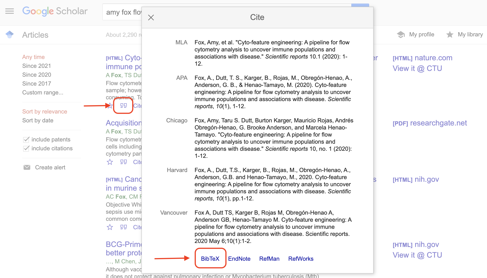
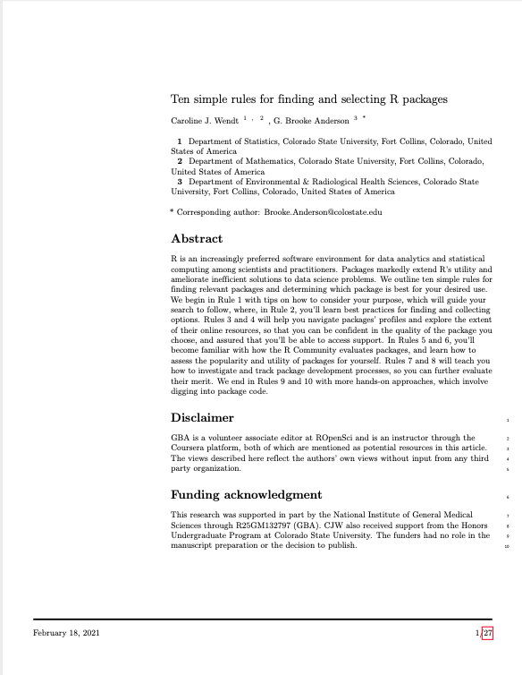

## RMarkdown for creating reproducible data pre-processing protocols {#module19}

The R extension package RMarkdown can be used to create documents that combine
code and text in a 'knitted' document, and it has become a popular tool for
improving the computational reproducibility and efficiency of the data analysis
stage of research. This tool can also be used earlier in the research process,
however, to improve reproducibility of pre-processing steps. In this module, we
will provide detailed instructions on how to use RMarkdown in RStudio to create
documents that combine code and text. We will show how an RMarkdown document
describing a data pre-processing protocol can be used to efficiently apply the
same data pre-processing steps to different sets of raw data.

**Objectives.** After this module, the trainee will be able to:

- Define RMarkdown and the documents it can create 
- Explain how RMarkdown can be used to improve the reproducibility of research
projects at the data pre-processing phase
- Create a document in RStudio using RMarkdown
- Apply it to several different datasets with the same format

### Creating knitted documents in R

In the last module (3.7), we described what knitted documents are, as well as the
advantages of using knitted documents to create data pre-processing protocols
for common pre-processing tasks in your research group. We also described the 
key elements of creating a knitted document, regardless of the software system 
you are using. In this module, we will
go into more detail about how you can create these documents using R and
RStudio, and in the next module (3.9) we will walk through an example data
pre-processing protocol created using this method. We strongly recommend that
you read the previous module (3.7) before working through this one.

R has a special format for creating knitted documents called **Rmarkdown**.
In the previous module, we talked about the elements of a knitted document, and
later in this module we'll walk through how they apply to Rmarkdown. However, 
the easiest way to learn how to use Rmarkdown is to try an example, so we'll 
start with a very basic one. If you'd like to try it yourself, you'll need 
to download R and RStudio. The RStudio IDE can be
downloaded and installed as a free software, as long as you use the personal
version (RStudio creates higher-powered versions for corporate use).


<!-- Later in this module, we will provide details on creating these documents, but -->
<!-- first, we will provide some details of some of the specific conventions used in -->
<!-- this type of knitted documents. As with other knitted documents, Rmarkdown -->
<!-- documents are originally written in plain text. In the previous module, we -->
<!-- discussed how knitted documents will use a markup language within the plain text -->
<!-- for formatting; for RMarkdown files, the markup language used is Markdown. Since -->
<!-- the laguage is Markdown, the preamble for each document uses YAML. We described -->
<!-- in the previous module how knitted documents include executable code, along with -->
<!-- the formatted text. By default, executable code for RMarkdown files will be in -->
<!-- R, but there are also options to include executable code in the document in a -->
<!-- number of other programming languages. -->

Like other plain text documents, an Rmarkdown file should be edited using a text
editor, rather than a word processor like Word or Google Docs. It is easiest to
use the Rstudio IDE as the text editor when creating and editing an R markdown
document, as this IDE has incorporated some helpful functionality for working
with plain text documents for Rmarkdown. In RStudio, you can create a number of
types of new files through the "File" menu. To create a new R markdown file,
open RStudio and then choose "New File", then choose "Rmarkdown" from the
choices in that menu. Figure \@ref(fig:rmarkdownnewfile) shows an example of
what this menu option looks like.

```{r rmarkdownnewfile, echo = FALSE, out.width = "\\textwidth", fig.cap = "RStudio pull-down menus to help you navigate to open a new Rmarkdown file."}
knitr::include_graphics("figures/rmarkdown_newfile.png")
```

This will open a window with some options you can specify some of the overall
information about the document (Figure \@ref(fig:rmarkdownchoices)), including
the title and the author. You can specify the output format that you would
like. Possible output formats include HTML, Word, and PDF. You should be able to
use the HTML and Word output formats without any additional software, so we'll start
there with this example. If you
would like to use the PDF output, you will need to install one other piece of
software: Miktex for Windows, MacTex for Mac, or TeX Live for Linux. These are
all pieces of software with an underlying TeX engine and all are open-source and
free. The example in the next module was created as a PDF using one of these tools.

```{r rmarkdownchoices, echo = FALSE, out.width = "\\textwidth", fig.cap = "Options available when you create a new Rmarkdown file in RStudio. You can specify information that will go into the document's preamble, including the title and authors and the format that the document will be output to (HTML, Word, or PDF)."}
knitr::include_graphics("figures/rmarkdown_choices.png")
```

Once you have selected the options in this menu you can choose the "Okay" button
(Figure \@ref(fig:rmarkdownchoices)). This will open a new document. This
document, however, won't be blank. Instead it will include an example document
written in Rmarkdown (Figure \@ref(fig:rmarkdowntemplate)). This example
document helps you navigate how the Rmarkdown process works, by letting you test
out a sample document. It also gives you a starting point---once you understand
how the example document works, you can edit it and change it to convert it
into the document you would like to create.

```{r rmarkdowntemplate, echo = FALSE, out.width = "\\textwidth", fig.cap = "Example of the template Rmarkdown document that you will see when you create a new Rmarkdown file in RStudio. You can explore this template and try rendering (knitting) it. Once you are familiar with how this example works, you can edit the text and code to adapt it for your own document."}
knitr::include_graphics("figures/rmarkdown_template.png")
```

If you have not used Rmarkdown before, it is very helpful to try knitting this
example document before making changes, to explore how pieces in the document
align with elements in the rendered output document. Once you are
familiar with the line-up between elements in this file in the output document,
you can delete parts of the example file and insert your own text and code.

Let's walk through and explore this example document, aligning it
with the formatted output document (Figure \@ref(fig:rmarkdownoriginalfinal)).
First, to render this or any Rmarkdown document, if you are in RStudio you can
use the "Knit" button at the top of the file, as shown in Figure
\@ref(fig:rmarkdowntemplate2). When you click on this button, it will render the
entire document to the output format you've selected (HTML, PDF, or Word). This
rendering process will both run the executable code and apply all formatting.
The final output (Figure \@ref(fig:rmarkdownoriginalfinal), right) will pop up
in a new window. As you start with Rmarkdown, it is useful to look at this
output to see how it compares with the plain text Rmarkdown file (Figure
\@ref(fig:rmarkdownoriginalfinal), left).


```{r rmarkdownoriginalfinal, fig.fullwidth = TRUE, echo = FALSE, out.width = "\\textwidth", fig.cap = "Example of the template Rmarkdown document that you will see when you create a new Rmarkdown file in RStudio. You can explore this template and try rendering (knitting) it. Once you are familiar with how this example works, you can edit the text and code to adapt it for your own document."}
knitr::include_graphics("figures/rmarkdownoriginalfinal.png")
```

```{r rmarkdowntemplate2, echo = FALSE, out.width = "\\textwidth", fig.cap = "Example of the template Rmarkdown document, highlighting buttons in RStudio that you can use to facilitate working with the document. The 'knit' button, highlighted at the top of the figure, will render the entire document. The green arrow, highlighted lower in the figure within a code chunk, can be used to run the code in that specific code chunk."}
knitr::include_graphics("figures/rmarkdown_template2.png")
```

You will also notice, after you first render the document, that your working
directory has a new file with this output document. For example, if you are
working to create an HTML document using an Rmarkdown file called
"my_report.Rmd", once you knit your Rmarkdown file, you will notice a new file
in your working directory called "my_report.html". This new file is your output
file, the one that you would share with colleagues as a report. You should
consider this output document to be read only---in other words, you can read and
share this document, but you should not make any changes directly to this
document, since they will be overwritten anytime you re-render the original
Rmarkdown document.

Next, let's compare the example Rmarkdown document (the one that is given when
you first open an Rmarkdown file in RStudio) with the output file that is
created when you render this example document (Figure
\@ref(fig:rmarkdownoriginalfinal)). If you look at the output document (Figure
\@ref(fig:rmarkdownoriginalfinal), right), you can notice how different elements
align with pieces in the original Rmarkdown file (Figure
\@ref(fig:rmarkdownoriginalfinal)). For example, the output document includes a
header with the text "R Markdown". This second-level header is created by the
Markdown notation in the original file of:

```
## R Markdown
``` 

This header is formatted in a larger font than other text, and on a separate
line---the exact formatting is specified within the style file for the Rmarkdown
document, and will be applied to all second-level headers in the document. You
can also see formatting specified through things like bold font for the word
"Knit", through the Markdown syntax `**Knit**`, and a clickable link specified
through the syntax `<http://rmarkdown.rstudio.com>`. At the beginning of the
original document, you can see how elements like the title, author, date, and
output format are specified in the YAML. Finally, you can see that special
character combinations demarcate sections of executable code.

Let's look a little more closely in the next part of the module at how these
elements of the Rmarkdown document work.

### Formatting text with Markdown in Rmarkdown

If you remember from the last module, one element of knitted documents is
that they are written in plain text, with all the formatting specified 
using a markup language.
For the main text in an Rmarkdown document, all formatting is done using
Markdown as the markup language. Markdown is a popular markup language, in part
because it is a good bit simpler than other markup languages like HTML or LaTeX.
This simplicity means that it is not quite as expressive as other markup
languages. However, Markdown probably provides adequate formatting for at least 90% of the
formatting you will typically want to do for a research report or
pre-processing protocol, and by staying simpler, it is much easier to learn the
Markdown syntax quickly compared to other markup languages.

As with other markup languages, Markdown uses special characters or combinations of characters to indicate formatting within the plain text of the original document. When the document is rendered, these markings are used by the software to create the formatting that you have specified in the final output document. Some example formatting symbols and conventions for Markdown include: 

- to format a word or phrase in bold, surround it with two asterisks (`**`) 
- to format a word or phrase in italics, surround it with one asterisk (`*`) 
- to create a first-level header, put the header text on its own line, starting the line with `# `
- to create a second-level header, put the header text on its own line, starting the line with `## `
- separate paragraphs with empty lines
- use hyphens to create bulleted lists

One thing to keep in mind when using Markdown, in terms of formatting, is that
white space can be very important in specifying the formatting. For example when
you specify a new paragraph, you must leave a blank line  from your previous
text. Similarly when you use a hash (`#`) to indicate a header, you must leave a
blank space after the hash before the word or phrase that you want to be used in
that header. To create a section header, you would write:

```
# Initial Data Inspection
```

On the other hand, if you forgot the space after the hash sign, like this:

```
#Initial Data Inspection
```

then in your ouput document you would get this:

#Initial Data Inspection

Similarly, white space is needed to separate paragraphs. For example, this would create two paragraphs: 

```
This is a first paragraph. 

This is a second.
```

Meanwhile this would create one: 

```
This is a first paragraph.
This is still part of the first paragraph.
```

The syntax of Markdown is fairly simple and can be learned quickly. For more
details on this syntax, you can refer to the Rmarkdown reference guide at
https://rstudio.com/wp-content/uploads/2015/03/rmarkdown-reference.pdf. The
basic formatting rules for Markdown are also covered in some more
extensive resources for Rmarkdown that we will point you to later in this
module.

### Preambles in Rmarkdown documents

In the previous module, we explained how knitted documents include a 
preamble to specify some metadata about the document, including elements
like the title, authors, and output format. In R, this preamble is 
created using YAML. In this subsection, we provide some more details
on using this YAML section in Rmarkdown documents.

In an Rmarkdown document, the YAML is a special section
at the top of an RMarkdown document (the original, plain text file, not the
rendered version). It is set off from the rest of the document using a special
combination of characters, using a process very similar to how executable code
is set off from other text with a special set of characters so it can be easily
identified by the software program that renders the document. For the YAML, this
combination of characters is three hyphens (`---`) on a line by themselves to
start the YAML section and then another three on a line by themselves to end it.
Here is an example of what the YAML might look like at the top of an RMarkdown
document:

````
---
title: "Laboratory report for example project"
author: "Brooke Anderson"
date: "1/12/2020"
output: word_document
---
````

Within the YAML itself, you can specify different options for your document. 
You can change simple things like the title, author, and date, but you can 
also change more complex things, including how the output document is rendered.
For each thing that you want to specify, you specify it with a special 
keyword for that option and then a valid choice for that keyword. The idea 
is very similar to setting parameter values in a function call in R. For 
example, the `title:` keyword is a valid one in RMarkdown YAML. It allows you 
to set the words that will be printed in the title space, using title formatting, 
in your output document. It can take any string of characters, so you can put in 
any text for the title that you'd like, as long as you surround it with quotation 
marks. The `author:` and `date:` keywords work in similar ways. The `output:` 
keyword allows you to specify the output that the document should be rendered to. 
In this case, the keyword can only take one of a few set values, including
`word_document` to output a Word document, `pdf_document` to output a pdf 
document (see later in this section for some more set-up required to make that
work), and `html_document` to output an HTML document. 

As you start using RMarkdown, you will be able to do a lot without messing with
the YAML much. In fact, you can get a long way without ever changing the values
in the YAML from the default values they are given when you first create an
RMarkdown document. As you become more familiar with R, you may want to learn
more about how the YAML works and how you can use it to customize your
document---it turns out that quite a lot can be set in the YAML to do very
interesting customizations in your final rendered document. The book *R
Markdown: The Definitive Guide* [@xie2018r], which is available free online, has
sections discussing YAML choices for both HTML and pdf output, at
https://bookdown.org/yihui/rmarkdown/html-document.html and
https://bookdown.org/yihui/rmarkdown/pdf-document.html, respectively. There is
also a talk that Yihui Xie, the creator of RMarkdown, gave on this topic at a
past RStudio conference, available at
https://rstudio.com/resources/rstudioconf-2017/customizing-extending-r-markdown/.

### Executable code in Rmarkdown files

In the previous module, we described how knitted documents use special markers
to indicate where sections of executable code start and stop. In RMarkdown, 
the markers you will use to indicate executable code look like this: 

````
```r{}
my_object <- c(1, 2, 3)
```
````

In Rmarkdown, the following combination indicates
the start of executable  code:
 
```` ```{r} ````

\noindent while this combination indicates the end of executable code (in other
words the start of regular text):
  
```` ``` ````

In the example above, we have shown the most basic
version of the markup character combination used to specify the start of
executable code (```` ```{r} ````). This character combination can be expanded,
however, to include some specifications for how you want the code in the section
following it to be run, as well as how you want output to be shown. For example,
you could use the following indications to specify that the code should be run,
but the code itself should not be printed in the final document, by specifying
`echo = FALSE`, as well as that the created figure should be centered on the
page, by specifying `fig.align = "center"`:

```` ```{r echo = FALSE, fig.align = "center"} ````

There are numerous options that can be used to specify how the code will be run.
These specifications are called
**chunk options**, and you specify them in the special character combination
where you mark the start of executable code. For example, you can specify that
the code should be printed in the document, but not executed, by setting the
`eval` parameter to `FALSE` with ```` ```{r eval = FALSE} ```` as the marker to
start the code section.

The chunk options also include `echo`, which can be used to specify whether to
print the code in that code chunk when the document is rendered. For some
documents, it is useful to print out the code that is executed, where for other
documents you may not want that printed. For example, for a pre-processing
protocol, you are aiming to show yourself and others how the pre-processing was
done. In this case, it is very helpful to print out all of the code, so that
future researchers who read that protocol can clearly see each step. By
contrast, if you are using Rmarkdown to create a report or an article that is
focused on the results of your analysis, it may make more sense to instead hide
the code in the final document.

As part of the code options, you can also specify whether messages and warnings
created when running the code should be included in the document output, and
there are number of code chunk options that specify how tables and figures
rendered by the code should be shown. For more details on the possible options
that can be specified for how code is evaluated within an executable chunk of
code, you can refer to the Rmarkdown cheat sheet available at
https://rstudio.com/wp-content/uploads/2015/02/rmarkdown-cheatsheet.pdf

RStudio has some functionality that is useful when you are working with code in
Rmarkdown documents. Within each code chuck are some buttons that can be used to
test out the code in that chunk of executable code. One is the green right arrow
key to the right at the top of the code chunk, highlighted in Figure
\@ref(fig:rmarkdowntemplate2). This button will run all of the code in that
chunk and show you the output in an output field that will open directly below
the code chunk. This functionality allows you to explore the code in your
document as you build it, rather than waiting until you are ready to render the
entire document. The button directly to the left of that button, which looks
like an upward-pointing arrow over a rectangle, will execute all code that comes
before this chunk in the document. This can be very helpful in making sure that
you have set up your environment to run this particular chunk of code.

### More advanced Rmarkdown functionality

The details and resources that we have covered so far focus on the basics of
Rmarkdown. You can get a lot done just with these basics. However, the Rmarkdown
system is very rich and allows complex functionality beyond these basics. In
this subsection, we will highlight just a few of the ways Rmarkdown can be used
in a more advanced way. Since this topic is so broad, we will focus on elements
that we have found to be particularly useful for biomedical researchers as they
become more advanced Rmarkdown users. For the most part, we will not go into
extensive detail about how to use these more advanced features in this module,
but instead point to resources where you can learn more as you are ready. If you
are just learning Rmarkdown, at this point it will be helpful to just know that
some of these advanced features are available, so you can come back and explore
them when you become familiar with the basics. However, we will provide more
details for one advanced element that we find particularly useful in creating data
pre-processing protocols: including bibliographical references. 

**Including bibliographical references.**

To include references in RMarkdown documents, you can use something called
**BibTeX**. This is a software system that is free and open source and works in
concert with LaTeX and other markup languages. It allows you to save bibliographical information in a plain
text file---following certain rules---and then reference that information in a
document. In this way, it can serve the role of a bibliographical reference
manager (like Endnote or Mendeley) while being free and keeping all information
in plain text files, where they can easily be tracked with version control like
git. By using BibTeX with RMarkdown, you can include bibliographical references
in the documents that you create, and Rmarkdown will handle the creation of the
references section and the numbering of the documents within your text.

To use BibTeX to add references to an RMarkdown document, you'll need to take
three steps:

1. Create a plain text file with listings for each of 
your references (**BibTeX file**). Save this file with the
extension `.bib`. These listings need to follow a special format, which
we'll describe in just a minute.
2. In your RMarkdown document, include the filepath
to this BibTeX file, so that RMarkdown will be able to find the bibliographical
listings. 
3. In the text of the RMarkdown file, include a key and special character
combination anytime you want to reference a paper. This referencing also 
follows a special format, which we'll describe below.

Let's look at each of these steps in a bit more detail. The first step is 
to create a plain text file with a listing for each of the documents that 
you'd like to cite. The plain text document should be saved with the file 
extension `.bib` (for example, "mybibliography.bib"), and the listings for 
each document in the file must follow specific rules. 

Let's take a look at one to explore these rules. Here's an example of a BibTeX
listing for a scientific article:

```
@article{fox2020,
  title={Cyto-feature engineering: A pipeline for flow cytometry 
    analysis to uncover immune populations and associations with 
    disease},
  author={Fox, Amy and Dutt, Taru S and Karger, Burton and Rojas, 
    Mauricio and Obreg{\'o}n-Henao, Andr{\'e}s and 
    Anderson, G Brooke and Henao-Tamayo, Marcela},
  journal={Scientific Reports},
  volume={10},
  number={1},
  pages={1--12},
  year={2020}
}
```

You can see that this listing is for an article, because it starts with the 
keyword `@article`. BibTeX can record a number of different types of documents, 
including articles, books, and websites. You start by specifying the document 
type because different types of documents need to include different elements
in their listings. For example, a website should include the date when it was 
last accessed, while an article typically will not. 

Within the curly brackets for the listing shown above, there are key-value
pairs---elements where the type of value is given with a keyword (e.g.,
`title`), and then the value for that element is given after an equals signe.
For example, to specify the journal in which the article was published, this
listing has `journal={Scientific Reports}`. Finally, the listing has a key 
that you will use to identify the listing in the main text. In this case, 
the listing is given the key `fox2020`, which combines the first author and 
publication year. You can use any keys you like for the items in the bibliography, 
as long as they are different for every listing, so that the computer can 
identify which bibliographical listing you are referring to when you use a key.

This format may seem overwhelming, but fortunately you will rarely have to
create these listings by hand. Instead, you can get them directly from Google
Scholar. To do this, look up the paper on Google Scholar (Figure
\@ref(fig:googlebibtex)). When you see it, look for a small quotation mark
symbol at the bottom of the article listing (shown with the top red arrow in
Figure \@ref(fig:googlebibtex)). If you click on this, it will open a pop-up
with the citation for the article. At the bottom of that pop-up is a link that
says "BibTeX" (bottom red arrow in Figure \@ref(fig:googlebibtex)). If you click
on that, it will take you to a page that gives the full BibTex listing for that
article, and you can just copy and paste this into your plain text BibTeX file.

```{r googlebibtex, echo = FALSE, out.width = "\\textwidth", fig.fullwidth = TRUE, fig.cap = "Example of using Google Scholar to get bibliographical information for a BibTeX file. When you look up an article on Google Scholar, there is an option (the quotation mark icon under the article listing) to open a pop-up window with bibliographical information. At the bottom of this pop-up box, you can click on 'BibTeX' to get a plain text version of the BibTeX entry for the article. You can copy and paste this into you BibTeX file."}

```


Once you have this plain text BibTeX file, you will tell your computer how to
find it by including its path in the YAML. For example, if you created a BibTeX
file called "mybibliography.tex" and saved it in the same directory as a
RMarkdown document, you could use the following to indicate this file for 
the RMarkdown document:

```
  ---
  title: "Reproducible Research with R"
  author: "Brooke Anderson"
  date: "1/25/2021"
  output: beamer_presentation
  bibliography: mybibliography.bib
  ---
```

This shows the YAML for the document---the part that goes at the beginning of
the RMarkdown document and gives some metadata and overall instructions for the
document. In this example, we've added an extra line: `bibliography:
mybibliography.bib`. This says that you'd like to link to a BibTeX file when
this document is rendered, as well as where to find that file (the file named
"mybibliography.bib" in the directory of the RMarkdown file).

Now that you have created the BibTeX file and told the RMarkdown file where to 
find it, you can connect the two. As you write in the RMarkdown file, you can 
refer to any of your BibTeX listings by using the key that you set for that
document. For example, if you wanted to reference the Fox et al. paper we 
used in the example listing above, you would use the key that we set for 
that listing, `fox2020`. 
You will follow a special convention when you reference this key: you'll use the
`@` symbol directly followed by that key. Typically, you will surround 
this with square brackets. Therefore, to reference the Fox et al. paper, 
you'd use `[@fox2021]`. 

Here's how that might look in practice. If you write in the RMarkdown document:

```
This technique follows earlier work [@fox2020].
```

In the output from rendering that RMarkdown document you'd get:

> ``This technique follows earlier work (Fox et al. 2020)."

The full paper details will then be included at the end of the document, in a reference
section.

**Other advanced Rmarkdown functionality**

There are a number of other advanced things that you can do with Rmarkdown, once
you have mastered the basics. First, you can use Rmarkdown to build different
types of documents, not just reports in Word, PDF, or HTML. For example, you can
use the `bookdown` package to create entire online and print books using the
Rmarkdown framework. This book of modules was created using this system.
You can also create websites and web dashboards, using the `blogdown` and
`flexdashboard` packages, repectively. The `blogdown` package allows you to
create professionally-styled websites, including blog sections where you can
include R code and results. Figure \@ref(fig:blogdown) gives an example of a
website created using `blogdown`---you can see the full website
[here](https://kind-neumann-789611.netlify.app/) if you'd like to check out some
of the features that this framework provides. The `flexdashboard` package lets
you create "dashboards" with data, similar to the dashboards that many public
health departments using during the COVID-19 pandemic to share case numbers in
specific counties and states.

```{r blogdown, echo = FALSE, out.width = "\\textwidth", fig.fullwidth = TRUE, fig.cap = "Example of a website created using blogdown, leveraging the Rmarkdown framework."}

```

With Rmarkdown, you can also create reports that are more customized than the 
default style that we explored above. First, you can create templates that add 
customized styling to the document. In fact, many journals have created journal-specific
templates that you can use in Rmarkdown. With these templates, you can write 
up your research results in a reproducible way, using Rmarkdown, and submit the
resulting document directly to the journal, in the correct format. An example of the first page of an article created in Rmarkdown using
one of these article templates is shown in Figure \@ref(fig:rticleexample). The `rticles`
package in R provides these templates for several different journal families.

```{r rticleexample, out.width = "\\textwidth", echo = FALSE, fig.cap = "Example of a manuscript written in Rmarkdown using a templat. This figure shows the first page of an article written for submission to PLoS Computation Biology, written in Rmarkdown while using the PLoS template from the `rticles` package. The full article, including the Rmarkdown input and final pdf, are available on GitHub at https://github.com/cjwendt/plos_ten."}

```

Rmarkdown also has some features that make it easy to run code that is
computationally expensive or code that is written in another programming
language. If code takes a long time to run, there are options in Rmarkdown to
**cache** the results---that is, run the code once when you render the document,
and then only re-run it in later renderings if the inputs have changed. Rmarkdown 
does this through by saving intermediate results, as well as using a system to 
remember which pieces of code depend on which earlier code. With very computationally
expensive code, it can be a big time saver, although it can also use more storage, 
since it is saving more results. To include code in languages other than R, you can
change something called the **engine** of the code chunk. Essentially, this is the
language that your computer will use to run the code in that chunk. You can change
the engine so that certain chunks of code are run using Python, Julia, and other
languages by specifying the engine you'd like to use in the marker in the document
that indicates the start of a piece of executable code. Earlier in this module, 
we showed you that executable code is normally introduced in Rmarkdown with 
```` ```{r} ````. The `r` in this string is specifying that the R engine should be
used to run the code. 

Finally, Rmarkdown allows you to create very customized formatting, as you move into
more advanced ways to use the framework. 
As mentioned earlier, Markdown is a fairly simple markup language. Occasionally,
this simplicity means that you might not be able to create fancier formatting
that you might desire. There is a method that allows you to work around this
constraint in RMarkdown.

In Rmarkdown documents, when you need more complex formatting, you can shift
into a more complex markup language for part of the document. Markup languages
like LaTeX and HTML are much more expressive than Markdown, with many more
formatting choices possible. However, 
there is a downside---when you include formatting specified in these 
more complex markup languages, you will limit the output formats that you can
render the document to. For example, if you include LaTeX formatting within 
an RMarkdown document, you must output the document to PDF, while if you 
include HTML, you must output to an HTML file. Conversely, if you stick with 
the simpler formatting available through the Markdown syntax, you can easily 
switch the output format for your document among several choices.

One area of customization that is particularly useful and simple to implement is
with customized tables. The Markdown syntax can create very simple tables, but
does not allow the creation of more complex tables. There is an R package called
`kableExtra` that allows you to create very attractive and complex tables
in RMarkdown documents.
This package leverages more of the power of underlying markup languages, rather
than the simpler Markdown language. 
The
`kableExtra` package is extensively documented through two vignettes that come
with package, one if the output will be in pdf
(https://cran.r-project.org/web/packages/kableExtra/vignettes/awesome_table_in_pdf.pdf)
and one if it will be in HTML
(https://cran.r-project.org/web/packages/kableExtra/vignettes/awesome_table_in_html.html).


<!-- **Including executable code in other languages.** -->

<!-- In your RMarkdown documents, you include executable code in special sections -->
<!-- ("chunks") that are separated from the regular text using a special combination -->
<!-- of characters, as described earlier in this module and in the previous module. -->
<!-- By default, in Rmarkdown files the code in these chunks are executed using the R -->
<!-- programming language. However, you can also include executable code in a number -->
<!-- of other programming languages. For example, you could set some code chunks to -->
<!-- run Python, others to run Julia, and still others (e.g., bash) to run a shell script. -->

<!-- This can be very helpful if you have steps in you Python that use code in  -->
<!-- different languages. For example, there may be a module in Python that -->
<!-- works well for an early step in your data preprocessing, and then later  -->
<!-- steps that are easier with general R functions. This presents no problem in  -->
<!-- creating an RMarkdown data pre-processing protocol, as you can include  -->
<!-- different steps using different languages.  -->

<!-- The program that is used to run the code in a specific chunk is called the -->
<!-- "engine" for that chunk [ref---R Markdown def guide]. You can change the engine -->
<!-- by changing the combination of characters you use to demarcate the start of -->
<!-- executable code. When you are including a chunk of R code, you mark it off -->
<!-- starting with the character combination ```` ```{r} ````. You change this to -->
<!-- give the engine you would like to use---for example, you would include a chunk -->
<!-- of Python code using ```` ```{python} ```` [ref---R Markdown def guide]. When -->
<!-- your RMarkdown document is rendered, your computer will use the specified -->
<!-- software to run each code chunk. Of course, to run that piece of code, your -->
<!-- computer must have that type of software installed and available. For example, -->
<!-- if you include a chunk of code that you'd like to run with a Python engine, you -->
<!-- must have Python on your computer. -->

<!-- While you can use many different software programs as the engine for each code -->
<!-- chunk, there are a few limitations with some programs. For many open-source -->
<!-- software programs, the results from running a chunk of code with that engine -->
<!-- will be available for later code chunks that also use that engine to use as an -->
<!-- input [ref---R Markdown def guide]. This is not the case, however, for most of -->
<!-- the available engines. For example, if you use the SAS software program as the -->
<!-- engine for one of your code chunks, the output from running that code will not -->
<!-- be available to input to later code in the document. -->

<!-- **Caching code results.** -->

<!-- Some code can take a while to run, particularly if it is processing very large -->
<!-- datasets. By default, RMarkdown will re-run all code in the document every time -->
<!-- you render it. This is usually the best set-up, since it allows you to confirm -->
<!-- that the code is all executing as desired each time the code is rendered. -->
<!-- However, if you have steps that take a long time, this can make it so the -->
<!-- RMarkdown document takes a long time to render each time you render it. -->

<!-- To help with this problem, RMarkdown has a system that allows you to *cache* -->
<!-- results from some or all code chunks in the document. This is a really nice -->
<!-- system---it will check the inputs to that part of the code each time the -->
<!-- document is run. If those inputs have changed, it will take the time to re-run -->
<!-- that piece of code, to use the updated inputs. However, if the inputs have not -->
<!-- changed since the last time the document was rendered, then the last results for -->
<!-- that chunk of code will be pulled from memory and used, without re-running the -->
<!-- code in that chunk. This saves time most of the times that you render the -->
<!-- document, while taking the time to re-run the code when necessary, because the -->
<!-- inputs have changed and so the outputs may be different. -->

<!-- There are some downsides to caching. For example, caching can increase the -->
<!-- storage space it takes to save Rmarkdown work, as intermediate results are -->
<!-- saved. However, if some of your code is very time-intensive to run, it may make -->
<!-- sense to look into caching options with Rmarkdown. For more on caching with -->
<!-- Rmarkdown documents, see [this -->
<!-- section](https://bookdown.org/yihui/rmarkdown-cookbook/cache.html) of the *R -->
<!-- Markdown Cookbook* [ref]. -->

<!-- **Outputting to other formats.** -->

<!-- You can use RMarkdown to create documents other than traditional reports.  -->
<!-- Scientists might find the outputs of presentations and posters particularly  -->
<!-- useful.  -->

<!-- RMarkdown has allowed a pdf slide output for a long time. This output leverages -->
<!-- the "beamer" format from LaTeX. You can create a series of presentation slides -->
<!-- in RMarkdown, using Markdown to specify formatting, and then the document will -->
<!-- be rendered to pdf slides. These slides can be shown using pdf viewer software, -->
<!-- like Adobe Acrobat, set either to full screen or to the presentation option. -->
<!-- More recently, capability has been added to RMarkdown that allows you to create -->
<!-- PowerPoint slides. Again, you will start from an RMarkdown document, using -->
<!-- Markdown syntax to do things like divide content into separate slides. -->
<!-- Regardless of the output format you choose (pdf slides or PowerPoint), the code -->
<!-- to generate figures and tables in the presentation can be included directly in -->
<!-- the RMarkdown file, so it is re-run with the latest data each time you render -->
<!-- the presentation. -->

<!-- It is also possible to use RMarkdown to create scientific posters, although this -->
<!-- is a bit less common and there are fewer tutorial resources with instructions on -->
<!-- doing this. To find out more about creating scientific posters with Rmarkdown, -->
<!-- you can start by looking at the documentation for some R packages that have been -->
<!-- created for this process. Two include the `posterdown` package [ref], with -->
<!-- documentation available at -->
<!-- https://reposhub.com/python/miscellaneous/brentthorne-posterdown.html, and the -->
<!-- `pagedown` package [ref], with documentation available at -->
<!-- https://github.com/rstudio/pagedown. There are also some blog posts available -->
<!-- where researchers describe how they created a poster with Rmarkdown; one -->
<!-- thorough one is "How to make a poster in R" by Wei Yang Tham, available at -->
<!-- https://wytham.rbind.io/post/making-a-poster-in-r/. -->

<!-- This idea of customizing Rmarkdown documents has evolved in another useful way -->
<!-- through the idea of Rmarkdown templates. These are templates that are  -->
<!-- customized---often very highly customized---while allowing you to write the -->
<!-- content using Rmarkdown. One area where these templates can be very useful to -->
<!-- scientists is with article templates that are customized for specific  -->
<!-- scientific journals. A number of scientific journals have created LaTeX -->
<!-- templates that can be used when writing drafts to submit to the journal.  -->
<!-- These templates produce a draft that is nicely formatted, following all  -->
<!-- the journal's guidelines for submission, and in some cases formatted as the -->
<!-- final article would be for the journal. These templates have existed for  -->
<!-- a long time, particularly for journals in fields in which LaTeX is commonly -->
<!-- used for document formatting, including physics and statistics. However,  -->
<!-- the templates traditionally required you to use LaTeX, which is a complex -->
<!-- markup language with a high threshold for learning to use it.  -->

<!-- Now, many of these article templates have been wrapped within an Rmarkdown -->
<!-- template, allowing you to leverage them while writing all the content in -->
<!-- Rmarkdown syntax, and allowing you to include executable code directly in the -->
<!-- draft. An example of the first page of an article created in Rmarkdown using -->
<!-- one of these article templates is shown in Figure \@ref(fig:rticleexample).  -->

<!-- ```{r rticleexample, out.width = "\\textwidth", echo = FALSE, fig.cap = "Example of a manuscript written in Rmarkdown using a templat. This figure shows the first page of an article written for submission to *PLoS Computation Biology*, written in Rmarkdown while using the *PLoS* template from the `rticles` package. The full article, including the Rmarkdown input and final pdf, are available on GitHub at https://github.com/cjwendt/plos_ten."} -->
<!--  -->
<!-- ``` -->

<!-- These Rmarkdown templates are typically available through R packages, which you -->
<!-- can install on your computer in the same way you would install any R package -->
<!-- (i.e., with the `install.packages` function). Many journal article templates are -->
<!-- available through the `rticles` package [ref], including the template used to -->
<!-- create the manuscript shown in Figure \@ref(fig:rticleexample). You can find -->
<!-- more information about the `rticles` package on its GitHub page, at -->
<!-- https://github.com/rstudio/rticles. There is also a section in the book *R -->
<!-- Markdown: A Definitive Guide* [ref] on writing manuscripts for scientific -->
<!-- journals using Rmarkdown, available online at -->
<!-- https://bookdown.org/yihui/rmarkdown/rticles-templates.html. -->

<!-- As a similar idea, you can created parameterized RMarkdown documents. These are -->
<!-- a simple way to create a kind of template for reports in your laboratory.  -->
<!-- You can create these is a similar way to regular RMarkdown documents, but -->
<!-- they include an area where you can change some inputs each time you render -->
<!-- the document. There is a section on parameterized reports in *R -->
<!-- Markdown: A Definitive Guide* [ref]. -->

<!-- You can also use RMarkdown to create much larger outputs, compared to simpler reports -->
<!-- and protocols. RMarkdown can now be used to create very large and dynamic -->
<!-- documents, including online books (which can also be rendered to pdf versions -->
<!-- suitable for printing), dashboard-style websites, and blogs. Once members of -->
<!-- your research group are familiar with the basics of RMarkdown, you may want to -->
<!-- explore using it to create these more complex outputs. The book format divides -->
<!-- content into chapters and special sections like appendices and references. It -->
<!-- includes a table of contents based on weblinks, so readers can easily navigate -->
<!-- the content. It uses a book format as its base that allows readers to do things -->
<!-- like change the font size and search the book text for keywords. The book -->
<!-- containing these modules is one example of using bookdown. If you would like to -->
<!-- explore using bookdown to create online books based on Rmarkdown files, there -->
<!-- are a number of resources available. There is an online book available with -->
<!-- extensive instructions on using this package, available at -->
<!-- https://bookdown.org/yihui/bookdown/. There is also a helpful website with more -->
<!-- details on this package, https://bookdown.org/. The website include a gallery of -->
<!-- example books created with bookdown https://bookdown.org/home/archive/, which -->
<!-- you can use to explore the types of books that can be created. -->

<!-- You can also use Rmarkdown documents to create webpages, with pages included for -->
<!-- blogs. This format allows you to create a very attractive website that includes -->
<!-- a blog section, where you can write and regularly post new blogs, keeping the -->
<!-- site dynamic. It is a nice entry point to developing and maintaining a website -->
<!-- for people who are learning to code in R but otherwise haven't done much coding, -->
<!-- as you can do all the steps within RStudio. There are templates for these blogs -->
<!-- that are appropriate for creating personal or research group websites for -->
<!-- academics. These websites can be created to highlight the research and people in -->
<!-- your research lab. You can encourage students and postdocs to create personal -->
<!-- sites, to raise the profile of their research. In the past, we have even used -->
<!-- one as a central, unifying spot for a group study, with students contributing -->
<!-- blog posts as their graded assignment -->
<!-- (https://kind-neumann-789611.netlify.app/). To learn how to create websites with -->
<!-- blogs, you can check the book *blogdown: Creating Websites with R Markdown* -->
<!-- [ref], which is available both in print and free online at -->
<!-- https://bookdown.org/yihui/blogdown/. This process takes a bit of work to -->
<!-- initially get the website set up, but then allows for easy and straightforward -->
<!-- maintenance. -->

<!-- Finally, a simpler way to make basic web content with RMarkdown is through their -->
<!-- *flexdashboard* format. This format creates a smaller website that is focused on -->
<!-- sharing data results---you can see a gallery of examples at -->
<!-- https://rmarkdown.rstudio.com/flexdashboard/examples.html. This format is -->
<!-- excellent for creating a webpage that allows users to view complex, and -->
<!-- potentially interactive, results from data you've collected. It can be -->
<!-- particularly helpful for groups that need to quickly communicate regularly -->
<!-- updated data to viewers. During the COVID-19 pandemic, for example, many public -->
<!-- health departments maintained dashboard-style websites to share evolving data on -->
<!-- COVID-19 in the community. Using RMarkdown in this case has the key advantage of -->
<!-- allowing you to easily update the dashboard webpage as you get new or updated -->
<!-- data, since it is easy to re-run any data processing, analysis, and -->
<!-- visualization code in the document. To learn how to use RMarkdown to create -->
<!-- dashboard websites, you can check out RStudio's flexdashboard site at -->
<!-- https://rmarkdown.rstudio.com/flexdashboard/index.html. There is also guidance -->
<!-- available in one of the chapters of *R Markdown: The Definitive Guide* [ref]: -->
<!-- https://bookdown.org/yihui/rmarkdown/dashboards.html. -->

<!-- **More complex formatting.** -->

<!-- As mentioned earlier, Markdown is a fairly simple markup language. Occasionally, -->
<!-- this simplicity means that you might not be able to create fancier formatting -->
<!-- that you might desire. There is a method that allows you to work around this -->
<!-- constraint in RMarkdown. -->

<!-- In Rmarkdown documents, when you need more complex formatting, you can shift -->
<!-- into a more complex markup language for part of the document. Markup languages -->
<!-- like LaTeX and HTML are much more expressive than Markdown, with many more -->
<!-- formatting choices possible. For example, there is functionality within  -->
<!-- LaTeX and HTML to create much more complex tables than in Markdown. However,  -->
<!-- there is a downside---when you include formatting specified in these  -->
<!-- more complex markup languages, you will limit the output formats that you can -->
<!-- render the document to. For example, if you include LaTeX formatting within  -->
<!-- an RMarkdown document, you must output the document to PDF, while if you  -->
<!-- include HTML, you must output to an HTML file. Conversely, if you stick with  -->
<!-- the simpler formatting available through the Markdown syntax, you can easily  -->
<!-- switch the output format for your document among several choices. -->

<!-- The *R Markdown Cookbook* [ref] includes chapters on how to customize Rmarkdown -->
<!-- output through LaTeX -->
<!-- (https://bookdown.org/yihui/rmarkdown-cookbook/latex-output.html) and HTML -->
<!-- (https://bookdown.org/yihui/rmarkdown-cookbook/html-output.html). These -->
<!-- customizations can include creating custom formats for the entire document (for -->
<!-- example, you can customize the appearance of a whole HTML document by -->
<!-- customizing the CSS style file for the document). They can also include -->
<!-- smaller-level customizations, like changing the citation style that is used in -->
<!-- conjunction with a BibTeX file by adding to the preamble for LaTeX output. -->

<!-- One area of customization that is particularly useful and simple to implement is -->
<!-- with customized tables. The Markdown syntax can create very simple tables, but -->
<!-- does not allow the creation of more complex tables. There is an R package called -->
<!-- `kableExtra` [ref] that allows you to create very attractive and complex tables -->
<!-- in RMarkdown documents. -->

<!-- This package leverages more of the power of underlying markup languages, rather -->
<!-- than the simpler Markdown language. If you remember, Markdown is pretty easy to -->
<!-- learn because it has a somewhat limited set of special characters and special -->
<!-- markings that you can use to specify formatting in your output document. This -->
<!-- basic set of functionality is often all you need, but for complex table -->
<!-- formatting, you will need more. There is much more available in the deeper -->
<!-- markup languages that you can use specifically to render pdf documents (software -->
<!-- derived from TeX) and the one that you can use specifically to render HTML (the -->
<!-- HTML markup language). As a result, you will need to create RMarkdown files that -->
<!-- are customized to a single output format (pdf or HTML) to take advantage of this -->
<!-- package. -->

<!-- You can install this package the same as any other R package from CRAN, using -->
<!-- `install.packages`. You will need to use then need to use `library("kableExtra)` -->
<!-- within your RMarkdown document before you use functions from the package. The -->
<!-- `kableExtra` package is extensively documented through two vignettes that come -->
<!-- with package, one if the output will be in pdf -->
<!-- (https://cran.r-project.org/web/packages/kableExtra/vignettes/awesome_table_in_pdf.pdf) -->
<!-- and one if it will be in HTML -->
<!-- (https://cran.r-project.org/web/packages/kableExtra/vignettes/awesome_table_in_html.html). -->
<!-- There is also information on using `kableExtra` available through *R Markdown -->
<!-- Cookbook* [ref]: https://bookdown.org/yihui/rmarkdown-cookbook/kableextra.html. -->

### Learning more about Rmarkdown.

To learn more about RMarkdown, you can explore a number of excellent resources.
The most comprehensive are shared by RStudio, where RMarkdown's developer
and maintainer, Yihui Xie, works. These resources are all freely available 
online, and some are also available to buy as print books, if you prefer that
format. 

First, you should check out the online tutorials that are provided by RStudio on
RMarkdown. These are available at RStudio's RMarkdown page:
https://rmarkdown.rstudio.com/. The page's "Getting Started" section
(https://rmarkdown.rstudio.com/lesson-1.html) provides a nice introduction you
can work through to try out RMarkdown and practice the overview provided in the
last subsection of this module. The "Articles" section
(https://rmarkdown.rstudio.com/articles.html) provides a number of other
documents to help you learn RMarkdown. RStudio's RMarkdown page also includes a
"Gallery" (https://rmarkdown.rstudio.com/gallery.html). This resource allows you
to browse through example documents, so you can get a visual idea of what you
might want to create and then access the example code for a similar document.
This is a great resource for exploring the variety of documents that you can
create using RMarkdown.

To go more deeply into RMarkdown, there are two online books from some of the
same team that are available online. The first is *R Markdown: The Definitive
Guide* by Yihui Xie, J. J. Allaire, and Garrett Grolemund [@xie2018r]. This book is
available free online at https://bookdown.org/yihui/rmarkdown/. It moves from
basics through very advanced functionality that you can implement with
RMarkdown, including several of the topics we highlight later in this
subsection.

The second online book to explore from this team is *R Markdown Cookbook*, by
Yihui Xie, Christophe Dervieux, and Emily Riederer [@xie2020r]. This book is available
free online at https://bookdown.org/yihui/rmarkdown-cookbook/. This book is a
helpful resource for dipping in to a specific section when you want to learn how
to achieve a specific task. Just like a regular cookbook has recipes that you
can explore and use one at a time, this book does not require a comprehensive
end-to-end read, but instead provides "recipes" with advice and instructions for
doing specific things. For example, if you want to figure out how to align a
figure that you create in the center of the page, rather than the left, you can
find a "recipe" in this book to do that.


<!-- ### Potential quotes / refs  -->

<!-- > "WordPerfect was always the best word processor. Because it allowed for insight into -->
<!-- its very structure. You could hit a certain key combination and suddenly the screen -->
<!-- would split and you'd reveal the codes, the bolds and italics, and so forth,  -->
<!-- that would define your text when it was printed. It was beloved of legal secretaries -->
<!-- and journalists alike. Because when you work with words, at the practical, everyday -->
<!-- level, the ability to look under the hood is essential. Words are not simple. And -->
<!-- WordPerfect acknowledged that. Microsoft Word did not. Microsoft kept insisting that -->
<!-- what you saw on your screen was the way things *were*, and if your fonts just kept -->
<!-- sort of randonmly changing, well, you must have wanted it that way. Then along came  -->
<!-- HTML, and what I remember most was that sense of being back inside the file. Sure,  -->
<!-- HTML was a typographic nightmare, a bunch of unjustified Times New Roman in 12 pt on  -->
<!-- screens with chiclet-size pixels, but under the hood you could see all the pieces.  -->
<!-- Just like WordPerfect. That transparency was a wonderful thing, and it renewed -->
<!-- computing for me." [@ford2015on] -->

<!-- > "TeX was created by Donald E. Knuth, a professor at Stanford University who has -->
<!-- achieved international renown as a mathematician and computer scientist. -->
<!-- Knuth also has an aesthetic sense uncommon in his field, and his work output is -->
<!-- truly phenomenal. TeX is a happy byproduct of Knuth's mammoth enterprise,  -->
<!-- *The Art of Computer Programming*. This series of reference books, designed -->
<!-- to cover the whole gamut of programming concepts and techniques, is a  -->
<!-- *sine qua non* for all computer scientists." [@seroul2012beginner] -->

<!-- > "Roughly speaking, text processors fall into two categories: -->
<!-- (1) WYSIWYG systems: what you see is what you get. You see on the screen at all -->
<!-- times what the printed document will look like, and what you type has immediate -->
<!-- effect on the appearance of the document. (2)  markup systems, where you type your text  -->
<!-- interspersed with formatting instructions, but don't see their effect right away. You must run a program to examine the -->
<!-- resulting image, whether on paper or on the screen. In computer science jargon, -->
<!-- markup systems must compile the source file you type.  WYSIWYG systems have the obvious  -->
<!-- advantage of immediate feedback, but they -->
<!-- are not very precise: what is acceptable at a resolution of 300 dots per inch, for an -->
<!-- ephemeral publication such as a newsletter or flier, is no longer so for a book that -->
<!-- will be phototypeset at high resolution. The human eye is extraordinarily sensitive: -->
<!-- you can be bothered by the appearance of a text without being able to pinpoint why, -->
<!-- just as you can tell when someone plays the wrong note in an orchestra, without -->
<!-- being able to identify the CUlprit. One quickly leams in typesetting that the beauty, -->
<!-- legibility and comfortable reading of a text depend on minute details: each element -->
<!-- must be placed exactly right, within thousandths of an inch. For this type of work, -->
<!-- the advantage of immediate feedback vanishes: fine details of spacing, alignment, -->
<!-- and so on are much too small to be discernible at the screen's relatively low  -->
<!-- resolution, and even if it such were not the case, it would still be a monumental chore -->
<!-- to find the right place for everything by hand. For this reason it is not surprising that in the world of professional typesetting -->
<!-- markup systems are preferred. They automate the task of finding the right place -->
<!-- for each character with great precision. Naturally, this approach is less attractive for -->
<!-- beginners, since one can't see the results as one types, and must develop a feeling -->
<!-- for what the system will do. But nowadays, you can have the best of both worlds -->
<!-- by using a markup system with a WYSIWYG *front end*; we'll talk about such front -->
<!-- ends for TEX later on. TEX was developed in the late seventies and early eighties,  -->
<!-- before WYSIWYG systems were widespread. But were it to be redesigned now, it would  -->
<!-- still be a markup -->
<!-- language. To give you an idea of the precision with which TEX operates: the internal  -->
<!-- unit it uses for its calculations is about a hundred times smaller than the -->
<!-- wavelength of visible light! (That's right, a hundred times.) In other words, any -->
<!-- round-off error introduced in the calculations is invisible to the naked eye."  -->
<!-- [@seroul2012beginner] -->

<!-- > "You should be sure to understand the difference between a text editor and a text -->
<!-- processor. A text processor is a text editor together with formatting software that -->
<!-- allows you to switch fonts, do double columns, indent, and so on. A text editor -->
<!-- puts your text in a file on disk, and displays a portion of it on the screen. It doesn't -->
<!-- format your text at all. We insist on the difference because those accustomed to WYSIWYG systems are -->
<!-- often not aware of it: they only know text processors. Where can you find a text -->
<!-- editor? Just about everywhere. Every text processor includes a text editor which -->
<!-- you can use. But if you use your text processor as a text editor, be sure to save your -->
<!-- file using a 'save ASCII' or 'save text only' option, so that the text processor's own -->
<!-- formatting commands are stripped off. If you give TEX a file created without this -->
<!-- precaution, you'll get garbage, because TEX cannot digest your text processor's -->
<!-- commands." [@seroul2012beginner] -->

<!-- > "TeX enabled authors to encode their precise intent into their manuscripts: -->
<!-- This block of text is a computer program, while this word is a keyword in that -->
<!-- program. The language it used, called TeX markup, formalized the slow, -->
<!-- error-prone communication that is normally carried out with the printer over -->
<!-- repeated galley proofs." [@apte2019lingua] -->

<!-- > "The idea of writing markup inside text wasn’t especially novel; it has been -->
<!-- used from 1970’s runoff (the UNIX family of printer-preparation utilities) to -->
<!-- today’s HTML tags. TeX was new in that it captured key concepts necessary for -->
<!-- realistic typesetting and formalized them." [@apte2019lingua] -->

<!-- > "With these higher-level commands, the free TeX engine, and the LaTeX book, -->
<!-- the use of TeX exploded. The macro file has since evolved and changed names, but -->
<!-- authors still typically run the program called latex or its variants. Hence, -->
<!-- most people who write TeX manuscripts know the program as LaTeX and the commands -->
<!-- they use as LaTeX commands." [@apte2019lingua] -->

<!-- > "The effect of LaTeX on scientific and technical publishing has been profound. -->
<!-- Precise typesetting is critical, particularly for conveying concepts using -->
<!-- chemical and mathematical formulas, algorithms, and similar constructs. The -->
<!-- sheer volume of papers, journals, books, and other publications generated in the -->
<!-- modern world is far beyond the throughput possible via manual typesetting. And -->
<!-- TeX enables automation without losing precision. Thanks to LaTeX, book authors -->
<!-- can generate camera-ready copy on their own. Most academic and journal -->
<!-- publishers accept article manuscripts written in LaTeX, and there’s even an open -->
<!-- archive maintained by Cornell University where authors of papers in physics, -->
<!-- chemistry, and other disciplines can directly submit their LaTeX manuscripts for -->
<!-- open viewing. Over 10,000 manuscripts are submitted to this archive every month -->
<!-- from all over the world." [@apte2019lingua] -->

<!-- > "For many users, a practical difficulty with typesetting using TeX is -->
<!-- preparing the manuscripts. When TeX was first developed, technical authors were -->
<!-- accustomed to using plain-text editors like WordStar, vi, or Emacs with a -->
<!-- computer keyboard. The idea of marking up their text with commands and running -->
<!-- the manuscript through a typesetting engine felt natural to them. Today’s -->
<!-- typesetters, particularly desktop publishers, have a different mental model. -->
<!-- They expect to see the output in graphical form and then to visually make edits -->
<!-- with a mouse and keyboard, as they would in any WYSIWYG program. They might not -->
<!-- be too picky about the quality of the output, but they appreciate design -->
<!-- capabilities, such as the ability to flow text around curved outlines. Many -->
<!-- print products are now produced with tools like Microsoft Word for this very -->
<!-- reason. TeX authors cannot do the same work as easily." [@apte2019lingua] -->

<!-- > "Poor documentation can lead to irreproducibility and serious errors. There's -->
<!-- a vast amount of lurking complexity in bioinformatics work: complex workflows,  -->
<!-- multiple files, countless program parameters, and different software versions. -->
<!-- The best way to prevent this complexity from causing problems is to document -->
<!-- everything extensively. Documentation also makes your life easier when you need to  -->
<!-- go back and rerun an analysis, write detailed methods about your steps for a  -->
<!-- paper, or find the origin of some data in a directory." [@buffalo2015bioinformatics] -->


<!-- > "Scatterplots are useful for visualizing treatment-response comparisons ...,  -->
<!-- assocations between variables ..., or paired data (e.g., a disease biomarker in  -->
<!-- several patients before and after treatment)." [@holmes2018modern] -->

<!-- > "Sometimes we want to show the relationshiips between more than two variables. -->
<!-- Obvious choices for including additional dimensions are plot symbol shapes and -->
<!-- colors. ... Another way to show additional dimensions of the data is to show -->
<!-- multiple plots that result from repeatedly subsetting (or 'slicing') the data -->
<!-- based on one (or more) of the variables, so that we can visualize each part -->
<!-- separately. This is called faceting and it enables us to visualize data in up to -->
<!-- four or five dimensions. So we can, for instance, investigate whether the -->
<!-- observed patterns among the other variables are the same or different across the -->
<!-- range of the faceting variable." [@holmes2018modern] -->

<!-- > "You can add an enormous amount of information and expressivity by making your -->
<!-- plots interactive. ... The package `ggvis` is an attempt to extend the good -->
<!-- features of `ggplot2` into the realm of interactive graphics. In contrast to -->
<!-- `ggplot2`, which produces graphics into R's traditional graphics devices (PDF, -->
<!-- PNG, etc.), `ggvis` builds upon a JavaScript infrastructure called *Vega*, and -->
<!-- its plots are intended to be viewed in an HTML browser." [@holmes2018modern] -->

<!-- > "Heatmaps are a powerful way of visualizing large, matrix-like datasets and  -->
<!-- providing a quick overview of the patterns that might be in the data. There  -->
<!-- are a number of heatmap drawing functions in R; one that is convenient and  -->
<!-- produces good-looking output is the function `pheatmap` from the eponymous  -->
<!-- package." [@holmes2018modern] -->

<!-- > "Plots in which most points are huddled in one area, with much of the available -->
<!-- spaces sparesly populated, are difficult to read. If the histogram of the  -->
<!-- marginal distribution of a variable has a sharp peak and then long tails to  -->
<!-- one or both sides, transforming the data can be helpful. ... The plots in  -->
<!-- this chapter that involve microarray data use the logarithmic transformation -->
<!-- [footnote: 'We used it implicitly, since the data in the `ExpressionSet` object -->
<!-- `x` already came log-transformed']---not only in scatterplots... for the x- and -->
<!-- y-coordinates but also ... for the color scale that represents the  -->
<!-- expression fold change. The logarithm transformation is attractive because it has -->
<!-- a definite meaning---a move up or down by the same amount on a log-transformed -->
<!-- scale corresponds to the same multiplicative change on the original scale:  -->
<!-- log(ax) = log a + log x. Sometimes, however, the logarithm is not good enough,  -->
<!-- for instance when the data include zero or negative values, or when even on the  -->
<!-- logarithmic scale the data distribution is highly uneven." [@holmes2018modern] -->

<!-- > "To visualize genomic data, in addition to the general principles we have -->
<!-- discussed in this chapter, there are some specific considerations. The data are -->
<!-- usually associated with genomic coordinates. In fact, genomic coordinates offer -->
<!-- a great organizing principle for the integration of genomic data. ... The main  -->
<!-- challenge of genomic data visualization is the size of the genomes. We need -->
<!-- visualization at multiple scales, from whole genome down to the  -->
<!-- nucleotide level. It should be easy to zoom in and out, and we may need different -->
<!-- visualization strategies for the different size scales. It can be convenient to  -->
<!-- visualize biological molecules (genomes, genes, transcripts, proteins) in a linear -->
<!-- manner, although their embedding in the physical world can matter (a great deal)." -->
<!-- [@holmes2018modern] -->

<!-- > "Visualizing the data, either 'raw' or along the various steps of processing,  -->
<!-- summarization, and inference, is one of the most important activities in applied -->
<!-- statistics and, indeed, in science. It sometimes gets short shrift in textbooks -->
<!-- since there is not much deductive theory. However, there are many good (and bad) -->
<!-- practices, and once you pay attention to it, you will quickly see whether a  -->
<!-- certain graphic is effective in conveying its message, or what -->
<!-- choices you could make to create powerful and aesthetically attractive data -->
<!-- visualizations." [@holmes2018modern] -->

<!-- ### Applied exercise -->

<!-- > "Most scholarly works have citations and a bibliography or reference section. ... -->
<!-- The purpose of the bibliography is to provide details of the works that are -->
<!-- cited in the text. We shall refer to cited works as *references*. ... -->
<!-- The bibliography entries are listed as <citation label> <bibliography  -->
<!-- content>. The <citation label> of a reference is also used when the work is -->
<!-- cited in the text. The <bibliography content> lists the relevant information -->
<!-- about the work. ... Even within a single work there may be different styles of -->
<!-- citations. *Parenthetical citations* are usually formed by putting one or  -->
<!-- several citation labels inside square brackets or parentheses. However,  -->
<!-- there are also other forms of citations that are derived from information in  -->
<!-- the citation label. ... The `\bibliographystyle` command tells LaTeX which  -->
<!-- style to use for the bibliography [e.g., labels as numbers, labels as  -->
<!-- names and years]. The bibliography style called <style>, is defined in the  -->
<!-- file <style>.bst. ... for citations you use the `\cite` command. The -->
<!-- argument of the `\cite` command is the logical label of the work you cite." -->
<!-- [@van2012latex] -->

<!-- > "Since bibliographies are important and since it's easy to get them wrong,  -->
<!-- some of the work related to the creation of the bibliography has been  -->
<!-- automated. This is done by BibTeX. The BibTeX tool requires an external human-readable bibliography database. The database may be viewed as a collection -->
<!-- of records. The record defines the title of the work, the author(s) of the work, the year of publication, and so on. The record also defines the logical  -->
<!-- label of the work. This is the label you use when you `\cite` the work.  -->
<!-- The advantage of using BibTeX is that you provide the information of the  -->
<!-- entries in the bibliography and that BibTeX generates the text for the  -->
<!-- bibliography. This guarantees consistency and ease of mind. Furthermore,  -->
<!-- the BibTeX database is reusable and you may find BibTeX descriptions of  -->
<!-- many scholarly works on the web. ... Generating the bibliography with  -->
<!-- BibTex is a multi-stage process, which requires an external program called -->
<!-- bibtex. The bibtex program is to BibTeX what the latex program is to LaTeX." -->
<!-- [@van2012latex] -->

<!-- > "You specify the name of the BibTeX database and the location of the  -->
<!-- bibliography with the `\bibliography` command. The argument of the command -->
<!-- is the basename of the BibTeX database. So if you use `\bibliography{<db>}`,  -->
<!-- then your database is <db>.bib." [@van2012latex] -->

<!-- > "There are several problems with the basic LaTeX citation mechanism.  -->
<!-- The `biblatex` package overcomes many of these. It provides a more flexible -->
<!-- citation mechanism and lets you configure your own citation style." -->
<!-- [@van2012latex] -->

<!-- > "The `biblatex` package distinguishes between *parenthetical* and  -->
<!-- *textual* citations." [@van2012latex] -->

<!-- > "This chapter is an introduction to presenting pictures that are stored in -->
<!-- external files. Historically, this was an important mechanism for importing -->
<!-- pictures. ... The `figure` environment is used to present pictures, diagrams, -->
<!-- and graphs. The environment creates a *floating* environment. *Floating* -->
<!-- environments don't allow pagebreaks and they may 'float' to a convenient -->
<!-- location in the output document. This mechanism gives LaTeX more freedom to -->
<!-- choose better page breaks for the remaining text. ... However, it should be -->
<!-- noted that you can also force the typesetting of a floating environment at the -->
<!-- 'current' position in the output file. ... LaTeX gives some control over the -->
<!-- placement of floating figures, of floating tables, and other floats. For figures -->
<!-- the placement is controlled with an optional argument of the `figure` -->
<!-- environment. The same mechanism is used for the `table` environment... The -->
<!-- optional argument, which controls the placement, may contain any combination of -->
<!-- the letters `t` [top of the page], `b` [bottom of a page], `p` pseparate page -->
<!-- with no text], `h` [approximately at the current position], and `H` [at the -->
<!-- current position] ... The default value for the optional argument is `tbp`. -->
<!-- LaTeX parses the letters in the optional argument from left to right and puts -->
<!-- the figure at the position corresponding to the first letter for which it thinks -->
<!-- the position is 'reasonable'. Good positions are the top of the page, the bottom -->
<!-- of the page, or a page with floats only, because these positions do not disturb -->
<!-- the running text too much." [@van2012latex] -->

<!-- > "We have already seen how to present information in `tabular` environments.  -->
<!-- The `table` environment creates a *floating* table. As with the `figure` -->
<!-- environment, this puts the body of the environment in a numbered table,  -->
<!-- which may be put in a different place in the document than where it's  -->
<!-- actually defined. The table placement is controlled with an optional argument. -->
<!-- This optional argument works as with the optional argument of the  -->
<!-- `figure` environment." [@van2012latex] -->

<!-- > "LaTeX's basic support for mathematics is limited, which is why the  -->
<!-- American Mathematical Society (AMS) provides a package called `amsmath`,  -->
<!-- which redefines some existing commands and environments and provides  -->
<!-- additional commands and environments for mathematical  -->
<!-- typesetting." [@van2012latex] -->

<!-- > "LaTeX has three basic modes that determine how it typesets its input.  -->
<!-- These modes are: **text mode** In this mode the output does not have mathematical -->
<!-- content and is typeset as text. ... **ordinary math mode** In this mode the -->
<!-- output has mathematical content and is typeset in the running text. Ordinary -->
<!-- math mode is more commonly referred to as inline math mode. **display math -->
<!-- mode** In this mode the output has mathematical content and is typeset in a -->
<!-- display." [@van2012latex] -->

<!-- > "The `$` operator switches from text mode to ordinary math mode and back... -->
<!-- The mathematical expressions in the output are typeset in the running text." -->
<!-- [@van2012latex] -->

<!-- > "The `equation` environment is for typesetting a *single* numbered  -->
<!-- displayed equation. It is one of the most commonly used environments for -->
<!-- typesetting display math material." [@van2012latex] -->

<!-- LaTeX math typesetting includes [@van2012latex]: -->

<!-- - subscripts and superscripts -->
<!-- - Greek letters -->
<!-- - text in formulae -->
<!-- - aligned sets of equations -->
<!-- - delimiters (parentheses, brackets) -->
<!-- - fractions -->
<!-- - sums, products, integration, differentiation -->
<!-- - square roots -->
<!-- - relational symbols (less than or equal to, greater than or equal to symbols) -->
<!-- - arrows -->
<!-- - matrices -->
<!-- - accents, hats, dots, overlines -->

<!-- > "This chapter introduces the `beamer` class, which is widely used for  -->
<!-- computer presentations. Some people call such presentations *powerpoint -->
<!-- presentations*. The beamer class is seamlessly integrated with the `tikz` -->
<!-- package and lets you present *incremental* presentations, which are  -->
<!-- presentations that incrementally add text and graphics to a page of the  -->
<!-- presentation." [@van2012latex] -->

<!-- > "In May 1977, Donald Knuth of Stanford University started work on the -->
<!-- text-processing system that is now know as 'TeX and METAFONT. ... In the early -->
<!-- 1990s, Donald Knuth officially announced that TeX would not undergo any further -->
<!-- development in the interest of stability. Perhaps unsurprisingly, the 1990s saw -->
<!-- a flowering of experimental projects that extended TeX in various directions; -->
<!-- many of these are coming to fruition in the early 21st century..." -->
<!-- [@mittelbach2004latex] -->


<!-- > The development of TeX from its birth as one of Don's 'personal productivity -->
<!-- tools' (created simply to ensure the rapid completion and typographic quality -->
<!-- of his then-current work on *The Art of Computer Programming*) was largely  -->
<!-- influenced and nourished by the American Mathematical Society on behalf of -->
<!-- UL research mathematicians." [@mittelbach2004latex] -->

<!-- > "The most obviously important files in any LaTeX-based documentation project -->
<!-- are the *input source files*. Typically, there will be a master file that uses -->
<!-- other subsidiary files... These files most often have the extension `.tex`... -->
<!-- they are commonly known as 'plain text files' since they can be prepared with a basic text editor. Often, external graphical images are included in the typeset document utilizing the `graphics` interface... LaTeX also needs several files -->
<!-- containing structure and layout definitions: *class* files with the extension -->
<!-- `.cls`; *option* files with the extension `.clo`; *package* files with the  -->
<!-- extension `.sty`... Many of these are provided by the base system set-up, but -->
<!-- others may be supplied by individual users." [@mittelbach2004latex] -->

<!-- > "One of the ideas behind LaTeX is the separation between layout and structure -->
<!-- (as far as possible), which allows the user to concentrate on content rather -->
<!-- than having to worry about layout issues." [@mittelbach2004latex] -->

<!-- > "Commands placed between `\documentclass` and `\begin{document}` are in -->
<!-- the so-called *document preamble*. All style parameters must be defined in this -->
<!-- preamble, either in package or class files or directly in the document *before* -->
<!-- the `\begin{document}` command, which sets the values for some of the global -->
<!-- parameters." [@mittelbach2004latex] -->

<!-- > "Basic LaTeX offers excellent mathematical typesetting capabilities -->
<!-- for straightforward documents. However, when complex displayed equations or -->
<!-- more advanced mathematical constructs are heavily used, something more is -->
<!-- needed. Although it is possible to define new commands or environments to  -->
<!-- ease the burden of typing in formulas, this is not the best solution.  -->
<!-- The American Mathematical Society (AMS) provides a major package, `amsmath`,  -->
<!-- which makes the preparation of mathematical documents much less time-consuming -->
<!-- and more consistent." [@mittelbach2004latex] -->

<!-- > "Citations are cross-references to bibliographical information outside -->
<!-- the current document, such as to publications containing further information -->
<!-- on a subject and source information about used quotations. ... There are  -->
<!-- numerous ways to compile bibliographies and reference lists. They can be  -->
<!-- prepared manually, if necessary, but usually they are automatically  -->
<!-- generated from a database containing bibliographical infromation..." -->
<!-- [@mittelbach2004latex] -->

<!-- > "There are four common methods of referring to sources: the 'short-title',  -->
<!-- 'author-date', 'author-number', and 'number-only' systems." [@mittelbach2004latex] -->

<!-- > "The standard LaTeX environment for generating a list of references or a  -->
<!-- bibliographyu is called `thebibliography`. In its default implementation it -->
<!-- automatically generates an appropriate heading and implements a vertical -->
<!-- list structure in which every publication is represented as a separate item." -->
<!-- [@mittelbach2004latex] -->

<!-- > "Inside a document, publications are cited by referring to the *cite-key*  -->
<!-- argument of the `\bibitem` commands. For this purpose LaTeX offers the `\cite` -->
<!-- command, which takes such a key as its argument. It can, in fact, take a  -->
<!-- comma-separated list of such keys and offers an optional argument to specify -->
<!-- additional information such as page or chapter numbers." [@mittelbach2004latex] -->

<!-- > "The BibTeX program gathers all citation keys used in a document, looks them  -->
<!-- up in a bibliographical database, and generates a complete `thebibliography` -->
<!-- environment that can be loaded by LaTeX in a subsequent run." [@mittelbach2004latex] -->

<!-- > "... the basic structure of a BibTeX entry consists of three parts: 1.  -->
<!-- A publication *entry type* (e.g., 'book', 'article', 'inproceedings',  -->
<!-- 'phdthesis'). 2. A *user-chosen keyword* identifying the publication. If you  -->
<!-- want to reference the entry in your document, then the argument *cite-key* -->
<!-- of the `\cite` command should be identical (also in case) to this keyword. -->
<!-- 3. A *series of fields* consisting of a field identifier with its data between -->
<!-- quotes or curly braces (e.g., 'author', 'journal', and 'title')." [@mittelbach2004latex] -->

<!-- > "BibTeX entries are read by BibTeX in the bibliography database (the `.bib` -->
<!-- file), and the formatting of the entries is controlled by an associated  -->
<!-- bibliography style (the `.bst` file), which contains a set of instructions -->
<!-- written in a stack-based language." [@mittelbach2004latex] -->

<!-- > "The BibTeX program was designed by Oren Patashnik to provide a flexible -->
<!-- solution to the problem of automatically generating bibliography lists conforming to different layout styles. It automatically detects the citation requests in  -->
<!-- a LaTeX document (by scanning its .aux file or files), selects the needed -->
<!-- bibliographical information from one or more specified databases, and formats -->
<!-- it according to a specified layout style. Its output is a file containing -->
<!-- the bibliography listing as LaTeX code that will be automatically loaded and  -->
<!-- used by LaTeX on the following run." [@mittelbach2004latex] -->

<!-- > "A BibTeX database is a plain text (ASCII) file that contains bibliographical -->
<!-- entries internally structured as keyword/value pairs. ... Each entry in a  -->
<!-- BibTeX database consists of three main parts: a *type* specifier, followed -->
<!-- by a *key*, and finally the *data* for the entry itself. The *type* describes -->
<!-- the general nature of the entry (e.g., whether it is an article, book, or  -->
<!-- some other publication). The *key* is used in the interface to LaTeX; it -->
<!-- is the string that you have to place in the argument of a `\cite` command when -->
<!-- referencing that particular entry. The *data* part consists of a series of  -->
<!-- *field entries* depending on the *type*), which can have one of two forms... -->
<!-- The comma is the field separator. Spaces surrounding the equals sign or the -->
<!-- comma are ignored. Inside the text part of a field (enclosed in a pair of  -->
<!-- double quotes or a pair of braces) you can have any string of characters,  -->
<!-- but braces must be matched. The quotes or braces can be omitted for text  -->
<!-- consisting entirely of numbers (like the year field...). ... BibTeX *ignores* -->
<!-- the case of the letters for the entry type, key, and field names. You must,  -->
<!-- however, be careful with the key. LaTeX honors the case of the keys specifically -->
<!-- as the argument for a `\cite` command, so the key for a given bibliographic -->
<!-- entry must match the one specified in the LaTeX file." [@mittelbach2004latex] -->

<!-- > "Various organizations and individuals have developed style files for  -->
<!-- BibTeX that correspond to the house style of particular journals or editing -->
<!-- houses." [@mittelbach2004latex] -->

<!-- > "The document format 'R Markdown' was first introduced in the `knitr`  -->
<!-- package in early 2012. The idea was to embed code chunks (of R or other -->
<!-- languages) in Markdown documents. In fact, `knitr` supported several -->
<!-- authoring languages from the beginning in addition to Markdown, including -->
<!-- LaTeX, HTML, AsciiDoc, reStructuredText, and Textile. Looking back over -->
<!-- the five years, it seems to be fair to say that Markdown has become the  -->
<!-- most popular document format, which is what we expected. The simplicity  -->
<!-- of Markdown clearly stands out among these document formats." [@xie2018r] -->

<!-- > "However, the original version of Markdown invented by John Gruber was -->
<!-- often found overly simple and not suitable to write highly technical  -->
<!-- documents. For example, there was no syntax for tables, footnotes,  -->
<!-- math expressions, or citations. Fortunately, John MacFarlane created a  -->
<!-- wonderful package named Pandoc to convert Markdown documents (and many  -->
<!-- other types of documents) to a large variety of output formats. More -->
<!-- importantly, the Markdown syntax was significantly enriched. -->
<!-- Now we can write more types of elements with Markdown while still enjoying -->
<!-- its simplicity." [@xie2018r] -->

<!-- > "In a nutshell, R Markdown stands on the shoulders of `knitr` and Pandoc.  -->
<!-- The former executes the computer code embedded in Markdown, and converts -->
<!-- R Markdown to Markdown. The latter renders Markdown to the output format -->
<!-- you want (such as PDF, HTML, Word, and so on.)." [@xie2018r] -->

<!-- > "R Markdown may not be the right format for you if you find these elements -->
<!-- not enough for your writing: paragraphs, (section) headers, block quotations,  -->
<!-- code blocks, (numbered and unnumbered) lists, horizontal rules, tables, inline -->
<!-- formatting (emphasis, strikeout, superscripts, subscripts, verbatim, and  -->
<!-- small caps text), LaTeX math expressions, equations, links, images, footnotes,  -->
<!-- citations, theorems, proofs, and examples. We believe this list of elements  -->
<!-- suffice for most technical and non-technical documents." [@xie2018r] -->

<!-- > "Please do not underestimate the customizability of R Markdown because of the -->
<!-- simplicity of its syntax. In particular, Pandoc templates can be surprisingly  -->
<!-- powerful, as long as you understand the underlying technologies such as LaTeX and -->
<!-- CSS, and are willing to invest time in the appearance of your output  -->
<!-- documents (reports, books, presentations, and / or websites)." [@xie2018r] -->

<!-- > "R Markdown documents are often portable in the sense that they can be -->
<!-- compiled to multiple types of output formats. Again, this is mainly due to the -->
<!-- simplified syntax of the authoring language, Markdown. The simpler the elements -->
<!-- in your document are, the more likely that the document can be converted to -->
<!-- different formats. Similarly, if you heavily tailor R Markdown to a specific -->
<!-- output format (e.g., LaTeX), you are likely to lose the portability, because not -->
<!-- all features in one format work in another format." [@xie2018r] -->

<!-- > "Last but not least, your computing results will be more likely to be  -->
<!-- reproducibly if you use R Markdown (or other `knitr`-based source documents),  -->
<!-- compared to the manual cut-and-paste approach. This is because the results -->
<!-- are dynamically generated from computer source code. If anything goes wrong -->
<!-- or needs to be updated, you can simply fix or update the source code, compile -->
<!-- the document again, and the results will automatically be updated. You can -->
<!-- enjoy reproducibility and convenience at the same time." [@xie2018r] -->

<!-- > "There is a fundamental assumption underneath R Markdown that users should -->
<!-- be aware of: we assum it suffices that only a limited number of features are -->
<!-- supported in Markdown. By 'features', we mean the types of elements you can  -->
<!-- create with native Markdown. The limitation is a great feature, not a bug." -->
<!-- [@xie2018r] -->

<!-- > "R Markdown provides an authoring framework for data science. You can use a  -->
<!-- single R Markdown file to both: save and execute code, and; generate high -->
<!-- quality reports that can be shared with an audience. R Markdown was designed -->
<!-- for easier reproducibility, since both the computer code and narratives -->
<!-- are in the same document, and results are automatically -->
<!-- generated from the source code." [@xie2018r] -->

<!-- > "There are three basic components of an R Markdown document: the  -->
<!-- metadata, text, and code. The metadata is written between the pair of  -->
<!-- three dashes `---`. The syntax for the metadata is YAML (YAML Ain't Markup -->
<!-- Language), so sometimes it's also called the YAML metadata or the YAML  -->
<!-- frontmatter. Before it bites you hard, we want to warn you in advance  -->
<!-- that indentation matters in YAML, so do not forget to indent the sub-fields -->
<!-- of a top field properly. ... The body of a document follows the metadata.  -->
<!-- The syntax for text (also known as prose or narratives) is Markdown... -->
<!-- There are two types of computer code... a code chunk starts with three -->
<!-- backticks ... and ends with three backticks... An inline R code expressions -->
<!-- starts with ``` `r ``` and ends with a backtick." [@xie2018r] -->

<!-- > "It is fine for humans to err (in computing), as long as the source code -->
<!-- is readily available." [@xie2018r] -->

<!-- > "The idea [of R Markdown] should be simple enough: interweave narratives -->
<!-- with code in a document, knit the document to dynamically generate results -->
<!-- from the code, and you will get a report. This idea was not generated by  -->
<!-- R Markdown, but came from an early programming paradigm called 'Literate -->
<!-- Programming' (Knuth, 1984)." [@xie2018r] -->

<!-- > "The text in an R Markdown document is written with the Markdown syntax.  -->
<!-- Precisely speaking, it is Pandoc's Mardown. There are many flavors of -->
<!-- Markdown invented by different people, and Pandoc's flavor is the  -->
<!-- most comprehensive one to our knowledge." [@xie2018r] -->

<!-- Markdown syntax allows: inline formatting (e.g., italics, subscript,  -->
<!-- superscript), hyperlinks, including images from external files, footnotes,  -->
<!-- bibliographical referencing, section headers, ... [@xie2018r] -->

<!-- > "There are multiple ways to insert citations [in Markdown], and we  -->
<!-- recommend that you use BibTeX databases, because they work better when  -->
<!-- the output format is LaTeX / PDF. ... The key idea is that when you have  -->
<!-- a BibTeX database (a plain-text file with the conventional filename extension -->
<!-- `.bib`) that contains entries like ... you may add a field named -->
<!-- `bibliography` to the YAML metadata, and set its value to the path of the  -->
<!-- BibTeX file. Then in Markdown, you may use `@R-base` ... to reference the -->
<!-- BibTeX entry. Pandoc will automatically generate a list of references in the -->
<!-- end of the document." [@xie2018r] -->

<!-- > "In general, you'd better leave at least one empty line between adjacent -->
<!-- but different elements, e.g., a header and a paragraph. This is to avoid -->
<!-- ambiguity to the Markdown renderer." [@xie2018r] -->

<!-- > "Inline LaTeX equations can be written in a pair of dollar signs using the -->
<!-- LaTeX syntax..." [@xie2018r] -->

<!-- > "There are a lot of things you can do in a code chunk: you can produce  -->
<!-- text output, tables, or graphics. You have fine control over all these output -->
<!-- via chunk options, which can be provided inside the curly braces. ... There are -->
<!-- a large number of chunk options in `knitr` document at https://yihui.name/knitr/options. We list a subset of them below [eval, echo, results, collapse, warning, message, error, include, cache, fig.width, fig.height, out.width, out.height, fig.align, dev, fig.cap]." [@xie2018r]  -->

<!-- > "Chunk options in `knitr` can be surprisingly powerful. For example,  -->
<!-- you can create animations from a series of plots in a code chunk." [@xie2018r] -->

<!-- > "If caching is enabled the same code chunk will not be evaluated the next -->
<!-- time the document is compiled (if the code chunk was not modified), which can -->
<!-- save you time. However, I want to honestly remind you of the two hard problems -->
<!-- in computer science (via Phil Karlton): naming things, and cache invalidation. -->
<!-- Caching can be handy but also tricky sometimes." [@xie2018r] -->

<!-- > "PDF documents are generated thorugh the LaTeX files generated from R  -->
<!-- Markdown. A highly surprising fact to LaTeX beginners is that figures float -->
<!-- by default: even if you generate a plot in a code chunk on the first page,  -->
<!-- the whole figure environment may float to the next page. This is just how  -->
<!-- LaTeX works by default. It has a tendency to float figures to the top or -->
<!-- bottom of pages. Although it can be annoying and distracting, we recommend -->
<!-- that you refrain from playing the 'Whac-A-Mole' game in the beginning of your -->
<!-- writing, i.e., desparately trying to position figures 'correctly' while  -->
<!-- they seem to be always dodging you. You may wish to fine-tune the positions -->
<!-- once the content is complete using the `fig.pos` chunk option." [@xie2018r] -->

<!-- > "Formatting tables can be a very complicated task, especially when certain -->
<!-- cells span more than one column or row. It is even more complicated when you -->
<!-- have to consider different output formats. For example, it is difficult to make -->
<!-- a complex table work for both PDF and HTML output." [@xie2018r] -->

<!-- > "A less well-known fact about R Markdown is that many other languages are also -->
<!-- supported, such as Python, Julia, C++, and SQL. The support comes from the -->
<!-- `knitr` package, which has provided a large number of *language engines*. -->
<!-- Language engines are essentially functions registered in the object -->
<!-- `knitr::knit_engine`. ... To use a different language engine, you can change the -->
<!-- language name in the chunk headerf rom `r` to the engine name... For engines -->
<!-- that rely on external interpreters such as `python`, `perl`, and `ruby`, the -->
<!-- default interpreters are obtained from `Sys.which()`, i.e., using the -->
<!-- interpreter found via the environment variable `PATH` of the system. If you want -->
<!-- to use an alternative interpreter, you may specify its path in the chunk option -->
<!-- `engine.path`. ... Most engines will execute each code chunk in a separate new -->
<!-- session (via a `system()` call in R), which means objects created in memory in a -->
<!-- previous code chunk will not be directly available to latter code chunks. ... -->
<!-- Currently, the only expections are `r`, `python`, and `julia`. Only these -->
<!-- engines execute code in the same session throughout the document. To clarify, -->
<!-- all `r` code chunks are executed in the same R session, all `python` code chunks -->
<!-- are executed in the same Python session, and so on, by *the R session and the -->
<!-- Python session are independent.*" [@xie2018r] -->

<!-- > "You can also write Shell scripts in R Markdown, if your system can run them -->
<!-- (the executable `bash` or `sh` should exist). Usually this is not a problem for -->
<!-- Linux or macOS users. It is not impossible for Windows users to run Shell scripts, but you will have to install additional software (such as Cygwin or the Linux Subsystem)." [@xie2018r] -->

<!-- > "R Markdown documents can also generate interactive content. THere are two -->
<!-- types of interactive R Markdown documents: you can use the HTML Widgets -->
<!-- framework, or the Shiny framework (or both). ... The HTML Widgets framework is -->
<!-- implemented in the R package `htmlwidgets`, interfacing JavaScript libraries -->
<!-- that create interactive applications, such as interactive graphics and tables. -->
<!-- ... The `shiny` package builds interactive web apps powered by R. ... You may -->
<!-- use Shiny to run any R code that you like in response to user actions. Since web -->
<!-- browsers cannot execute R code, Shiny interactions occur on the server side and -->
<!-- rely on a live R session. By comparison, HTML widgets do not require a live R -->
<!-- session to support them, because the interactivity comes from the client side -->
<!-- (via JavaScript in the web browser)." [@xie2018r] -->

<!-- > "By default, MathJax scripts are included in HTML documents for rendering LaTeX and MathML equations." [@xie2018r] -->

<!-- > "Within R Markdown documents that generate PDF output, you can use raw LaTeX, and even define LaTeX macros. See Pandoc's documentation on the raw_tex extension for details." [@xie2018r] -->

<!-- > "By default, citations are processed through `pandoc-citeproc`, which works for all output formats. For PDF output, sometimes it is better to use LaTeX packages to process citations, such as `natbib` or `biblatex`. To use one of these packages, just set the option `citation_package` [in the YAML]." [@xie2018r] -->

<!-- > "Dashboards are particularly common in business-style reports. THey can  -->
<!-- be used to highlight brief and key summaries of a report. THe layout of  -->
<!-- a dashboard is often grid-based, with components arranged in boxes of various -->
<!-- sizes." [@xie2018r] -->

<!-- > "Most R Markdown applications are single documents. That is you, have a  -->
<!-- single R Markdown source document, and it generates a single output file.  -->
<!-- However, it is also possible to work with multiple Rmd documents in a  -->
<!-- project, and organize them in a meaningful way (e.g., pages can  -->
<!-- reference each other). Currently there are two major ways to build  -->
<!-- multiple Rmd documents: blogdown for building websites, and bookdown for -->
<!-- authoring books." [@xie2018r] -->

<!-- > "With blogdown, you can write a blog post or a general page in an Rmd -->
<!-- document, or a plain Markdown document. These source documents will be -->
<!-- built into a static webset, which is essentially a folder containing static  -->
<!-- HTML files and associated assets (such as images and CSS files). You  -->
<!-- can publish this folder to any web server as a website. Because it is  -->
<!-- only a single folder, it can be easy to maintain. ... Because the website -->
<!-- is generated from R Markdown, the content is more likely to be reproducible,  -->
<!-- and also easier to maintain (no cut-and-paste results). Using Markdown  -->
<!-- means your content could be more protable in the sense that you may convert -->
<!-- your pages to PDF or other formats in the future, and you are not tied to the  -->
<!-- default HTML format." [@xie2018r] -->

<!-- > "Academic journals often have strict guidelines on the formatting for -->
<!-- submitted articles. As of today, few journals directly support R  -->
<!-- Markdown submissions, but many support the LaTeX format. While you can -->
<!-- convert R Markdown to LaTeX, different journals have different  -->
<!-- typesetting requirements and LaTeX styles, and it may be slow and  -->
<!-- frustrating for all authors who want to use R Markdown to figure out  -->
<!-- the technical details about how to properly convert a paper based on  -->
<!-- R Markdown to a LaTeX document that meets the journal requirements. The  -->
<!-- rticles package is designed to simplify the creation of documents that -->
<!-- conform to submission standards. A suite of custom R Markdown templates  -->
<!-- for popular journals is provided... Understanding of LaTeX is recommended,  -->
<!-- but not essential, to use this package. R Markdown templates may sometimes -->
<!-- inevitably contain LaTeX code, but usually we can use the simpler Markdown -->
<!-- and knit syntax to produce elements like figures, tables, and  -->
<!-- math equations..." [@xie2018r] -->

<!-- The `rticles` package includes templates for the Elsevier and Springer -->
<!-- family of journals. -->