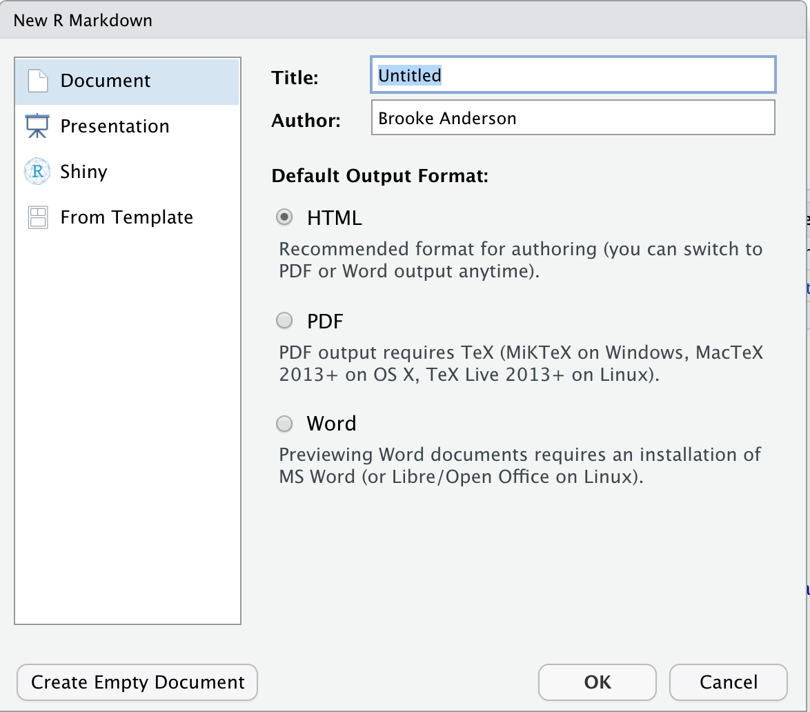
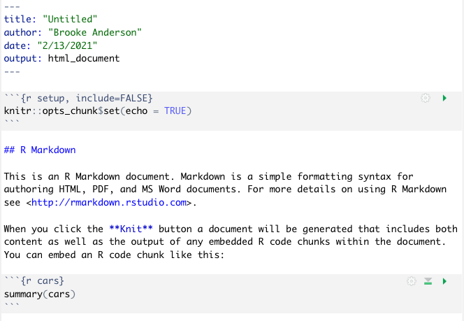
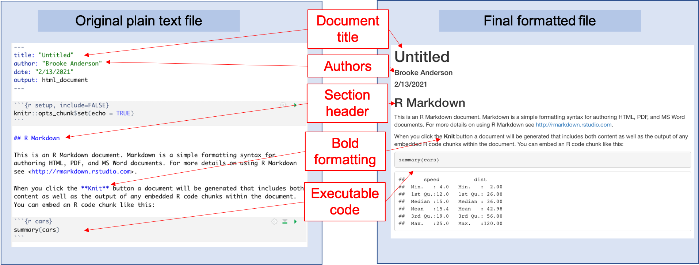

## RMarkdown for creating reproducible data pre-processing protocols

The R extension package RMarkdown can be used to create documents that combine
code and text in a 'knitted' document, and it has become a popular tool for
improving the computational reproducibility and efficiency of the data analysis
stage of research. This tool can also be used earlier in the research process,
however, to improve reproducibility of pre-processing steps. In this module, we
will provide detailed instructions on how to use RMarkdown in RStudio to create
documents that combine code and text. We will show how an RMarkdown document
describing a data pre-processing protocol can be used to efficiently apply the
same data pre-processing steps to different sets of raw data.

**Objectives.** After this module, the trainee will be able to:

- Define RMarkdown and the documents it can create 
- Explain how RMarkdown can be used to improve the reproducibility of research
projects at the data pre-processing phase
- Create a document in RStudio using RMarkdown
- Apply it to several different datasets with the same format

### Creating knitted documents in R

In the last module, we described what knitted documents are, as well as the
advantages of using knitted documents to create data pre-processing protocols
for common pre-processing tasks in your research group. In this module, we will
go into more detail about how you can create these documents using R and
RStudio, and in the next module we will walk through an example data
pre-processing protocol created using this method.

R has a special format for creating knitted documents called **Rmarkdown**.
Later in this module, we will provide details on creating these documents, but
first, we will provide some details of some of the specific conventions used in
this type of knitted documents. As with other knitted documents, Rmarkdown
documents are originally written in plain text. In the previous module, we
discussed how knitted documents will use a markup language within the plain text
for formatting; for RMarkdown files, the markup language used is Markdown. Since
the laguage is Markdown, the preamble for each document uses YAML. We described
in the previous module how knitted documents include executable code, along with
the formatted text. By default, executable code for RMarkdown files will be in
R, but there are also options to include executable code in the document in a
number of other programming languages.

### Creating and exploring an Rmarkdown file

**Creating a new Rmarkdown file and exploring the template.**

First, we will explain how you can create a new Rmarkdown document using
RStudio. Like other plain text documents, an Rmarkdown file should be edited
using a text editor, rather than a word processor like Word or Google Docs. It
is easiest to use the Rstudio IDE as the text editor when creating and editing
an R markdown document, as this IDE has incorporated some helpful functionality
for working with plain text documents for Rmarkdown. The RStudio IDE can be
downloaded and installed as a free software, as long as you use the personal
version (RStudio creates higher-powered versions for corporate use). Since
RStudio is free and has many helpful tools for working with Rmarkdown, we will
focus on using this interface in our advice in this module.

In RStudio, you can create a number of types of new files through the
"File" menu. To create a new R markdown file, choose "New File" and then choose
"Rmarkdown" from the choices in that menu. Figure \@ref(fig:rmarkdownnewfile)
shows an example of what this menu option looks like.

```{r rmarkdownnewfile, echo = FALSE, out.width = "\\textwidth", fig.cap = "RStudio pull-down menus to help you navigate to open a new Rmarkdown file."}
knitr::include_graphics("figures/rmarkdown_newfile.png")
```

This will open a window with some options you can specify some of the overall
information about the document (Figure \@ref(fig:rmarkdownchoices)), including
the title and the author, and you can specify the output format that you would
like. Possible output formats include HTML, Word, and PDF. You should be able to
use the HTML and Word output formats without any additional software. If you
would like to use the PDF output, you will need to install one other piece of
software: Miktex for Windows, MacTex for Mac, or TeX Live for Linux. These are
all pieces of software with an underlying TeX engine and all are open-source and
free.

```{r rmarkdownchoices, echo = FALSE, out.width = "\\textwidth", fig.cap = "Options available when you create a new Rmarkdown file in RStudio. You can specify information that will go into the document's preamble, including the title and authors and the format that the document will be output to (HTML, Word, or PDF)."}

```

Once you have selected the options in this menu you can choose the "Okay" button
(Figure \@ref(fig:rmarkdownchoices)). This will open a new document. This
document, however, won't be blank. Instead it will include an example document
written in Rmarkdown (Figure \@ref(fig:rmarkdowntemplate)). This example
document helps you navigate how the Rmarkdown process works, by letting you test
out a sample document. It also gives you a starting point---once you understand
how the example document works, you can edit it and change it to convert it
into the document you would like to create.

```{r rmarkdowntemplate, echo = FALSE, out.width = "\\textwidth", fig.cap = "Example of the template Rmarkdown document that you will see when you create a new Rmarkdown file in RStudio. You can explore this template and try rendering (knitting) it. Once you are familiar with how this example works, you can edit the text and code to adapt it for your own document."}

```

If you have not used Rmarkdown before, it is very helpful to try knitting this
example document before making changes, to explore how pieces in the document
align with elements in the rendered output document. Once you are
familiar with the line-up between elements in this file in the output document,
you delete parts of the example file and insert your own text and code.

We will walk you through exploring this example document, as well as aligning it
with the formatted output document (Figure \@ref(fig:rmarkdownoriginalfinal)).
First, to render this or any Rmarkdown document, if you are in RStudio you can
use the "Knit" button at the top of the file, as shown in Figure
\@ref(fig:rmarkdowntemplate2). When you click on this button, it will render the
entire document to the output format you've selected (HTML, PDF, or Word). This
rendering process will both run the executable code and apply all formatting.
The final output (Figure \@ref(fig:rmarkdownoriginalfinal), right) will pop up
in a new window. As you start with Rmarkdown, it is useful to look at this
output to see how it compares with the plain text Rmarkdown file (Figure
\@ref(fig:rmarkdownoriginalfinal), left).


```{r rmarkdownoriginalfinal, fig.fullwidth = TRUE, echo = FALSE, out.width = "\\textwidth", fig.cap = "Example of the template Rmarkdown document that you will see when you create a new Rmarkdown file in RStudio. You can explore this template and try rendering (knitting) it. Once you are familiar with how this example works, you can edit the text and code to adapt it for your own document."}

```

```{r rmarkdowntemplate2, echo = FALSE, out.width = "\\textwidth", fig.cap = "Example of the template Rmarkdown document, highlighting buttons in RStudio that you can use to facilitate working with the document. The 'knit' button, highlighted at the top of the figure, will render the entire document. The green arrow, highlighted lower in the figure within a code chunk, can be used to run the code in that specific code chunk."}
knitr::include_graphics("figures/rmarkdown_template2.png")
```

You will also notice, after you first render the document, that your working
directory has a new file with this output document. For example, if you are
working to create an HTML document using an Rmarkdown file called
"my_report.Rmd", once you knit your Rmarkdown file, you will notice a new file
in your working directory called "my_report.html". This new file is your output
file, the one that you would share with colleagues as a report. You should
consider this output document to be read only---in other words, you can read and
share this document, but you should not make any changes directly to this
document, since they will be overwritten anytime you re-render the original
Rmarkdown document.

Next, let's compare the example Rmarkdown document (the one that is given when
you first open an Rmarkdown file in RStudio) with the output file that is
created when you render this example document (Figure
\@ref(fig:rmarkdownoriginalfinal)). If you look at the output document (Figure
\@ref(fig:rmarkdownoriginalfinal), right), you can notice how different elements
align with pieces in the original Rmarkdown file (Figure
\@ref(fig:rmarkdownoriginalfinal)). For example, the output document includes a
header with the text "R Markdown". This second-level header is created by the
Markdown notation in the original file of:

```
## R Markdown
``` 

This header is formatted in a larger font than other text, and on a separate
line---the exact formatting is specified within the style file for the Rmarkdown
document, and will be applied to all second-level headers in the document. You
can also see formatting specified through things like bold font for the word
"Knit", through the Markdown syntax `**Knit**`, and a clickable link specified
through the syntax `<http://rmarkdown.rstudio.com>`. At the beginning of the
original document, you can see how elements like the title, author, date, and
output format are specified in the YAML. Finally, you can see that special
character combinations demarcate sections of executable code.

**Formatting text with Markdown.**

For the main text in an Rmarkdown document, all formatting is done using
Markdown as the markup language. Markdown is a popular markup language, in part
because it is a good bit simpler than other markup languages like HTML or LaTeX.
This simplicity means that it is not quite as expressive as other markup
languages. However, Markdown provides adequate formatting for 90% of the
formatting you will typically want to do for a research report or
pre-processeing protocol, and by staying simpler, it is much easier to learn the
Markdown syntax quickly compared to other markup languages.

As with other markup languages, Markdown uses special characters or combinations of characters to indicate formatting within the plain text of the original document. When the document is rendered, these markings are used by the software to create the formatting that you have specified in the final output document. Some example formatting symbols and conventions for Markdown include: 

- to format a word or phrase in bold, surround it with two asterisks (`**`) 
- to format a word or phrase in italics, surround it with one asterisk (`*`) 
- to create a first-level header, put the header text on its own line, starting the line with `# `
- to create a second-level header, put the header text on its own line, starting the line with `## `
- separate paragraphs with empty lines
- use hyphens to create bulleted lists

One thing to keep in mind when using Markdown, in terms of formatting, is that
white space can be very important in specifying the formatting. For example when
you specify a new paragraph, you must leave a blank line  from your previous
text. Similarly when you use a hash (`#`) to indicate a header, you must leave a
blank space after the hash before the word or phrase that you want to be used in
that header. To create a section header, you would write:

```
# Initial Data Inspection
```

Meanwhile this: 

```
#Initial Data Inspection
```

Would render to: 

#Initial Data Inspection

Similarly, white space is needed to separate paragraphs. For example, this would create two paragraphs: 

```
This is a first paragraph. 

This is a second.
```

Meanwhile this would create one: 

```
This is a first paragraph.
This is still part of the first paragraph.
```

The syntax of Markdown is fairly simple and can be learned quickly. For more
details on this syntax, you can refer to the Rmarkdown reference guide at
https://rstudio.com/wp-content/uploads/2015/03/rmarkdown-reference.pdf. The
basic formatting rules for Markdown are also covered any number of more
extensive resources for Rmarkdown that we will point you to later in this
module.

**Creating a preamble with YAML.**

In the previous module, we explained how knitted documents include a 
preamble to specify some metadata about the document, including elements
like the title, authors, and output format. In R, this preamble is 
created using YAML. In this subsection, we provide some more details
on using this YAML section in Rmarkdown documents.

When you initially create an Rmarkdown document, you select the output format
for it (e.g., pdf, Word, HTML). You can change this output selection once you've
created the document, however, by making a change in a special section at the
top of the RMarkdown document called the "YAML". The YAML is a special section
at the top of an RMarkdown document (the original, plain text file, not the
rendered version). It is set off from the rest of the document using a special
combination of characters, using a process very similar to how executable code
is set off from other text with a special set of characters so it can be easily
identified by the software program that renders the document. For the YAML, this
combination of characters is three hyphens (`---`) on a line by themselves to
start the YAML section and then another three on a line by themselves to end it.
Here is an example of what the YAML might look like at the top of an RMarkdown
document:

````
---
title: "Laboratory report for example project"
author: "Brooke Anderson"
date: "1/12/2020"
output: word_document
---
````

Within the YAML itself, you can specify different options for your document. 
You can change simple things like the title, author, and date, but you can 
also change more complex things, including how the output document is rendered.
For each thing that you want to specify, you specify it with a special 
keyword for that option and then a valid choice for that keyword. The idea 
is very similar to setting parameter values in a function call in R. For 
example, the `title:` keyword is a valid one in RMarkdown YAML. It allows you 
to set the words that will be printed in the title space, using title formatting, 
in your output document. It can take any string of characters, so you can put in 
any text for the title that you'd like, as long as you surround it with quotation 
marks. The `author:` and `date:` keywords work in similar ways. The `output:` 
keyword allows you to specify the output that the document should be rendered to. 
In this case, the keyword can only take one of a few set values, including
`word_document` to output a Word document, `pdf_document` to output a pdf 
document (see later in this section for some more set-up required to make that
work), and `html_document` to output an HTML document. 

As you start using RMarkdown, you will be able to do a lot without messing with
the YAML much. In fact, you can get a long way without ever changing the values
in the YAML from the default values they are given when you first create an
RMarkdown document. As you become more familiar with R, you may want to learn
more about how the YAML works and how you can use it to customize your
document---it turns out that quite a lot can be set in the YAML to do very
interesting customizations in your final rendered document. The book *R
Markdown: The Definitive Guide* [ref], which is available free online, has
sections discussing YAML choices for both HTML and pdf output, at
https://bookdown.org/yihui/rmarkdown/html-document.html and
https://bookdown.org/yihui/rmarkdown/pdf-document.html, respectively. There is
also a talk that Yihui Xie, the creator of RMarkdown, gave on this topic at a
past RStudio conference, available at
https://rstudio.com/resources/rstudioconf-2017/customizing-extending-r-markdown/.

**Executable code in Rmarkdown files.**

In the previous module, we described how knitted documents use special markers
to indicate where sections of executable code start and stop. In RMarkdown, 
the markers you will use to indicate executable code look like this: 

````
```r{}
my_object <- c(1, 2, 3)
```
````

The first part of this marker (```` ```r{} ````) indicates that a section of
code is starting. Then end part (```` ``` ````) indicates that the file is
moving back to regular Markdown. In the first marker, you can use the simplest
form (```` ```r{} ````) to indicate the start of the code. However, you can also
include options to customize actions when the code in that section is executed.
There are many options that you can set for each code chunk. These options will
specify how the code in that section of executable code will be run and how the
output from running the code will be presented. These specifications are called
**chunk options**, and you specify them in the special character combination
where you mark the start of executable code. For example, you can specify that
the code should be printed in the document, but not executed, by setting the
`eval` parameter to `FALSE` with ```` ```{r eval = FALSE} ```` as the marker to
start the code section.

The chunk options also include `echo`, which can be used to specify whether to
print the code in that code chunk when the document is rendered. For some
documents, it is useful to print out the code that is executed, where for other
documents you may not want that printed. For example, for a pre-processing
protocol, you are aiming to show yourself and others how the pre-processing was
done. In this case, it is very helpful to print out all of the code, so that
future researchers who read that protocol can clearly see each step. By
contrast, if you are using Rmarkdown to create a report or an article that is
focused on the results of your analysis, it may make more sense to instead hide
the code in the final document.

As part of the code options, you can also specify whether messages and warnings
created when running the code should be included in the document output, and
there are number of code chunk options that specify how tables and figures
rendered by the code should be shown. For more details on the possible options
that can be specified for how code is evaluated within an executable chunk of
code, you refer to the Rmarkdown cheat sheet available at
https://rstudio.com/wp-content/uploads/2015/02/rmarkdown-cheatsheet.pdf

RStudio has some functionality that is useful when you are working with code in
Rmarkdown documents. Within each code chuck are some buttons that can be used to
test out the code in that chunk of executable code. One is the green right arrow
key to the right at the top of the code chunk, highlighted in Figure
\@ref(fig:rmarkdowntemplate2). This button will run all of the code in that
chunk and show you the output in an output field that will open directly below
the code chunk. This functionality allows you to explore the code in your
document as you build it, rather than waiting until you are ready to render the
entire document. The button directly to the left of that button, which looks
like an upward-pointing arrow over a rectangle, will execute all code that comes
before this chunk in the document. This can be very helpful in making sure that
you have set up your environment to run this particular chunk of code.

### More advanced Rmarkdown functionality

The details and resources that we have covered so far focus on the basics of
Rmarkdown. You can get quite a lot done just with these basics. However,
the Rmarkdown system is very rich and allows complex functionality beyond
these basics. In this section, we will highlight just a few of the ways
Rmarkdown can be used in a more advanced way. Since this topic is so broad, we
will focus on elements that we have found to be particularly useful for
biomedical researchers as they become more advanced with Rmarkdown. We will not
go into extensive detail about how to use these more advanced features in this
module, but instead point to resources where you can learn more as you are
ready. If you are just learning Rmarkdown, at this point it will be helpful to
just know that some of these advanced features are available, so you can come
back and explore them when you become familiar with the basics.

First you can use R markdown, in contact with something called bib
tag, as a referencing system. This allows you to include bibliographical
references in the documents that you create, and R markdown will handle the
creation of the references section and the numbering of the documents Within
your text. Second you can include math and mathematical equations with in your
rmarkdown document. this allows you to use Clean and Clear formatting anytime
you are testifying an equation within your document. With r markdown the default
is to include code that is executed in our. However especially in workflows for
biological data, you may need to use different languages for different parts of
your workflow. Rmarkdown will allow you to specify that code and specific chunks
of code should be run using different languages. You can include specifications
to run code in languages like Python and other options. As mentioned earlier
markdown is a fairly simple markup language. It can do a lot but occasionally
the Simplicity means that you might not be able to create fancier formatting
that you might desire. For R markdown it will allow you to shift into a more
complex markup language in those cases. This does restrict you with that because
it will depend on what output format you are using and as a result at that point
you will only be able to render to a single output format typically. However
this functionality allows you to incorporate specifications for me there lay
Tech if you are rendering to PDF or HTML if you are rendering in that format.
This allows for very complex formatting within an R markdown document. Here we
have focused on creating report documents as a basic type of document output.
However rmarkdown will allow you to Output to a number of different formats. For
example the Articles package includes templates for a number of different
Journal and allows you to use R markdown to directly write your Journal article
into the journals desired format. You can also create presentations either as
PDF slideshow, as PowerPoint, where is HTML slides using different options under
the presentation Tab 4 armor John. R markdown is also now able to be used to
create larger projects that are pulling together multiple documents created in
an R markdown format these include online books that can be also render to PDF
through the package book down. It also includes websites with a Blog section
through the block down package and online dashboards through the flex dashboard
package. There's some excellent and free resources for learning both basics and
advanced features of R markdown. The team developing rmarkdown is largely based
out of our studio, and so many of the resources are available through our
studios website they have a specific section on R markdown available at
https://rmarkdown.rstudio.com/. This way webpage includes tutorial both for
Basics and more advanced topics, a gallery where you can see examples of hell
are marked down as used and find the code to try it's acting it for your own
use, and it fence articles. Members of this development team have also created
two excellent free online books these are available online and also in print.
the first is R markdown the definitive guide and the second is the rmarkdown
cookbook. The first book provides an ordered look through different topics in R
markdown, while the second is excellent first searching for a particular thing
that you want to do with r markdown and then get it going directly to a section
that describes how to do that using a cookbook approach.


### Some helpful additional features in RMarkdown

The previous subsection gave an overview of the basics of creating and 
rendering a document with RMarkdown. We gave just an overview, as there are 
many resources for learning and practicing RMarkdown that are available, including
many that are freely available online. In this sections, we'll point you to 
some of those resources. 

To learn more about RMarkdown, you can explore a number of excellent resources.
The most comprehensive are shared by RStudio, where RMarkdown's developer
and maintainer, Yihui Xie, works. These resources are all freely available 
online, and some are also available to buy as print books, if you prefer that
format. 

First, you should check out the online tutorials that are provided by RStudio on
RMarkdown. These are available at RStudio's RMarkdown page:
https://rmarkdown.rstudio.com/. The page's "Getting Started" section 
(https://rmarkdown.rstudio.com/lesson-1.html) provides a nice introduction 
you can work through to try out RMarkdown and practice the overview provided
in the last subsection of this module. The "Articles" section 
(https://rmarkdown.rstudio.com/articles.html) provides a number of other 
documents to help you learn RMarkdown.

RStudio's RMarkdown page also includes a "Gallery"
(https://rmarkdown.rstudio.com/gallery.html). This resource allows you to browse
through example documents, so you can get a visual idea of what you might want
to create and then access the example code for a similar document. This is a 
great resource for exploring the variety of documents that you can create 
using RMarkdown.

To go more deeply into RMarkdown, there are two online books from some of the
same team that are available online. The first is *R Markdown: The Definitive
Guide* by Yihui Xie, J. J. Allaire, and Garrett Grolemund [ref for this book]. 
This book is available at https://bookdown.org/yihui/rmarkdown/. It moves from 
basics through very advanced functionality that you can implement with RMarkdown, 
including several of the topics we highlight later in this subsection. 

The second online book to explore from this team is *R Markdown Cookbook*, 
by Yihui Xie, Christophe Dervieux, and Emily Riederer. This book is a helpful 
resource for dipping in to a specific section when you want to learn how to 
achieve a specific task. Just like a regular cookbook has recipes that you can
explore and use one at a time, this book does not require a comprehensive
end-to-end read, but instead provides "recipes" with advice and instructions
for doing specific things. For example, if you want to figure out how to 
align a figure that you create in the center of the page, rather than the 
left, you can find a "recipe" in this book to do that.

### Some helpful additional features in RMarkdown

Some of the references mentioned in the last subsection are very comprehensize.
Therefore, in this section, we'll point out and briefly overview several
features that you might not be introduced to in introductory RMarkdown
tutorials, but we have found can be very useful for researchers who are using
RMarkdown to document their code for scientific projects. You can find more
details about these in the references given in the last subsection, so in this
subsection, our aim is to help make you aware that these resources are available
if you need them and to point you to places where you can find out more. 

[How to extract just the code from the document]

[How to include references using BibTex as a reference manager]

[How to include formulas and math]

In your RMarkdown documents, you include executable code in special sections
("chunks") that are separated from the regular text using a special combination
of characters. By default, the code in these chunks are executed using the 
R programming language. However, you can also include executable code in a 
number of other programming languages. For example, you could set some code
chunks to run Python, others to run Julia, and still others to run a 
shell script [?].

This can be very helpful if you have steps in you Python that use code in 
different languages. For example, there may be a package [?] in Python that
works well for an early step in your data preprocessing, and then later 
steps that are easier with general R functions. This presents no problem in 
creating an RMarkdown data pre-processing protocol, as you can include 
different steps using different languages. 
 
The program that is used to run the code in a specific chunk is called the 
"engine" for that chunk [?]. You can change the engine [where in the code
chunk markup]. [More on this.] When your RMarkdown document is rendered, 
your computer will use the specified software to run each code chunk. Of course, 
to run that piece of code, your computer must have that type of software installed
and available. For example, if you include a chunk of code that you'd like to 
run with a Python engine, you must have Python on your computer.

While you can use many different software programs as the engine for each code
chunk, there are a few limitations with some programs. For many open-source 
software programs, the results from running a chunk of code with that engine
will be available for later code chunks to use as an input. This is not the case, 
however, for some proprietary software [?]. For example, if you use the SAS software
program as the engine for one of your code chunks, the output from running that code
will not be available to input to later code in the document [?].

Some code can take a while to run, particularly if it is processing very large
datasets. By default, RMarkdown will re-run all code in the document every time
you render it. This is usually the best set-up, since it allows you to confirm
that the code is all executing as desired each time the code is rendered.
However, if you have steps that take a long time, this can make it so the
RMarkdown document takes a long time to render each time you render it.

To help with this problem, RMarkdown has a system that allows you to *cache*
results from some or all code chunks in the document. This is a really nice
system---it will check the inputs to that part of the code each time the
document is run. If those inputs have changed, it will take the time to re-run
that piece of code, to use the updated inputs. However, if the inputs have not
changed since the last time the document was rendered, then the last results for
that chunk of code will be pulled from memory and used, without re-running the
code in that chunk. This saves time most of the times that you render the
document, while taking the time to re-run the code when necessary, because the
inputs have changed and so the outputs may be different.

[More on caching from RMarkdown, including things to look out for, like the size
of the document as it grows to include cached values.]

[Using journal article templates]


You can use RMarkdown to create documents other than traditional reports. 
Scientists might find the outputs of presentations and posters particularly 
useful. 

RMarkdown has allowed a pdf slide output for a long time. This output leverages
the "beamer" format from LaTeX. You can create a series of presentation slides
in RMarkdown, using Markdown to specify formatting, and then the document will
be rendered to pdf slides. These slides can be shown using a pdf viewer [?],
like Adobe Acrobat, set either to full screen or to the presentation option [?].
More recently, capability has been added to RMarkdown that allows you to create
PowerPoint slides. Again, you will start from an RMarkdown document, using
Markdown syntax to do thinks like divide content into separate slides.
Regardless of the output format you choose (pdf slides or PowerPoint), the code
to generate figures and tables in the presentation can be included directly in
the RMarkdown, so it is re-run with the latest data each time you render the
presentation.

[Where to find out more about creating presentations with RMarkdown]

It is also possible to use RMarkdown to create scientific posters, although this
is a bit less common and there are fewer tutorial resources with instructions on
doing this. [More on making posters with RMarkdown. Some examples on GitHub.]

It is very easy to add figures and simple tables to RMarkdown documents, and 
this process is covered thoroughly in basic tutorials on RMarkdown. However, 
as you start using RMarkdown more and more, and want to use it to create 
article drafts, posters, and presentations, you may want to create more 
customized tables. 

There is an R package that allows you to create very attractive and complex
tables in RMarkdown documents. This package leverages more of the power of
underlying markdown languages, rather than the simpler Markdown language. If you
remember, Markdown is pretty easy to learn because it has a somewhat limited set
of special characters and special markings that you can use to specify
formatting in your output document. This basic set of functionality is often all
you need, but for complex table formatting, you will need more. There is much
more available in the deeper markup languages that you can use specifically to
render pdf documents (software derived from TeX) and the one that you can use
specifically to render HTML (the HTML markup language---the "ML" in "HTML", in
fact, stand for "Markup Language" [?]).

As a result, you will need to create RMarkdown files that are customized to a
single output format (pdf or HTML) to take advantage of this package. The
package is called `kableExtra`. You can install it the same as any other R
package from CRAN, using `install.packages`. You will need to use then need to
use `library("kableExtra)` within your RMarkdown document before you use
functions from the package. The `kableExtra` package is extensively documented
through two vignettes that come with package, one if the output will be in pdf
and one if it will be in HTML: [websites for these vignettes]. There is also
information on using `kableExtra` available through [RMarkdown book. doublecheck
which one. Cookbook?]

You can use RMarkdown to create much larger outputs, compared to simpler reports
and protocols. RMarkdown can now be used to create very large and dynamic documents, 
including online books (which can also be rendered to pdf versions suitable for 
printing), dashboard-style websites, and blogs. Once members of your research 
group are familiar with the basics of RMarkdown, you may want to explore using 
it to create these more complex outputs. The book format divides content into 
chapters and special sections like appendices and references. It includes a 
table of contents based on weblinks, so readers can easily navigate the content. 
It uses a book format as its base that allows readers to do things like change the 
font size and search the book text for keywords. The blog format allows you to 
create a very attractive website that includes a blog section, where you can 
write and regularly post new blogs, keeping the site dynamic. There are templates
for these blogs that are appropriate for creating personal or research group 
websites for academics. The dashboard format is excellent for creating a webpage
that allows users to view complex, and potentially interactive, results from 
data you've collected. It can be particularly helpful for groups that need to 
quickly communicate regularly updated data to viewers. During 2020, for example, 
many public health departments maintained dashboard-style websites to share 
evolving data on COVID-19 in the community.

Using RMarkdown in this case has two key advantages. First, you can include
executable R code in any of these documents if you create them with RMarkdown.
This will allow you to put example code in the document and ensure that it is
working correctly. It also allows you to easily update documents as you get new
or updated data, since it is easy to re-run any data processing, analysis, and
visualization code in the document.

There are several thorough references that you can use to learn more about creating
the larger output documents using RMarkdown. Online books can be created using the
package `bookdown`. There is an online book available with extensive instructions on 
using this package, available at [weblink to bookdown book]. There is also a helpful
website with more details on this package, bookdown.org [put in full webline here].
The website include a gallery of example books created with bookdown [link for this], 
which you can use to explore the types of books that can be created. There are also 
online video tutorials [?], available at ....

To learn how to create websites with blogs, you can check the book *blogdown* [check 
title, add ref], which is available both in print and free online at [weblink]. This
process takes a bit of work to initially get the website set up, but then allows for 
easy and straightforward maintenance. [Gallery with example websites?]. These 
websites can be created to highlight the research and people in your research lab. 
You can encourage students and postdocs to create personal sites, to raise the profile
of their research. In the past, we have even used one as a central, unifying spot
for a group study or other course [link to our course website for the group study].


<!-- ### Potential quotes / refs  -->

<!-- > "WordPerfect was always the best word processor. Because it allowed for insight into -->
<!-- its very structure. You could hit a certain key combination and suddenly the screen -->
<!-- would split and you'd reveal the codes, the bolds and italics, and so forth,  -->
<!-- that would define your text when it was printed. It was beloved of legal secretaries -->
<!-- and journalists alike. Because when you work with words, at the practical, everyday -->
<!-- level, the ability to look under the hood is essential. Words are not simple. And -->
<!-- WordPerfect acknowledged that. Microsoft Word did not. Microsoft kept insisting that -->
<!-- what you saw on your screen was the way things *were*, and if your fonts just kept -->
<!-- sort of randonmly changing, well, you must have wanted it that way. Then along came  -->
<!-- HTML, and what I remember most was that sense of being back inside the file. Sure,  -->
<!-- HTML was a typographic nightmare, a bunch of unjustified Times New Roman in 12 pt on  -->
<!-- screens with chiclet-size pixels, but under the hood you could see all the pieces.  -->
<!-- Just like WordPerfect. That transparency was a wonderful thing, and it renewed -->
<!-- computing for me." [@ford2015on] -->

<!-- > "TeX was created by Donald E. Knuth, a professor at Stanford University who has -->
<!-- achieved international renown as a mathematician and computer scientist. -->
<!-- Knuth also has an aesthetic sense uncommon in his field, and his work output is -->
<!-- truly phenomenal. TeX is a happy byproduct of Knuth's mammoth enterprise,  -->
<!-- *The Art of Computer Programming*. This series of reference books, designed -->
<!-- to cover the whole gamut of programming concepts and techniques, is a  -->
<!-- *sine qua non* for all computer scientists." [@seroul2012beginner] -->

<!-- > "Roughly speaking, text processors fall into two categories: -->
<!-- (1) WYSIWYG systems: what you see is what you get. You see on the screen at all -->
<!-- times what the printed document will look like, and what you type has immediate -->
<!-- effect on the appearance of the document. (2)  markup systems, where you type your text  -->
<!-- interspersed with formatting instructions, but don't see their effect right away. You must run a program to examine the -->
<!-- resulting image, whether on paper or on the screen. In computer science jargon, -->
<!-- markup systems must compile the source file you type.  WYSIWYG systems have the obvious  -->
<!-- advantage of immediate feedback, but they -->
<!-- are not very precise: what is acceptable at a resolution of 300 dots per inch, for an -->
<!-- ephemeral publication such as a newsletter or flier, is no longer so for a book that -->
<!-- will be phototypeset at high resolution. The human eye is extraordinarily sensitive: -->
<!-- you can be bothered by the appearance of a text without being able to pinpoint why, -->
<!-- just as you can tell when someone plays the wrong note in an orchestra, without -->
<!-- being able to identify the CUlprit. One quickly leams in typesetting that the beauty, -->
<!-- legibility and comfortable reading of a text depend on minute details: each element -->
<!-- must be placed exactly right, within thousandths of an inch. For this type of work, -->
<!-- the advantage of immediate feedback vanishes: fine details of spacing, alignment, -->
<!-- and so on are much too small to be discernible at the screen's relatively low  -->
<!-- resolution, and even if it such were not the case, it would still be a monumental chore -->
<!-- to find the right place for everything by hand. For this reason it is not surprising that in the world of professional typesetting -->
<!-- markup systems are preferred. They automate the task of finding the right place -->
<!-- for each character with great precision. Naturally, this approach is less attractive for -->
<!-- beginners, since one can't see the results as one types, and must develop a feeling -->
<!-- for what the system will do. But nowadays, you can have the best of both worlds -->
<!-- by using a markup system with a WYSIWYG *front end*; we'll talk about such front -->
<!-- ends for TEX later on. TEX was developed in the late seventies and early eighties,  -->
<!-- before WYSIWYG systems were widespread. But were it to be redesigned now, it would  -->
<!-- still be a markup -->
<!-- language. To give you an idea of the precision with which TEX operates: the internal  -->
<!-- unit it uses for its calculations is about a hundred times smaller than the -->
<!-- wavelength of visible light! (That's right, a hundred times.) In other words, any -->
<!-- round-off error introduced in the calculations is invisible to the naked eye."  -->
<!-- [@seroul2012beginner] -->

<!-- > "You should be sure to understand the difference between a text editor and a text -->
<!-- processor. A text processor is a text editor together with formatting software that -->
<!-- allows you to switch fonts, do double columns, indent, and so on. A text editor -->
<!-- puts your text in a file on disk, and displays a portion of it on the screen. It doesn't -->
<!-- format your text at all. We insist on the difference because those accustomed to WYSIWYG systems are -->
<!-- often not aware of it: they only know text processors. Where can you find a text -->
<!-- editor? Just about everywhere. Every text processor includes a text editor which -->
<!-- you can use. But if you use your text processor as a text editor, be sure to save your -->
<!-- file using a 'save ASCII' or 'save text only' option, so that the text processor's own -->
<!-- formatting commands are stripped off. If you give TEX a file created without this -->
<!-- precaution, you'll get garbage, because TEX cannot digest your text processor's -->
<!-- commands." [@seroul2012beginner] -->

<!-- > "TeX enabled authors to encode their precise intent into their manuscripts: -->
<!-- This block of text is a computer program, while this word is a keyword in that -->
<!-- program. The language it used, called TeX markup, formalized the slow, -->
<!-- error-prone communication that is normally carried out with the printer over -->
<!-- repeated galley proofs." [@apte2019lingua] -->

<!-- > "The idea of writing markup inside text wasn’t especially novel; it has been -->
<!-- used from 1970’s runoff (the UNIX family of printer-preparation utilities) to -->
<!-- today’s HTML tags. TeX was new in that it captured key concepts necessary for -->
<!-- realistic typesetting and formalized them." [@apte2019lingua] -->

<!-- > "With these higher-level commands, the free TeX engine, and the LaTeX book, -->
<!-- the use of TeX exploded. The macro file has since evolved and changed names, but -->
<!-- authors still typically run the program called latex or its variants. Hence, -->
<!-- most people who write TeX manuscripts know the program as LaTeX and the commands -->
<!-- they use as LaTeX commands." [@apte2019lingua] -->

<!-- > "The effect of LaTeX on scientific and technical publishing has been profound. -->
<!-- Precise typesetting is critical, particularly for conveying concepts using -->
<!-- chemical and mathematical formulas, algorithms, and similar constructs. The -->
<!-- sheer volume of papers, journals, books, and other publications generated in the -->
<!-- modern world is far beyond the throughput possible via manual typesetting. And -->
<!-- TeX enables automation without losing precision. Thanks to LaTeX, book authors -->
<!-- can generate camera-ready copy on their own. Most academic and journal -->
<!-- publishers accept article manuscripts written in LaTeX, and there’s even an open -->
<!-- archive maintained by Cornell University where authors of papers in physics, -->
<!-- chemistry, and other disciplines can directly submit their LaTeX manuscripts for -->
<!-- open viewing. Over 10,000 manuscripts are submitted to this archive every month -->
<!-- from all over the world." [@apte2019lingua] -->

<!-- > "For many users, a practical difficulty with typesetting using TeX is -->
<!-- preparing the manuscripts. When TeX was first developed, technical authors were -->
<!-- accustomed to using plain-text editors like WordStar, vi, or Emacs with a -->
<!-- computer keyboard. The idea of marking up their text with commands and running -->
<!-- the manuscript through a typesetting engine felt natural to them. Today’s -->
<!-- typesetters, particularly desktop publishers, have a different mental model. -->
<!-- They expect to see the output in graphical form and then to visually make edits -->
<!-- with a mouse and keyboard, as they would in any WYSIWYG program. They might not -->
<!-- be too picky about the quality of the output, but they appreciate design -->
<!-- capabilities, such as the ability to flow text around curved outlines. Many -->
<!-- print products are now produced with tools like Microsoft Word for this very -->
<!-- reason. TeX authors cannot do the same work as easily." [@apte2019lingua] -->

<!-- > "Poor documentation can lead to irreproducibility and serious errors. There's -->
<!-- a vast amount of lurking complexity in bioinformatics work: complex workflows,  -->
<!-- multiple files, countless program parameters, and different software versions. -->
<!-- The best way to prevent this complexity from causing problems is to document -->
<!-- everything extensively. Documentation also makes your life easier when you need to  -->
<!-- go back and rerun an analysis, write detailed methods about your steps for a  -->
<!-- paper, or find the origin of some data in a directory." [@buffalo2015bioinformatics] -->


<!-- > "Scatterplots are useful for visualizing treatment-response comparisons ...,  -->
<!-- assocations between variables ..., or paired data (e.g., a disease biomarker in  -->
<!-- several patients before and after treatment)." [@holmes2018modern] -->

<!-- > "Sometimes we want to show the relationshiips between more than two variables. -->
<!-- Obvious choices for including additional dimensions are plot symbol shapes and -->
<!-- colors. ... Another way to show additional dimensions of the data is to show -->
<!-- multiple plots that result from repeatedly subsetting (or 'slicing') the data -->
<!-- based on one (or more) of the variables, so that we can visualize each part -->
<!-- separately. This is called faceting and it enables us to visualize data in up to -->
<!-- four or five dimensions. So we can, for instance, investigate whether the -->
<!-- observed patterns among the other variables are the same or different across the -->
<!-- range of the faceting variable." [@holmes2018modern] -->

<!-- > "You can add an enormous amount of information and expressivity by making your -->
<!-- plots interactive. ... The package `ggvis` is an attempt to extend the good -->
<!-- features of `ggplot2` into the realm of interactive graphics. In contrast to -->
<!-- `ggplot2`, which produces graphics into R's traditional graphics devices (PDF, -->
<!-- PNG, etc.), `ggvis` builds upon a JavaScript infrastructure called *Vega*, and -->
<!-- its plots are intended to be viewed in an HTML browser." [@holmes2018modern] -->

<!-- > "Heatmaps are a powerful way of visualizing large, matrix-like datasets and  -->
<!-- providing a quick overview of the patterns that might be in the data. There  -->
<!-- are a number of heatmap drawing functions in R; one that is convenient and  -->
<!-- produces good-looking output is the function `pheatmap` from the eponymous  -->
<!-- package." [@holmes2018modern] -->

<!-- > "Plots in which most points are huddled in one area, with much of the available -->
<!-- spaces sparesly populated, are difficult to read. If the histogram of the  -->
<!-- marginal distribution of a variable has a sharp peak and then long tails to  -->
<!-- one or both sides, transforming the data can be helpful. ... The plots in  -->
<!-- this chapter that involve microarray data use the logarithmic transformation -->
<!-- [footnote: 'We used it implicitly, since the data in the `ExpressionSet` object -->
<!-- `x` already came log-transformed']---not only in scatterplots... for the x- and -->
<!-- y-coordinates but also ... for the color scale that represents the  -->
<!-- expression fold change. The logarithm transformation is attractive because it has -->
<!-- a definite meaning---a move up or down by the same amount on a log-transformed -->
<!-- scale corresponds to the same multiplicative change on the original scale:  -->
<!-- log(ax) = log a + log x. Sometimes, however, the logarithm is not good enough,  -->
<!-- for instance when the data include zero or negative values, or when even on the  -->
<!-- logarithmic scale the data distribution is highly uneven." [@holmes2018modern] -->

<!-- > "To visualize genomic data, in addition to the general principles we have -->
<!-- discussed in this chapter, there are some specific considerations. The data are -->
<!-- usually associated with genomic coordinates. In fact, genomic coordinates offer -->
<!-- a great organizing principle for the integration of genomic data. ... The main  -->
<!-- challenge of genomic data visualization is the size of the genomes. We need -->
<!-- visualization at multiple scales, from whole genome down to the  -->
<!-- nucleotide level. It should be easy to zoom in and out, and we may need different -->
<!-- visualization strategies for the different size scales. It can be convenient to  -->
<!-- visualize biological molecules (genomes, genes, transcripts, proteins) in a linear -->
<!-- manner, although their embedding in the physical world can matter (a great deal)." -->
<!-- [@holmes2018modern] -->

<!-- > "Visualizing the data, either 'raw' or along the various steps of processing,  -->
<!-- summarization, and inference, is one of the most important activities in applied -->
<!-- statistics and, indeed, in science. It sometimes gets short shrift in textbooks -->
<!-- since there is not much deductive theory. However, there are many good (and bad) -->
<!-- practices, and once you pay attention to it, you will quickly see whether a  -->
<!-- certain graphic is effective in conveying its message, or what -->
<!-- choices you could make to create powerful and aesthetically attractive data -->
<!-- visualizations." [@holmes2018modern] -->

### Applied exercise

