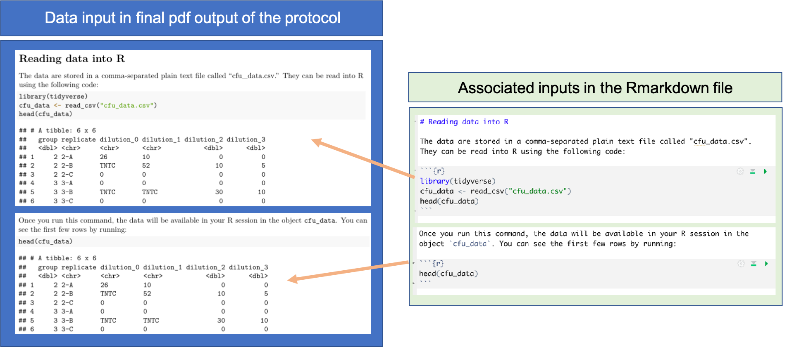
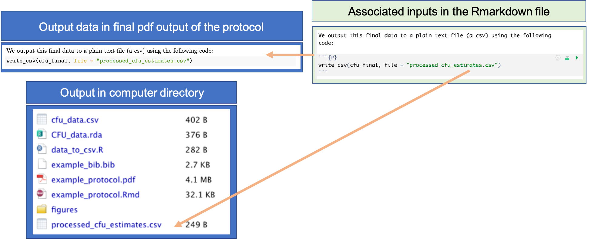
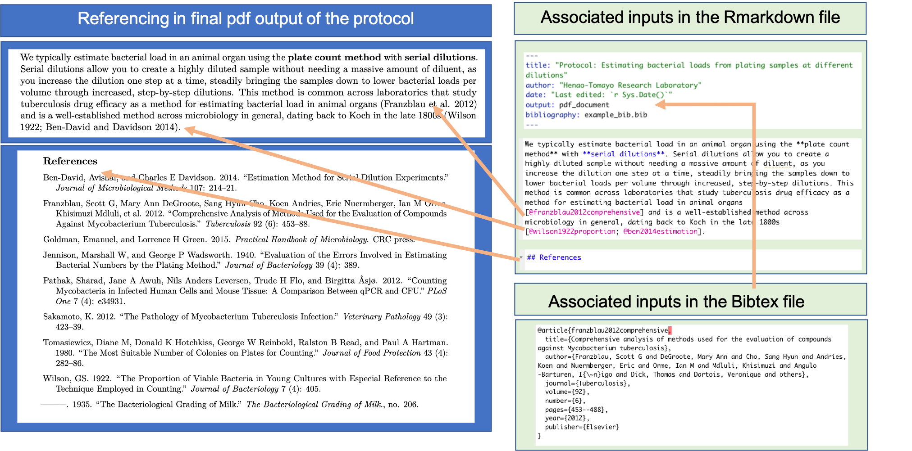

## Example: Creating a reproducible data pre-processing protocol

We will walk through an example of creating a reproducible protocol for the
automated gating of flow cytometry data for a project on the immunology of
tuberculosis lead by one of our Co-Is. This data pre-processing protocol was
created using RMarkdown and allows the efficient, transparent, and reproducible
gating of flow cytometry data for all experiments in the research group. We will
walk the trainees through how we developed the protocol initially, the final
pre-processing protocol, how we apply this protocol to new experimental data.

**Objectives.** After this module, the trainee will be able to:

- Explain how a reproducible data pre-processing protocol can be integrated into
a real research project
- Understand how to design and implement a data pre-processing protocol to
replace manual or point-and-click data pre-processing tools

### Introduction and example data

In this module, we'll provide advice and an example of how you can use the 
tools for knitted documents to create a reproducible data preprocessing 
protocol. This module builds on ideas and techniques that were introduced 
in the last two modules, to help you put them into practical use for 
data preprocessing that you do repeatedly for research data in your 
laboratory.

In this module, we will use an example of a common pre-processing task in
immunological research: estimating the bacterial load in samples by plating at
different dilutions, identifying a good dilution for counting colony-forming
units (CFUs), and then back-calculating the estimated bacterial load in the
original sample based on the colonies counted at this dilution. This
experimental technique dates back to the late 1800s, with Koch, and continues to
be widely used in microbiology research and applications today
[@ben2014estimation]. These data are originally from example data for an R
package called `bactcountr`, currently under development at
https://github.com/aef1004/bactcountr/tree/master/data.

These data represent data from a common laboratory task in immunological
research: estimating the bacterial load in samples by plating each sample at
different dilutions and counting colony-forming units at a "good" dilution for
each sample. For example, you may be testing out some drugs against an
infectious bacteria and want to know how successful different drugs are in
limiting bacterial load. You run an experiment and have samples from animals
treated with different drugs or under control. You want to know: How much viable
(i.e., replicating) bacteria are in each of your samples? 

You can find out by plating the sample at different dilutions and
counting the colony-forming units (CFUs) that are cultured on each plate.
You put a sample on a plate with a medium they can grow on and then give them
time to grow. The idea is that individual bacteria from the original sample end
up randomly around the surface of the plate, and any that are viable (able to
reproduce) will form a new colony that, after a while, you'll be able to see.

To count the number of colonies, you need a "just right" dilution (and you
typically won't know which dilution this is for a sample until after plating) to
have a countable plate. If you have too high of a dilution (i.e., one with very
few viable bacteria), randomness will play a big role in the CFU count, and
you'll estimate the original with more variability. If you have too low of a
dilution (i.e., one with lots of viable bacteria), it will be difficult to
identify separate colonies, and they may complete for resources. To translate
from diluted concentration to original concentration, you can then do a
back-calculation, incorporating both the number of colonies counted at that
dilution and how dilute the sample was. There is therefore some pre-processing
required (although it is fairly simple) to prepare the data collected by 
counting the CFUs on each plate for use in statistical testings and to 
combine with other experimental data. 

We will use this example pre-processing protocol as an illustration in this
module. If you would like, you can access all the components and follow along
with the example, re-rendering it yourself on your own computer. The example
data are available as a csv file, downloadable
[here](https://raw.githubusercontent.com/geanders/improve_repro/master/data/bactcountr_example_data/cfu_data.csv).
You can open this file using spreadsheet software, or look at it directly in
RStudio. 

The final pre-processing protocol for these data can be downloaded, including
both [the original RMarkdown
file](https://raw.githubusercontent.com/geanders/improve_repro/master/data/bactcountr_example_data/example_protocol.Rmd)
and [the output PDF
document](https://github.com/geanders/improve_repro/raw/master/data/bactcountr_example_data/example_protocol.pdf).
Throughout this module, we will walk through elements of this document, to
provide an example as we explain the process of developing data pre-processing
modules for common tasks in your research group.

This example is intentionally simple, to allow a basic introduction to the
process using pre-processing tasks that are familiar to many laboratory-based
scientists and easy to explain to anyone who has not used plating experimental
work. However, the same general process can also be used to create
pre-processing protocols for data that are much larger or more complex or for
pre-processing pipelines that are much more involved.

### Advice on designing a pre-processing protocol

Before you write your protocol in a knitted document, you should decide on the
content to include in the protocol. This section provides tips on this design
process.

**Defining input and output data for the protocol.**

The first step in designing the data pre-processing protocol is to decide on
what the starting point will be for the protocol (the data input) and what will
be the ending point (the data output). It may make sense to design a separate
protocol for each major type of data that you collect in your research
laboratory. Your input data for the protocol, under this design, might be the
data that is output from a specific type of equipment (e.g., flow cytometer) or
from a certain type of sample or measurement (e.g., metabolomics run on a mass
spectrometer), even if it is a fairly simple type of data (e.g., CFUs from
plating data, as used in the example protocol for this module). For example, say
you are working with data from a flow cytometer, metabolomics data measuremd
with a mass spectrometer, and bacterial load data measured by plating data and
counting colony forming units (CFUs). In this case, you may want to create three
pre-processing protocols: one for the flow data, one for the metabolomics data,
and one for the CFU data. 

While pre-processing protocols for some types of data might be very complex,
others might be fairly simple. However, it is still worthwhile to develop a
protocol, as it allows you to pass along some of the details of pre-processing
the data that might have become "common sense" to longer-tenured members of your
research group. For example, The pre-processing protocol is fairly simple for
the CFU data used in the example protocol for this module. This protocol inputs
data collected in a plain-text delimited file (a csv file, in the example).
Within the protocol, there are be steps to convert initial measurements from
plating at different dilutions into estimates of the bacterial load in each
original sample. There are also sections in the protocol for exploratory data
analysis, to allow for quality assessment and control of the collected data as
part of the preprocessing. The output of the protocol is a simple data object (a
dataframe, in this example) with the bacterial load for each original sample.
These data are now ready to be used in tables and figures in the research report
or manuscript, as well as to explore associations with the experimental design
details (e.g., comparing bacterial load in treated versus untreated animals) or
merged with other types of experimental data (e.g., comparing immune cell
populations, as measured with flow cytometry data, with bacterial loads, as
measured from plating and counting CFUs).

Once you have identified the input data type to use for the protocol, you should
identify an example dataset from your laboratory that you can use to create the
protocol. This could be a dataset that you currently need to pre-process, in
which case the development of the protocol will serve a second purpose as
allowing you to complete this task at the same time. However, you may not have a
new set of data of this type that you need to pre-process, and in this case you
can build your protocol using a dataset from a previous experiment in your
laboratory. In this case, you may already have a record of the steps that you
used to pre-process the data previously, and these can be helpful as a starting
point as you draft the more thorough pre-processing protocol. You may want to
select an example dataset that you have already published or are getting ready
to publish, so you won't feel awkard about making the data available for people
to practice with.  

If you don't have an example dataset from your own laboratory, you can explore
example datasets that are already available, either as data included with
existing R packages or through open repositories, including those hosted through
national research institutions like the NIH. In this case, be sure to cite the
source of the data and include any available information about the equipment
that was used to collect it and the settings used when the data were collected.
With an example dataset, you can begin to create a pre-processing protocol
before you collect any of your own research data. If the format of the initial
data is similar to the format you anticipate for your data, you can create the
code and explanations for key steps in your pre-processing for that type of
data. Often, you will be able to adapt the RMarkdown document to change it from
inputting the example data to inputting your own experimental data with minimal
complications, once your data comes in. By thinking through and researching data
pre-processing options before the data is collected, you can save time in
analyzing and presenting your project results once you've completed the
experimental data collection for the project. Further, with an example dataset,
you can get a good approximation of the format in which you will output data
from the pre-processing steps. This will allow you to begin planning the
analysis and visualization that you will use to combine the different types of
data from your experiment and use it to investigate important research
hypotheses. Again, if data follow standardized formats across steps in your
process, it will often be easy to adapt the code in the protocol to input the
new dataset that you created, without major changes to the code developed with
the example dataset.


Whether you use data from your laboratory or example data, you will next want to
set up a file directory for storing all the inputs needed in the protocol. You
can include the data and the RMarkdown file for the protocol in an RStudio
Project (see module [x]) and post this either publicly or privately on GitHub
(see modules [x]). This creates a "packet" of everything that a reader needs to
use to recreate what you did---they can download the whole GitHub repository and
will have a nice project directory on their computer with everything they need
to try out the protocol.

For the example protocol for this module, we want to pre-process data that were
collected "by hand" by counting CFUs on plates in the laboratory. These counts
were recorded in a plain text delimited file (a csv file) using spreadsheet
software. The spreadsheet was set up to ensure the data were recorded in a
"tidy" format, as described in module 2.3. The first few rows of the input data
look like:

```{r echo = FALSE, message = FALSE, warning = FALSE}
library(tidyverse)
cfu_data <- read_csv("data/bactcountr_example_data/cfu_data.csv")

head(cfu_data)
```

Each row represents the number of bacterial colonies counted after plating a
certain sample at a certain dilution. Columns are included with values for the
experimental group of the sample (`group`), the specific ID of the sample within
that experimental group (`replicate`, e.g., `2-A` is mouse A in experimental
group 2), the dilution level for that plating (`dilution`), and the number of
bacterial colonies counted in that sample (`CFUs`).

When you have identified the input data type you will use for the protocol, 
as well as selected an example dataset of this type to use to create the 
protocol, you can include a subsection in the "Overview" section of the protocol
that describes these input data, what file format they are in, and how they
can be read into R for pre-processing (Figure \@ref(fig:protocoldatainput)).

```{r protocoldatainput, echo = FALSE, out.width = "\\textwidth", fig.fullwidth = TRUE, fig.cap = "Providing details on input data in the pre-processing protocol. Once you have an example data file for the type of data that will be input for the protocol, you can add a section that provides the code to read the data into R. You can also add code that will show the first few rows of the example dataset, as well as a description of the data. This figure shows examples of how these elements can be added to an RMarkdown file for a pre-processing protocol, and the associated elements in the final pdf of the protocol, using the example protocol for this module."}

```

For the data output, it often makes sense to plan for data in a format that is
appropriate for data analysis and for merging with other types of data collected
from the experiment.

**Outlining key tasks in pre-processing the input data.**

The next step is to outline the key tasks that are involved in moving from the
data input to the desired data output. For the plating data we are using for our
example, the key tasks to be included in the pre-processing protocol are:

1. Read the data into R
2. Explore the data and perform some quality checks
3. Identify a "good" dilution for each sample---one at which you have a
"countable" plate
4. Estimate the bacterial load in each original sample based on the CFUs counted
at the "good" dilution for the sample
5. Output data with the estimated bacterial load for each original sample

Once you have this basic design, you can set up the pre-processing protocol to
include a separate section for each task, as well as an "Overview" section at
the beginning to describe the overall protocol, the data being pre-processed,
and the laboratory procedures used to collect those data. In RMarkdown, you can
create first-level section headers by putting the text for the header on its own
line and beginning that line with `#`, followed by a space. You should include a
blank line before and after the line with this header text. Figure
\@ref(fig:protocolsections) shows how this is done in the example protocol for
this module, showing how text in the plain text RMarkdown file for the protocol
align with section headers in the final pdf output of the protocol.

```{r protocolsections, echo = FALSE, out.width = "\\textwidth", fig.fullwidth = TRUE, fig.cap = "Dividing an RMarkdown data pre-processing protocol into sections. This shows an example of creating section headers in a data pre-processing protocol created with RMarkdown, showing section headers in the example pre-procotcol for this module."}
knitr::include_graphics("figures/protocol_sections.png")
```

**Adding code for pre-processing.**

For many of these steps, you likely have code---or can start drafting the
code---required for that step. If you were doing the pre-processing entirely
through a code script or interactively, you would exclusively write code for the
steps. A good next step, therefore, in designing your pre-protocol is to add in
the code for each step to conduct the pre-processing required in each section.

In RMarkdown, you can test this code as you write it. You insert each piece
of executable code within a special section, separated from the regular 
text with special characters, as described in previous modules.

For any pre-processing steps that are straightforward (e.g., calculating the
dilution factor in the example module, which requires only simple mathematical
operations), you can directly write in the code required for the step. 
For other pre-processing steps, however, the algorithm may be a bit more 
complex. For example, complex algorithms have been developed for steps like 
peak identification and alignment that are required when 
pre-processing data from a mass spectrometer. 

For these more complex tasks, you can start to explore available R packages for
performing the task. There are thousands of packages available that extend the
basic functionality of R, providing code implementations of algorithms in a
variety of scientific fields. Many of the R packages relevant for biological
data---especially high-throughput biological data---are available through a
repository called Bioconductor. These packages are all open-source (so you can
explore their code if you want to) and free. You can use vigettes and package
manuals for Bioconductor packages to identify the different functions you can
use for your pre-processing steps. Once you have identified a function for the
task, you can use the helpfile for the function to see how to use it. This help
documentation will allow you to determine all of the function's parameters and
the choices you can select for each.

You can add each piece of code in the RMarkdown version of the protocol using
the standard method for RMarkdown (module [x]). Figure \@ref(fig:protocolcode)
shows an example from the example protocol for this module. Here, we are using
code to help identify a "good" dilution for counting CFUs for each sample. The
code in included in an executable code chunk, and so it will be run each time
the protocol is rendered. Code comments are included in the code to provide
finer-level details about what the code is doing.

```{r protocolcode, echo = FALSE, out.width = "\\textwidth", fig.fullwidth = TRUE, fig.cap = "Example of including code in a data pre-processing protocol created with RMarkdown. This figure shows how code can be included in the RMarkdown file for a pre-processing protocol (right), and the corresponding output in the final pdf of the protocol (left), for the code to identify a 'good' dilution for counting CFUs for each sample. Code comments are included to provide finer-level details on the code."}
knitr::include_graphics("figures/protocol_code.png")
```

For each step of the protocol, you can also include potential problems
that might come up in specific instances of the data you get from 
future experiments. This can help you adapt the code in the protocol in 
thoughtful ways as you apply it in the future to new data collected
for new studies and projects.

### Writing data pre-processing protocols

Now that you have planned out the key components of the pre-processing protocol,
you can use RMarkdown's functionality to flesh it out into a full pre-processing
protocol. This gives you the chance to move beyond a simple code script, and
instead include more thorough descriptions of what you're doing at each step and
why you're doing it. You can also include discussions of potential limitations
of the approach that you are taking in the pre-processing, as well as areas
where other research groups might use a different approach. These details can
help when it is time to write the Methods section for the paper describing your
results from an experiment using these data. They can also help your research
group identify pre-processing choices that might differ from other research
groups, which opens the opportunity to perform sensitivity analyses regarding
these pre-processing choices and ensure that your final conclusions are robust
across multiple reasonable pre-processing approaches.

Protocols are common for wet lab techniques, where they provide a "recipe" that
ensures consistency and reproducibility in those processes. Computational tasks,
including data pre-processing, can also be standardized through the creation and
use of protocol in your research group. While code scripts are becoming more
common as a means of recording data pre-processing steps, they are often not
as clear as a traditional protocol, in particular in terms of providing a 
thorough description of what is being done at each step and why it is being 
done that way. Data pre-processing protocols can provide these more thorough 
descriptions, and by creating them with RMarkdown or with similar types
of "knitted" documents (module [x]), you can combine the executable code
used to pre-process the data with extensive documentation. As a further 
advantage, the creation of these protocols will ensure that your research 
group has thought carefully about each step of the process, rather than 
relying on cobbling together bits and pieces of code they've found but don't
fully understand. Just as the creation of a research protocol for a 
clinical trial requires a careful consideration of each step of the ultimate
trial [@al2016protocol], the creation of data pre-processing protocols ensure
that each step in the process is carefully considered, and so helps to 
ensure that each step of this process is conducted as carefully as the 
steps taken in designing the experiment as a whole and each wet lab technique
conducted for the experiment.

> "Writing a research proposal is probably one of the most challenging and
difficult task as research is a new area for the majority of postgraduates and
new researchers. ... Protocol writing allows the researcher to review and
critically evaluate the published literature on the interested topic, plan and
review the project steps and serves as a guide throughout the investigation."
[@al2016protocol]

A data-preprocessing protocol, in the sense we use it here, is essentially an
annotated recipe for each step in preparing your data from the initial, "raw"
state that is output from the laboratory equipment (or collected by hand) to a
state that is useful for answering important research questions. The exact
implementation of each step is given in code that can be re-used and adapted
with new data of a similar format. However, the code script is often not enough
to helpfully understand, share, and collaborate on the process. Instead, it's
critical to also include descriptions written by humans and for humans. These
annotations can include descriptions of the code and how certain parameters are
standardized the algorithms in the code. They can also be used to justify
choices, and link them up both with characteristics of the data and equipment
for your experiment as well as with scientific principles that underlie the
choices. Protocols like this are critical to allow you to standardize the
process you use across many samples from one experiment, across different
experiments and projects in your research laboratory, and even across different
research laboratories.

As you begin adding text to your pre-processing protocol, you should keep in
mind these general aims. First, a good protocol provides adequate detail that
another researcher can fully reproduce the procedure [@al2016protocol]. For a
protocol for a trial or wet lab technique, this means that the protocol should
allow another researcher to reproduce the process and get results that are
*comparable* to your results [@al2016protocol]; for a data pre-processing
protocol, the protocol must include adequate details that another researcher,
provided they start with the same data, gets *identical* results (short of any
pre-processing steps that include some element of sampling or random-number
generation, e.g., Monte Carlo methods). This idea---being able to exactly
re-create the computational results from an earlier project---is refered to as
**computational reproducbility** [ref] and is considered a key component in
ensuring that research is fully reproducible [ref].

> "It should provide enough detail (methodology) that can allow another
investigator to do the study and arrive at comparable conclusions."
[@al2016protocol]

By creating the data pre-processing protocol as a knitted document (module [x])
using a tool like RMarkdown (module [x]), you can ensure that the protocol is
computationally reproducible. In an RMarkdown document, you include the code
examples as *executable* code---this means that the code is run every time you
render the document. You are therefore "checking" your code every time that you
run it. As the last step of your pre-processing protocol, you should output the
copy of the pre-processed data that you will use for any further analysis for
the project. You can use functions in R to output this to a plain text format,
for example a comma-separated delimited file (module [x]). Each time you render
the protocol, you will re-write this output file, and so this provides assurance
that the code in your protocol can be used to reproduce your output data (since
that's how you yourself created that form of the data).

Figure \@ref(fig:protocoloutput) provides an example from the example protocol
for this module. The RMarkdown file for the protocol includes code to write out
the final, pre-processed data to a comma-separated plain text file called
"processed_cfu_estimates.csv". This code writes the output file into the same
directory where you've saved the RMarkdown file. Each time the RMarkdown file is
rendered to create the pdf version of the protocol, the input data will be
pre-processed from scratch, using the code throughout the protocol, and this
file will be overwritten with the data generated. This guarantees that the code
in the protocol can be used by anyone---you or other researchers---to reproduce
the final data from the protocol, and so guarantees that these data are
computationally reproducible.

```{r protocoloutput, echo = FALSE, out.width = "\\textwidth", fig.fullwidth = TRUE, fig.cap = "Example of using code in pre-processing protocol to output the final, pre-processed data that will be used in further analysis for the research project. This example comes from the example protocol for this module, showing both the executable code included in the RMarkdown file for the protocol (right) and how this code is included in the final pdf of the protocol. Outputting the pre-processed data into a plain text file as the last step of the protocol helps ensure computational reproducibility for this step of working with experimental data."}

```

In your data pre-processing protocol, show the code that you use to implement
this choice and also explain clearly in the text why you made this choice and
what alternatives should be considered if data characteristics are different.
Write this as if you are explaining to a new research group member (or your
future self) how to think about this step in the pre-processing, why you're
doing it the way your doing it, and what code is used to do it that way. You
should also include references that justify choices when they are
available---include these using BibTex. By doing this, you will make it much
easier on yourself when you write the Methods section of papers that report on
the data you have pre-processed, as you'll already have draft information on
your pre-processing methods in your protocol.

Good protocols include not only *how* (for data pre-processing protocols, this
is the code), but also *why* each step is taken. This includes both higher-level
(i.e., what a larger question is being asked) and also at a fine level, for each
step in the process. A protocol should include some background, the
aims of the work, hypotheses to be tested, materials and methods, methods of
data collection and equipment to analyze samples [@al2016protocol] (This
reference is discussing full protocols for a study, e.g., a clinicial trial, so
includes more steps that just pre-processing.) 

This step of documentation and explanation is very important to creating a
useful data pre-processing protocol. Yes, the code itself allows someone else to
replicate what you did. However, only those who are very, very familiar with the
software program, including any of the extension packages you include, can
"read" the code directly to understand what it's doing. Further, even if you
understand the code very well when you create it, it is unlikely that you will
stay at that same level of comprehension in the future, as other tasks and
challenges take over that brain space. Explaining for humans, in text that
augments and accompanies the code, is also important because function names and
parameter names in code often are not easy to decipher. While excellent
programmers can sometimes create functions with clear and transparent names,
easy to translate to determine the task each is doing, this is difficult in
software development and is rare in practice. Human annotations, written by and
for humans, are critical to ensure that the steps will be clear to you and
others in the future when you revisit what was done with this data and what you
plan to do with future data.

The process of writing a protocol in this way forces you to think about each
step in the process, why you do it a certain way (include parameters you choose
for certain functions in a pipeline of code), and include justifications from
the literature for this reasoning. If done well, it should allow you to quickly
and thoroughly write the associated sections of Methods in research reports and
manuscripts and help you answer questions and challenges from reviewers. Writing
the protocol will also help you identify steps for which you are uncertain how
to proceed and what choices to make in customizing an analysis for your research
data. These are areas where you can search more deeply in the literature to
understand implications of certain choices and, if needed, contact the
researchers who developed and maintained associated software packages to get
advice.

For example, the example protocol for this module explains how to pre-process
data collected from counting CFUs after plating serial dilutions of samples. One
of the steps of pre-processing is to identify a dilution for each sample at
which you have a "countable" plate. The protocol includes an explanation of why
it is important to identify the dilution for a countable plate and also gives
the rules that are used to pick a dilution for each sample, before including the
code that implements those rules. This allows the protocol to provide research
group members with the logic behind the pre-processing, so that they can adapt
if needed in future experiments. For example, the count range of CFUs used for
the protocol to find a good dilution is about a quarter of the typically
suggested range for this process, and this is because this experiment plated
each sample on a quarter of a plate, rather than using the full plate. By
explaining this reasoning, in the future the protocol could be adapted when
using a full plate rather than a quarter of a plate for each sample.

One tool in Rmarkdown that is helpful for this process is its built-in
referencing system. In the previous module, we showed how you can include
bibliographical references in an Rmarkdown file. When you write a protocol
within RMarkdown, you can include references in this way to provide background
and support as you explain why you are conducting each step of the
pre-processing. Figure \@ref(fig:protocolreferences) shows an example of the
elements you use to do this, showing each element in the example protocol for
this module.

```{r protocolreferences, echo = FALSE, out.width = "\\textwidth", fig.fullwidth = TRUE, fig.cap = "Including references in a data pre-processing protocol created with RMarkdown. RMarkdown has a built-in referencing system that you can use, based on the BibTeX system for LaTeX. This figure shows examples from the example protocol for this module of the elements used for referencing. You create a BibTeX file with information about each reference, and then use the key for the reference within the text to cite that reference. All cited references will be printed at the end of the document; you can chose the header that you want for this reference section in the RMarkdown file ('References' in this example). In the YAML of the RMarkdown file, you specify the path to the BibTeX file (with the 'bibliography: ' key), so it can be linked in when the RMarkdown file is rendered."}

```


### Practice quiz

# References
