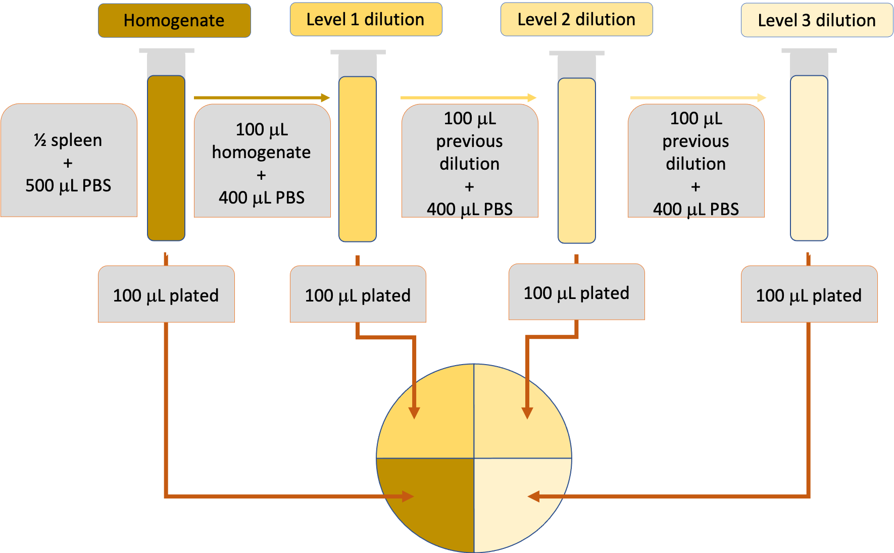

```{r setup, include=FALSE}
knitr::opts_chunk$set(echo = TRUE, message = FALSE, warning = FALSE)
```

# Overview

In our laboratory, we often need to estimate the **bacterial load** of
*Mycobacterium tuberculosis* in organs---including lungs and spleens---of
animals from experiments. These measurements help us assess how well a vaccine
or drug has worked in comparison to controls.

We typically estimate bacterial load in an animal organ using the **plate count
method** with **serial dilutions**. Serial dilutions allow you to create a
highly diluted sample without needing a massive amount of diluent: as you
increase the dilution one step at a time, you can steadily bring the samples
down to lower bacterial loads per volume. This method is common across
laboratories that study tuberculosis drug efficacy as a method for estimating
bacterial load in animal organs [@franzblau2012comprehensive] and is a
well-established method across microbiology in general, dating back to Koch in
the late 1800s [@wilson1922proportion; @ben2014estimation].

With this method, we homogenize part of the organ, and then create several
increasingly dilute samples. Each dilution is then spread on a plate with a
medium in which *Mycobacterium tuberculosis* can grow and left to grow for
several weeks at a temperature conducive to *Mycobacterium tuberculosis* growth.
The idea is that individual bacteria from the original sample end up randomly
spread across the surface of the plate, and any bacteria that are **viable**
(able to reproduce) will form a new colony that, after a while, you'll be able
to see [@wilson1922proportion; @goldman2015practical]. At the end of this
incubation period, you can count the number of these **colony-forming units
(CFUs)** on each plate.

To count the number of CFUs, you need **a "just right" dilution** (and you
likely won't know what this is until after plating) to have a **countable
plate**. If you have **too high** of a dilution (i.e., one with very few viable
bacteria), randomness will play a big role in the CFU count, and you'll estimate
the original with more variability, which isn't ideal. If you have **too low**
of a dilution (i.e., one with lots of viable bacteria), it will be difficult to
identify separate colonies, and they may complete for resources. (The pattern
you see when the dilution is too low (i.e., too concentrated with bacteria) is
called a **lawn**---colonies merge together).

Once you identify a good dilution for each sample, the CFU count from this
dilution can be used to estimate the bacterial load in the animal's organ. To
translate from diluted concentration to original concentration, you do a
back-calculation, incorporating both the number of colonies counted at that
dilution and how dilute the sample was [@ben2014estimation;
@goldman2015practical].

More details on each step of this process are described later in this document.
Broadly, this document provides an overview of our experimental process---for
background in understanding the pre-processing of these data---and then focuses
on how we pre-process the CFU counts from plating to generate estimates of the
bacterial load in the animal's organ.

## Laboratory description

In this section, we describe more of the details of the laboratory procedure
we use for creating serial dilutions, plating them, and counting CFUs on them
after a suitable incubation period. This section is not meant to serve as 
a full laboratory protocol, but rather to provide adequate details that 
are helpful to understand when pre-processing the data that result from this
process.

In a typical experiment in this laboratory, we will measure bacterial load 
under several experimental conditions (e.g., no vaccine, BCG vaccine, 
novel vaccine) at several time points. For each set of experimental conditions, 
we will have several **replicates**---several animals exposed to that set
of conditions. These animals are sacrificed at the appropriate time point
for the experiment, and the organs are used for several experimental 
measurements. Typically, some part of the animal's lungs and spleen will be
used to estimate bacterial load in that organ by homogenizing part of the
organ and then plating the homogenate and several serial dilutions and 
counting the CFUs on each plate following an incubation period. 

In this data pre-processing protocol, we are using example data from a research
project that our laboratory is currently conducting. This project tests novel
vaccines to protect against *Mycobacterium tuberculosis*. The experimental
groups in this case are given in Table 1.

```{r echo = FALSE}
library(kableExtra)
library(dplyr)

group <- c(1:10)
route <- c(rep("I.P.", 5), rep("Oral", 5))
drug <- c(rep(c("control", "control", "Drug 1", "Drug 2", "Drug 1 + Drug 2"), 2))

vaccination <- c(rep(c("PBS", rep("BCG", 4)), 2))

group_df <- data.frame(group, route, drug, vaccination)

group_df %>% 
  kable(caption = "Experimental groups in the example data for this pre-processing protocol.")
```

Figure 1 provides an overview of the experimental process. For each animal, half
of the spleen was homogenized in 500 microliters phosphate buffer saline (PBS)
to create a homogenate. While only part of the organ was used in this
experiment, in experiments where we expect bacterial counts to be very low
(e.g., long treatment regimens), it may make more sense to use a larger portion
of---up to the whole---organ and to plate a very large proportion of the
homogenate [@franzblau2012comprehensive], to be able to get higher CFU counts
and reduce sampling error in these counts. The homogenate was diluted several
times, and both the homogenate and each dilution were plated on a quarter of a
7H11 agar plate. Each dilution resulted from taking a 100 \textmu L aliquot from
the previous test tube (either homogenate or the previous dilution) and
resuspending it in 400 \textmu L PBS, for a total liquid volume of 500 \textmu
L. From each test tube, 100 \textmu L were plated. Figure 2 shows a photograph
of the resulting plating, and you can see that each sample was plated on a
quarter of the plate. The plates were incubated for 3--5 weeks at 37&deg;C, and
then colony-forming units (CFUs) were counted on each plate and recorded in the
data used as input to this protocol. *Mycobacterium tuberculosis* is very
slow-growing, with a rate of division that is between 12 and 24 hours
[@sakamoto2012pathology], so this incubation period is much longer than would be
needed for plate counts for most other types of bacteria.

```{r platingexample, echo = FALSE, out.width = "\\textwidth", fig.cap = "Visual overview of the dilution and plating process for this experiment. For each animal, half the spleen was homogenized in 500 microliters phosphate buffer saline (PBS) for plating ('Homogenate' tube in graphic). Three serial dilutions were created by resuspending 100 microliters from the homogenate or previous dilution in 400 microliters PBS ('Level 1 dilution', 'Level 2 dilution' and 'Level 3 dilution' tubes in graphic). From each tube, 100 microliters were plated in one quarter of a 7H11 agar plate (circle at bottom of graphic). After 3--5 weeks of incubation at 37\\textsuperscript{o}C, colony-forming units were counted from each quarter of the plate and recorded. These are the input data for this protocol."}

```
```{r platingexample2, echo = FALSE, out.width = "\\textwidth", fig.cap = "Example of a plate from this process. Each plate is divided into quarters, with a single sample (i.e., from a specific tube shown in Figure 1) spread in each quarter of the plate. The shows the plate after enough time has passed following plating for colony forming units (CFUs) to grow. In this example, CFUs can easily be counted in the bottom two quadrants of the plate, but may be too numerous to count in the top two quadrants."}

```

### Method limitations

As a conclusion for the experimental description, it is useful to keep in mind
some limitations of this method. There are a number of advantages to this
experimental procedure that result in our laboratory using it. However, there
are some constraints and limitations that should be kept in mind, as well.

First, the bacterial load estimates that are generated from counting CFUs
through plating are likely better suited to estimating *relative* loads
across different samples, rather than as a measure of *absolute* bacterial 
cell counts [@wilson1922proportion; @jennison1940evaluation].

Next, because *Mycobacterium tuberculosis* grows so slowly, it takes an
inconveniently long time to determine bacterial loads by plating
[@franzblau2012comprehensive; @pathak2012counting]. Since these bacteria are
dangerous, the incubation of the plates must be done in a secure laboratory, and
so a key limitation is that the process takes up valuable laboratory space over
several weeks [@pathak2012counting]. Further, the incubation process adds
several weeks to the time needed to generate results from an experiment
[@franzblau2012comprehensive]. Faster methods are being explored to cut out the
3--4 weeks of waiting required for plating; some new methods that are faster
include luciferase readout and fluorescence [@franzblau2012comprehensive].

Next, cells in the original sample can be prone to clumping
[@jennison1940evaluation; @franzblau2012comprehensive], mycobacteria in
particular [@pathak2012counting]. This can make it more likely that bacterial
cells land at the same spot or nearby on a plate. When bacterial cells land at
the same spot or very close together on a plate, they will likely result in a
single colony forming, rather than one per viable bacterial cell. This can
happen both when two colonies form too close together to distinguish them
separately, and so are counted as a single colony, and also when one of two
nearby colonies is stunted in its growth because the other colony takes needed
growth resources at that spot on the plate. Both situations result in the CFU
count underestimating the load of bacterial cells in the original sample
[@goldman2015practical]. There are methods, like shaking the sample, that can be
used in preparing the dilutions and plates that can help prevent clumping
[@jennison1940evaluation].

Next, the CFUs may provide a count only of viable bacteria, not of all bacteria
cells in the original sample [@wilson1922proportion; @goldman2015practical], and
this count will often focus on faster-growing bacteria, and may not capture the
load of subpopulations of *Mycobacterium tuberculosis* in the sample that are at
lower metabolic activity states. Some laboratories use liquid culture as an
alternative to solid agar to encourage better growth of subpopulations of
*Mycobacterium tuberculosis* that are in different metabolic activity states
[@franzblau2012comprehensive].

Further, there is some chance, when studying drug efficacy, that some drug
activity persists during the incubation period, after plating
[@franzblau2012comprehensive]. In this case, the drug activity may slow or
hender incubation of the colonies during plating, and so result in an
underestimate of the bacterial load at the time the animal was sacrificed. One
survey of multiple TB research laboratories suggested some potential approaches
to limit this problem, including "using LJ medium or 7H11 with 5% bovine serum
albumin (BSA) for [the drug] TMC-207, and using 0.4% activated charcoal for [the
drug] CLF" [@franzblau2012comprehensive].

Finally, there are several sources of error that can affect bacterial load
estimates during this process. **Sampling error** is introduced by the role of
randomness in CFU counts from sample to sample, and plays a particularly
important role in cases where CFUs are low [@ben2014estimation]. **Counting
error**, conversely, is linked with difficulties in correctly counting large
numbers of CFUs, as well as counting difficulties introduced with overcrowding
of colonies on a plate, and so plays a large role when CFUs are high
[@ben2014estimation; @goldman2015practical]. There are opportunities for error,
as well, in preparing the dilutions, plating them, and incubating them
[@goldman2015practical]. **Dilution error**, for example, is introduced by the
process of pipetting from one dilution level to another, since small errors in
volume can occur each time a sample is pipetted [@jennison1940evaluation].

## Data description

In our laboratory, we collect data from plating serial dilutions in a plain text
file, recording the data using a spreadsheet program that is set up so it is
easy to convert it into in a "tidy" data format once it is read into R. Here are
the first few rows of the data:

```{r echo = FALSE}
library(tidyverse)
cfu_data <- read_csv("cfu_data.csv")
head(cfu_data)
```

Each row represents a replicate from the experiment, providing the number of
bacterial colonies counted after plating a samples from that replicate at each
dilution. Columns are included with values for the experimental group of the
replicate (`group`), the specific ID of the replicate within that experimental
group (`replicate`, e.g., `2-A` is mouse A in experimental group 2), and the
CFUs counted at each dilution level (`dilution_0`, `dilution_1`, `dilution_2`,
and `dilution_3`). In cases where the bacteria were too numerous to count, this
is marked in the cell with "TNTC".

# Reading data into R

The data are stored in a comma-separated plain text file called "cfu_data.csv". 
They can be read into R using the following code: 

```{r}
library(tidyverse)
cfu_data <- read_csv("cfu_data.csv")
head(cfu_data)
```

You will need to be sure that the data file ("cfu_data.csv" in this case) is
in the working directory of your R session. You can check the current working
directory in R with the call `getwd()`, and you can list all files in the 
current working directory with the call `list.files()`. These function calls
can be useful to check to make sure that this file is in your working directory
and, if not, to identify which directory on your computer file system you 
should move it to.

Once you run this command, the data will be available in your R session in the
object `cfu_data`. You can see the first few rows by running: 

```{r}
head(cfu_data)
```

As soon as you read these data into R, you will want to convert them to a "tidy"
data format, as this will make it easier to do other work with the data. In this
case, that will require transforming the data so there's a single row for the
CFUs recorded for each dilution level for each replicate. As we "tidy" the data,
we'll also get rid of cases where the CFUs were too numerous to count, as well
as ensure that the column that gives CFU counts is in a numeric data type, so
that we can do numerical calculations on values in that column.

You can use the following code to make this transformation.

```{r}
cfu_data <- cfu_data %>% 
  # Convert all dilution columns to be numeric (this will change the "TNTC"
  # markers to missing---NA)
  mutate_at(c("dilution_0", "dilution_1", "dilution_2", "dilution_3"), 
            .funs = as.numeric) %>% 
  # Pivot the dilution columns so that there's one column giving the 
  # dilution level (previous the column name) and one giving the CFUs at that
  # dilution (previously the cell values for the columns)
  pivot_longer(cols = starts_with("dilution"), 
               names_to = "dilution", 
               values_to = "CFUs") %>% 
  # Clean up the `dilution` column so it gives only the numeric level 
  # of the dilution, and make sure that the column is in a numeric data type
  mutate(dilution = str_extract(dilution, "[0-9]+"), 
         dilution = as.numeric(dilution))
```

The data are now in a tidy format: 

```{r}
cfu_data
```

You can now get a summary of the data by running: 

```{r}
summary(cfu_data)
```

# Exploring the data and quality checks

It is helpful to explore the data once you read it in, to check for quality
control issues and other characteristics of the data from a particular
experiment. This section provides code examples for this quality control.

First, it can be helpful to ensure that the data includes the number of
experimental groups, and the number of replicates within each group, that
you are expecting. First, we can determine that there are eight experimental 
groups, with between two and three samples (replicates) in each group: 

```{r}
cfu_data %>% 
  group_by(group) %>% 
  summarize(n_replicates = length(unique(replicate)))
```

It is also helpful to see the distribution of CFUs at each dilution level, which 
can be plotted with the following code: 

```{r out.width = "0.8\\textwidth", fig.align = "center"}
cfu_data %>% 
  ggplot(aes(x = CFUs)) + 
  geom_histogram() + 
  facet_wrap(~ dilution)
```
In this case, most bacterial counts are zero at all dilution levels. However, 
there are more non-zero CFUs at dilution level 0 and fewer as you move to higher
dilution levels. The highest CFU count at any dilution level is a little over
50, for dilution level 1. Most non-zero CFU counts are at or below 30, 
regardless of dilution level.

# Identifying a good dilution for each sample

To count the number of CFUs for a sample, you need a "good" dilution for that
sample, one a which you have a to have a **countable plate**. You won't be able
to pick a "good" dilution for each sample until you have plated several
dilutions and see approximately how many colonies form on each. This is why a
plating experiment will include plates for each sample at several dilution
levels of the sample. 

It is important to use a "good" dilution to estimate the bacterial load in the
original sample, because there are challenges and pitfalls to trying to count
CFUs if the dilution is too high or too low. As mentioned earlier, there are
several potential sources of error when estimating bacterial load from CFUs from
plating, and this search for an optimal dilution tries to minimize those errors.
The potential for sampling error is higher at lower CFU counts, where randomness
of the underlying Poisson process governing the bacterial cells in a sample can
introduce substantial variation across estimates from the same sample
[@ben2014estimation]. Conversely, the potential for counting errors and errors
from overcrowding are higher at higher CFU counts [@ben2014estimation;
@wilson1935bacteriological]---if you have too low of a dilution (i.e., one that
has not been diluted much and has lots of viable bacteria), it will be difficult
to identify separate colonies, and they may complete for resources. Further,
when there are a lot of CFUs, there can be counting errors, in which the person
counting the colonies miscounts or loses track when counting. 

Typically, there will be some standard range of CFUs that are indicative of a
plate having a "good" dilution for counting. Several sources recommend ranges of
CFUs for a countable plate; depending on the source, these suggested ranges are
often 30--300 CFUs [@goldman2015practical; @ben2014estimation;
@tomasiewicz1980most], although some sources have also recommended ranges of
25--200, 40--400, 200--400, and 100--400 CFUs [@ben2014estimation].

Since we plate each sample in a quarter of a plate, rather than across the whole
plate, we use a range appropriate for this smaller surface area. We identify 
optimal dilutions for each sample as that in which the CFU is as close as 
possible to 25. This is similar to a full-plate count of 100 ($25 * 4 = 100$), 
in terms of the amount of resources and chance of overcrowding on the plate
at that dilution. The lower CFU number also helps reduce counting error, 
although it does present a higher chance for sampling error in the estimates, 
which we consider a reasonable trade-off as there are space constraints for 
growing plated bacteria within our BSL-3 facility.

We use the following criteria to pick the best dilution in each sample 
to use to back-calculate the bacterial load in the original sample: 

1. If CFU counts at all dilutions are 0, use the lowest dilution (level 0
dilution); and
2. If some of the dilutions have non-zero CFU counts, use the dilution with 
a CFU count closest to 25; and
3. If there are ties in terms of which dilutions have a CFU closest to 25, take
the plate with the lowest dilution level of those ties.

Here is the code we used to identify the best dilution level for each sample, 
based on these criteria: 

```{r}
cfu_data <- cfu_data %>% 
  # For each dilution, calculate how far the CFUs counted on the plate are 
  # from 25.
  mutate(diff_from_25 = abs(CFUs - 25)) %>% 
  # For each original sample (ID-ed by the 'replicate' column), determine
  # first if CFUs are 0 at all dilutions and second which dilution 
  # had a CFU count closes to 25. Finally, include a check to see if there
  # are non-zero ties for the sample, in terms of plates with non-zero CFU counts
  # equally close to 25.
  group_by(replicate) %>% 
  mutate(all_zeros = all(CFUs == 0),
         closest_to_25 = dilution[which.min(diff_from_25)], 
         ties_closest_to_25 = sum(diff_from_25 == min(diff_from_25)) > 1)
```

You can check some samples in these data to make sure it's identifying the right
dilution level. First, here is a sample where all CFUs are zero (replicate 3-A).
The code has correctly identified that the CFUs for these samples are all zeros,
marking `TRUE` in the `all_zeros` column.

```{r}
cfu_data %>% 
  filter(replicate == "3-A")
```

Here is an example where some dilutions resulted in non-zero CFU counts, from
replicate 2-B. In this case, there were non-zero CFU counts at dilution levels
1, 2, and 3. The closest to 25 was for dilution level 2, since $\lvert 25-10 \rvert = 15$, which is lower than $\lvert 25-52 \rvert = 27$ or $\lvert 25-5 \rvert = 20$.

```{r}
cfu_data %>% 
  filter(replicate == "2-B")
```

As a quality check, we can see if there are any samples where there were non-zero
ties in terms of which dilution level gave a CFU count closest to 25: 

```{r}
cfu_data %>% 
  filter(ties_closest_to_25 & !all_zeros)
```

These results show that there are no samples where there are non-zero ties in
terms of which dilutions gave CFU counts closest to 25, so in this case, that is
not a criteria we need to consider further in identifying the CFU count at the
best dilution level for each sample in these example data.

Now that we've identified the best dilution level for each replicate, we can
reduce the data, creating a new dataset with only a single row for each sample. 
Each sample will have a row that provides the best dilution level for that 
sample: 

```{r}
cfu_data_reduced <- cfu_data %>% 
  # Limit to the row with the best dilution for each sample
  filter(dilution == closest_to_25) %>% 
  # Remove the grouping tag applied in the code earlier
  ungroup() %>% 
  # Limit to just the columns of data we need for further steps
  select(group:CFUs)

# Print this reduced data out as a table
cfu_data_reduced %>% 
  knitr::kable()
```

For this experiment, many of the samples had 0 CFUs at all dilution levels. For
the samples with non-zero CFU counts, the best dilutions were often at dilution
level 0 (i.e., undiluted homogenate; see Figure 1), although in a few cases the
best dilutions for samples were at dilution levels of 1 ($\frac{1}{5}$ dilution)
or 2 ($\frac{1}{25}$ dilution). The CFU counts at the best dilution levels were,
for non-zero CFU samples, between 1 and 30. We may want to keep in mind that the
sampling error is likely pretty high for the CFU counts that are lower than
about 10 in these samples.

# Estimating bacterial load for each sample

Now that we have identified a good dilution level for each sample, we will
use this to back-calculate to estimate the bacterial load in each of the 
experimental animals' spleens. 

We first need to determine the dilution and dilution factor for each sample. 
Figure 1 shows the process of diluting and plating the samples. Based on this
information, we can determine the dilution and dilution factor for each of 
the tubes. We can also determine the percent of liquid in each tube that 
was plated. 

First, we can determine the **dilution** in each tube. The **dilution** for any
particular diluted sample is:

$$
\mbox{Dilution} = \frac{\mbox{Volume of aliquot}}{\mbox{Total volume}}
$$

The total sample volume includes the volume of the aliquot (100 \textmu L) and
the volume of PBS in which this aliquot was diluted (400 \textmu L). We can
therefore calculate the dilution for each level of dilution (as compared to the
undiluted homogenate) in this experiment as:

```{r}
volume_aliquot <- 100       # in microliters
volume_pbs <- 400           # in microliters

dilution <- volume_aliquot / (volume_aliquot + volume_pbs)
dilution
```

The **dilution factor** for any particular sample is: 

$$
\mbox{Dilution factor} = \frac{\mbox{Concentration in undiluted sample}}{\mbox{Concentration in diluted sample}} = \frac{1}{\mbox{Dilution}}
$$
Therefore, the dilution factor for this experiment is: 

```{r}
dilution_factor <- 1 / dilution
dilution_factor
```

In other words, for each level of dilution, there is a five-fold dilution of
the sample. 

These following general equations apply for determining the total dilution in
any of the tubes:

$$
\mbox{Dilution factor in tube} = 5^x
$$

$$
\mbox{Dilution in tube} = \frac{1}{5^x}
$$

where $x$ is the dilution level in the tube.

As you move through the levels of dilution, each level will become diluted by an
additional factor of 5 compared to the homogenate in the first tube (Figure 1):

| Dilution level  | Dilution factor in tube | Dilution in tube | 
| ------------- | ------------- | ------------- |
| 0  | $5^{0} = 1$ | $1$ | 
| 1  | $5^{1} = 5$  | $\frac{1}{5}$ |
| 2  | $5^{2} = 25$  | $\frac{1}{25}$ |
| 3  | $5^{3} = 125$  | $\frac{1}{125}$ |

We can apply these principles to get the dilution factor for the optimal
dilution we identified for each sample in the previous section:

```{r}
cfu_data_reduced <- cfu_data_reduced %>% 
  mutate(dilution_factor_in_tube = dilution_factor ^ dilution)

cfu_data_reduced %>% 
  knitr::kable()
```

Next, we can measure the proportion of each tube that was used for plating. With
plating, there is a dilution factor both for diluting to each tube, then a
further dilution factor to account for how much of each tube is spread on a
plate to incubate [@ben2014estimation]---we have already calculated the dilution
factor for dilution to each tube, and so we now need to calculate the dilution
factor for plating a sample from the tube. The second dilution factor is the
inverse of the proportion of each tube that is plated [@ben2014estimation]. From
each tube, 100 \textmu L is taken to plate, out of 500 \textmu L of liquid in
the tube (100 \textmu L of aliquot from the previous dilution or homogenate and
400 \textmu L PBS), so you are plating 20% of the liquid in each tube:

$$
100 \mu L * \frac{1}{500 \mu L} = 0.2
$$

Following this logic, we can calculate the dilution factor for the plate
at the selected dilution, as the total dilution on that plate will be the 
product of the dilution factor in that tube and the dilution factor of plating: 

```{r}
# Calculate dilution factor for plating process
volume_plated <- 100      # in microliters
frac_plated <- volume_plated / (volume_aliquot + volume_pbs)
plate_dilution_factor <- 1 / frac_plated
plate_dilution_factor

# Calculate dilution factor on plate for each sample compared to 
# homogenate in first tube
cfu_data_reduced <- cfu_data_reduced %>% 
  mutate(dilution_factor_on_plate = dilution_factor_in_tube *
           plate_dilution_factor)

# Print out the results
cfu_data_reduced %>% 
  knitr::kable()
```

Now, we can use the CFUs counted on the plate to estimate the concentration of
viable bacteria in the homogenate by multiplying the counted CFUs by the total
dilution factor on that plate:

```{r}
# Estimate CFUs in homogenate
cfu_data_reduced <- cfu_data_reduced %>% 
  mutate(cfu_in_homog = CFUs * dilution_factor_on_plate)

# Print results out as a table
cfu_data_reduced %>% 
  knitr::kable()
```

Finally, to get an estimate of the bacterial load in the full organ, we need 
to back-calculate from the concentration of bacteria we estimated in the
homogenate. To do this, we need to account for two factors: the volume of PBS 
that was used to create the homogenate and the proportion of the organ that was
included in the homogenate. 

The homogenate was created using 500 \textmu L of PBS to resuspend the portion
of the spleen, so the bacterial concentration that we estimated in the 
homogenate provides an estimate of CFUs per 500 \textmu L. To estimate the total 
number of viable bacteria in the original homogenate, we'll need to multiply 
the concentration of bacteria in the homogenate, which we calculated 
previously, by this volume. 

Next, to get an estimate of bacteria load in the full organ, we need to
backcalculate based on the proportion of the organ that was included in the
original sample. In this experiment, we used half of the spleen, so the
estimated bacterial load in the full organ should be approximately twice that
estimated in the sample (since $1/0.5 = 2$). 

We can calculate to account for these two factors, allowing us to estimate
the bacterial load in the entire spleen of the animal:

```{r}
prop_organ_in_homog <- 0.5 # Half the spleen was included in the homogenate
volume_resuspend <- 500    # The homogenate was created by resuspending the 
                           # organ part in this many microliters of PBS

# Estimate the bacterial load in the original organ based on the estimated
# bacterial concentration in the homogenate
cfu_data_reduced <- cfu_data_reduced %>% 
  mutate(cfu_in_organ = cfu_in_homog * volume_resuspend * 
           (1 / prop_organ_in_homog))

# Print the results as a table
cfu_data_reduced %>% 
  select(-group) %>% 
  knitr::kable()
```

# Final output

This protocol describes the pre-processing of data collected through a serial
dilution viable plate count for each sample from our experiment. Our input was
the CFUs counted for each plate at each of four dilution levels. Our output is
an estimate of the bacterial load in the spleen from each replicate (animal) in
the experiment.

From the previous steps, we can remove the columns that we no longer need, 
to create a simpler format for the output data: 

```{r}
cfu_final <- cfu_data_reduced %>% 
  select(group, replicate, cfu_in_organ)
cfu_final
```

Our final data includes a row for each of the samples in the experiment---in
this case, each sample represents one animal (replicate), with a single CFU
estimate representing our best estimate of the bacterial load in the whole
spleen of that animal.

You can visualize this data to explore patterns in it. For example, you can 
compare the CFU estimates across each experimental animal, grouping animals
that are replicates for the same experimental group together:

```{r}
library(ggbeeswarm)
cfu_final %>% 
  ggplot(aes(x = as.factor(group), 
             y = log10(cfu_in_organ + 0.1), 
             color = as.factor(group))) + 
  geom_quasirandom() + 
  labs(x = "Experimental group", 
       y = "Log(CFU + 1)", 
       color = "Experimental group")
```

In this example plot, the log-10 values of the CFUs are shown, since the counts
can otherwise be hard to compare. Since some of the CFU counts in the samples
are 0, a small constant (0.1) is added to each value before taking the log,
since the log of 0 is undefined.

We output this final data to a plain text file (a csv) using the following
code: 

```{r}
write_csv(cfu_final, file = "processed_cfu_estimates.csv")
```

These data can now be used for further analysis and combined with other
pre-processed experimental data. Through a survey of tuberculosis research
laboratories, for example, the following was found regarding standard ways to
analyze resulting data, and could be considered in next steps with these output:

> "The primary data analysis for mouse models is usually a one-way analysis of
variance (ANOVA) of the log-10 CF bacterial loads, with t-distribution based
contrasts comparing individual treatments. A Dunnett's test is an appropriate
method for comparing all new compounds to untreated controls, while controlling
the overall error rate in that set of comparisons is set at the usual 0.05
level. Also Bonferroni and Tukey statistical tests are appropriate tests for a
pairwise comparison between treatment groups." [@franzblau2012comprehensive]

# References


